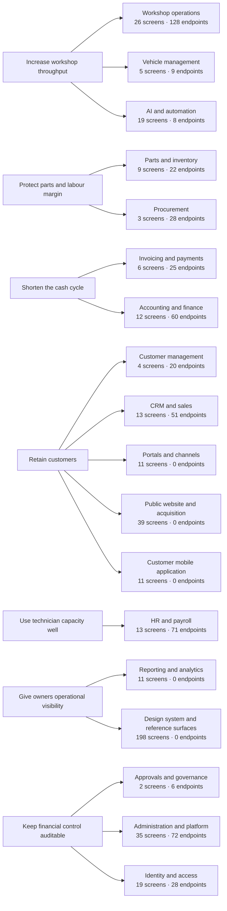

<!-- GENERATED FILE — DO NOT EDIT BY HAND.
     Generator: tools/docs/generators/capability.mjs
     Regenerate: node tools/docs/generate.mjs
     Derived from:
       - packages/contract/src/rbac.ts
       - project-control/MASTER_REGISTRY.json
       - server/src/registry.ts
-->

# Business capability map

**Status:** GENERATED · **Sources as of:** 2026-09-19 · 18 capabilities

## How capabilities are defined here

A capability is a grouping of **permission modules** and **screen domains** — the two taxonomies the implementation already agrees on. Inventing a third taxonomy for the documentation would give a map that looks tidy and drifts from the product within a release.

All 436 registered screens and all 528 endpoints map to exactly one capability. That is a property this generator checks, not a claim: an unmapped screen or endpoint is a failure in `docs:check`.

## Objectives to capabilities

## Capabilities

| Capability | Name | Objective | Permission modules | Screens | Data-backed | Endpoints | Entities | Roles with access |
| --- | --- | --- | --- | --- | --- | --- | --- | --- |
| CAP-WORKSHOP | Workshop operations | OBJ-THROUGHPUT | `jobcards`, `appointments`, `estimates` | 26 | 26 | 128 | 18 | 12 |
| CAP-CUSTOMERS | Customer management | OBJ-RETENTION | `customers` | 4 | 4 | 20 | 2 | 9 |
| CAP-VEHICLES | Vehicle management | OBJ-THROUGHPUT | `vehicles` | 5 | 5 | 9 | 1 | 11 |
| CAP-INVENTORY | Parts and inventory | OBJ-MARGIN | `inventory` | 9 | 9 | 22 | 2 | 9 |
| CAP-PROCUREMENT | Procurement | OBJ-MARGIN | `procurement` | 3 | 3 | 28 | 3 | 8 |
| CAP-BILLING | Invoicing and payments | OBJ-CASH | `invoices`, `payments` | 6 | 6 | 25 | 4 | 9 |
| CAP-ACCOUNTING | Accounting and finance | OBJ-CASH | `accounting`, `insurance` | 12 | 12 | 60 | 10 | 5 |
| CAP-HR | HR and payroll | OBJ-CAPACITY | `hr`, `technicians` | 13 | 13 | 71 | 8 | 10 |
| CAP-CRM | CRM and sales | OBJ-RETENTION | `crm`, `callcenter` | 13 | 11 | 51 | 6 | 7 |
| CAP-REPORTING | Reporting and analytics | OBJ-VISIBILITY | `reports`, `execreports` | 11 | 11 | 0 | 0 | 10 |
| CAP-GOVERNANCE | Approvals and governance | OBJ-CONTROL | `approvals`, `audit` | 2 | 2 | 6 | 1 | 9 |
| CAP-PORTALS | Portals and channels | OBJ-RETENTION | `portaltech`, `portalcustomer`, `portalsupplier`, `portalprocure`, `kiosk` | 11 | 9 | 0 | 0 | 14 |
| CAP-AI | AI and automation | OBJ-THROUGHPUT | `ai`, `aiadmin` | 19 | 4 | 8 | 2 | 0 |
| CAP-PLATFORM | Administration and platform | OBJ-CONTROL | `admin`, `departments`, `settings`, `superadmin`, `dashboard`, `network`, `ungated`, `platform` | 35 | 11 | 72 | 9 | 14 |
| CAP-IDENTITY | Identity and access | OBJ-CONTROL | `auth` | 19 | 1 | 28 | 0 | 0 |
| CAP-WEBSITE | Public website and acquisition | OBJ-RETENTION | _(screen domain: website)_ | 39 | 0 | 0 | 0 | 0 |
| CAP-CUSTOMERAPP | Customer mobile application | OBJ-RETENTION | _(screen domain: customerapp)_ | 11 | 6 | 0 | 0 | 0 |
| CAP-DESIGNSYSTEM | Design system and reference surfaces | OBJ-VISIBILITY | _(screen domain: ui, featuremap)_ | 198 | 39 | 0 | 0 | 0 |

## Objectives and the benefit each is for

| Objective | Name | Benefit |
| --- | --- | --- |
| OBJ-THROUGHPUT | Increase workshop throughput | More jobs completed per bay per day |
| OBJ-MARGIN | Protect parts and labour margin | Cost visibility and controlled procurement |
| OBJ-CASH | Shorten the cash cycle | Faster invoicing, fewer unpaid balances |
| OBJ-RETENTION | Retain customers | Repeat service revenue |
| OBJ-CAPACITY | Use technician capacity well | Utilisation and scheduling |
| OBJ-VISIBILITY | Give owners operational visibility | Decisions on current numbers |
| OBJ-CONTROL | Keep financial control auditable | Approvals, segregation of duties, audit trail |

## Reading the "data-backed" column

172 of 436 screens are wired to the live API; the remainder render from the ported design fixtures. That is the single largest fact about the product's current state, and it is measured in `project-control/STATUS.json` rather than asserted here.

## Per-capability detail

### CAP-WORKSHOP — Workshop operations

**Objective:** OBJ-THROUGHPUT (Increase workshop throughput)

| Aspect | Value |
| --- | --- |
| Permission modules | `jobcards`, `appointments`, `estimates` |
| Screen domains | `workshop` |
| Screens | 26 (26 data-backed) |
| Endpoints | 128 |
| Entities | `appointments`, `cannedJobs`, `declinedJobs`, `deliverySignoffs`, `diagCopies`, `obdDevices`, `diagFindings`, `diagLabour`, `diagParts`, `obdDtcReadings`, `diagStages`, `estimates`, `inspectionFindings`, `inspectionMedia`, `jobCards`, `dtcCodes`, `kbProcedures`, `services` |
| Roles with any grant | owner, superadmin, manager, advisor, technician, qc, parts, accountant, frontdesk, callcenter, customer, test |
| Rule guards | — |

### CAP-CUSTOMERS — Customer management

**Objective:** OBJ-RETENTION (Retain customers)

| Aspect | Value |
| --- | --- |
| Permission modules | `customers` |
| Screen domains | — |
| Screens | 4 (4 data-backed) |
| Endpoints | 20 |
| Entities | `customers`, `fleets` |
| Roles with any grant | owner, superadmin, manager, advisor, technician, accountant, frontdesk, callcenter, test |
| Rule guards | — |

### CAP-VEHICLES — Vehicle management

**Objective:** OBJ-THROUGHPUT (Increase workshop throughput)

| Aspect | Value |
| --- | --- |
| Permission modules | `vehicles` |
| Screen domains | — |
| Screens | 5 (5 data-backed) |
| Endpoints | 9 |
| Entities | `vehicles` |
| Roles with any grant | owner, superadmin, manager, advisor, technician, qc, accountant, frontdesk, callcenter, customer, test |
| Rule guards | — |

### CAP-INVENTORY — Parts and inventory

**Objective:** OBJ-MARGIN (Protect parts and labour margin)

| Aspect | Value |
| --- | --- |
| Permission modules | `inventory` |
| Screen domains | `parts` |
| Screens | 9 (9 data-backed) |
| Endpoints | 22 |
| Entities | `parts`, `warehouseZones` |
| Roles with any grant | owner, superadmin, manager, advisor, technician, parts, accountant, procurement, test |
| Rule guards | BR-INVENTORY-checkMovement, BR-INVENTORY-checkReceipt, BR-INVENTORY-checkReservation, BR-INVENTORY-checkReservationRelease, BR-INVENTORY-movementDelta |

### CAP-PROCUREMENT — Procurement

**Objective:** OBJ-MARGIN (Protect parts and labour margin)

| Aspect | Value |
| --- | --- |
| Permission modules | `procurement` |
| Screen domains | — |
| Screens | 3 (3 data-backed) |
| Endpoints | 28 |
| Entities | `purchaseOrders`, `requisitions`, `suppliers` |
| Roles with any grant | owner, superadmin, manager, parts, accountant, procurement, supplier, test |
| Rule guards | BR-PROCUREMENT-checkPurchaseOrderApprovable, BR-PROCUREMENT-checkReceive, BR-PROCUREMENT-purchaseOrderTotals, BR-PROCUREMENT-requisitionEstimatedTotalHalalas |

### CAP-BILLING — Invoicing and payments

**Objective:** OBJ-CASH (Shorten the cash cycle)

| Aspect | Value |
| --- | --- |
| Permission modules | `invoices`, `payments` |
| Screen domains | — |
| Screens | 6 (6 data-backed) |
| Endpoints | 25 |
| Entities | `invoiceLines`, `invoices`, `payments`, `receipts` |
| Roles with any grant | owner, superadmin, manager, advisor, accountant, frontdesk, callcenter, customer, test |
| Rule guards | — |

### CAP-ACCOUNTING — Accounting and finance

**Objective:** OBJ-CASH (Shorten the cash cycle)

| Aspect | Value |
| --- | --- |
| Permission modules | `accounting`, `insurance` |
| Screen domains | — |
| Screens | 12 (12 data-backed) |
| Endpoints | 60 |
| Entities | `chartOfAccounts`, `expenses`, `journalEntries`, `bankStatements`, `equipmentWarranties`, `insuranceClaims`, `insurancePolicies`, `loanContracts`, `loanRepayments`, `savedReports` |
| Roles with any grant | owner, superadmin, manager, accountant, test |
| Rule guards | — |

### CAP-HR — HR and payroll

**Objective:** OBJ-CAPACITY (Use technician capacity well)

| Aspect | Value |
| --- | --- |
| Permission modules | `hr`, `technicians` |
| Screen domains | — |
| Screens | 13 (13 data-backed) |
| Endpoints | 71 |
| Entities | `employees`, `leaveRequests`, `payrollLines`, `payrollRuns`, `technicians`, `timesheets`, `trainingCourses`, `trainingEnrolments` |
| Roles with any grant | owner, superadmin, manager, advisor, technician, qc, accountant, hr, frontdesk, test |
| Rule guards | BR-HR-payrollLineNetHalalas, BR-HR-sumPayrollLines |

### CAP-CRM — CRM and sales

**Objective:** OBJ-RETENTION (Retain customers)

| Aspect | Value |
| --- | --- |
| Permission modules | `crm`, `callcenter` |
| Screen domains | — |
| Screens | 13 (11 data-backed) |
| Endpoints | 51 |
| Entities | `campaigns`, `leads`, `opportunities`, `segments`, `crmTasks`, `customerFeedback` |
| Roles with any grant | owner, superadmin, manager, advisor, frontdesk, callcenter, test |
| Rule guards | — |

### CAP-REPORTING — Reporting and analytics

**Objective:** OBJ-VISIBILITY (Give owners operational visibility)

| Aspect | Value |
| --- | --- |
| Permission modules | `reports`, `execreports` |
| Screen domains | — |
| Screens | 11 (11 data-backed) |
| Endpoints | 0 |
| Entities | — |
| Roles with any grant | owner, superadmin, manager, advisor, qc, parts, accountant, hr, procurement, test |
| Rule guards | — |

### CAP-GOVERNANCE — Approvals and governance

**Objective:** OBJ-CONTROL (Keep financial control auditable)

| Aspect | Value |
| --- | --- |
| Permission modules | `approvals`, `audit` |
| Screen domains | — |
| Screens | 2 (2 data-backed) |
| Endpoints | 6 |
| Entities | `approvalLines` |
| Roles with any grant | owner, superadmin, manager, advisor, parts, accountant, hr, procurement, test |
| Rule guards | BR-APPROVALS-checkApprovalCeiling, BR-APPROVALS-checkQcIndependence, BR-APPROVALS-checkSelfApproval, BR-APPROVALS-SOD_PAIRS |

### CAP-PORTALS — Portals and channels

**Objective:** OBJ-RETENTION (Retain customers)

| Aspect | Value |
| --- | --- |
| Permission modules | `portaltech`, `portalcustomer`, `portalsupplier`, `portalprocure`, `kiosk` |
| Screen domains | `portals` |
| Screens | 11 (9 data-backed) |
| Endpoints | 0 |
| Entities | — |
| Roles with any grant | owner, superadmin, manager, advisor, technician, qc, parts, accountant, frontdesk, callcenter, procurement, supplier, customer, test |
| Rule guards | — |

### CAP-AI — AI and automation

**Objective:** OBJ-THROUGHPUT (Increase workshop throughput)

| Aspect | Value |
| --- | --- |
| Permission modules | `ai`, `aiadmin` |
| Screen domains | — |
| Screens | 19 (4 data-backed) |
| Endpoints | 8 |
| Entities | `aiAgents`, `conversations` |
| Roles with any grant | — |
| Rule guards | — |

### CAP-PLATFORM — Administration and platform

**Objective:** OBJ-CONTROL (Keep financial control auditable)

| Aspect | Value |
| --- | --- |
| Permission modules | `admin`, `departments`, `settings`, `superadmin`, `dashboard`, `network`, `ungated`, `platform` |
| Screen domains | `admin` |
| Screens | 35 (11 data-backed) |
| Endpoints | 72 |
| Entities | `departments`, `branches`, `integrations`, `oemTools`, `notifications`, `partsNetworkMembers`, `partsNetworkOrders`, `partsNetworkQuotations`, `partsNetworkRequests` |
| Roles with any grant | owner, superadmin, manager, advisor, technician, qc, parts, accountant, hr, frontdesk, callcenter, procurement, supplier, test |
| Rule guards | — |

### CAP-IDENTITY — Identity and access

**Objective:** OBJ-CONTROL (Keep financial control auditable)

| Aspect | Value |
| --- | --- |
| Permission modules | `auth` |
| Screen domains | `auth` |
| Screens | 19 (1 data-backed) |
| Endpoints | 28 |
| Entities | — |
| Roles with any grant | — |
| Rule guards | — |

### CAP-WEBSITE — Public website and acquisition

**Objective:** OBJ-RETENTION (Retain customers)

| Aspect | Value |
| --- | --- |
| Permission modules | — |
| Screen domains | `website` |
| Screens | 39 (0 data-backed) |
| Endpoints | 0 |
| Entities | — |
| Roles with any grant | — |
| Rule guards | — |

### CAP-CUSTOMERAPP — Customer mobile application

**Objective:** OBJ-RETENTION (Retain customers)

| Aspect | Value |
| --- | --- |
| Permission modules | — |
| Screen domains | `customerapp` |
| Screens | 11 (6 data-backed) |
| Endpoints | 0 |
| Entities | — |
| Roles with any grant | — |
| Rule guards | — |

### CAP-DESIGNSYSTEM — Design system and reference surfaces

**Objective:** OBJ-VISIBILITY (Give owners operational visibility)

| Aspect | Value |
| --- | --- |
| Permission modules | — |
| Screen domains | `ui`, `featuremap` |
| Screens | 198 (39 data-backed) |
| Endpoints | 0 |
| Entities | — |
| Roles with any grant | — |
| Rule guards | — |
