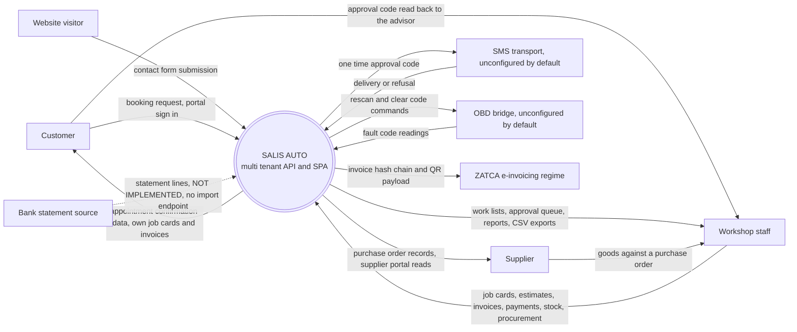
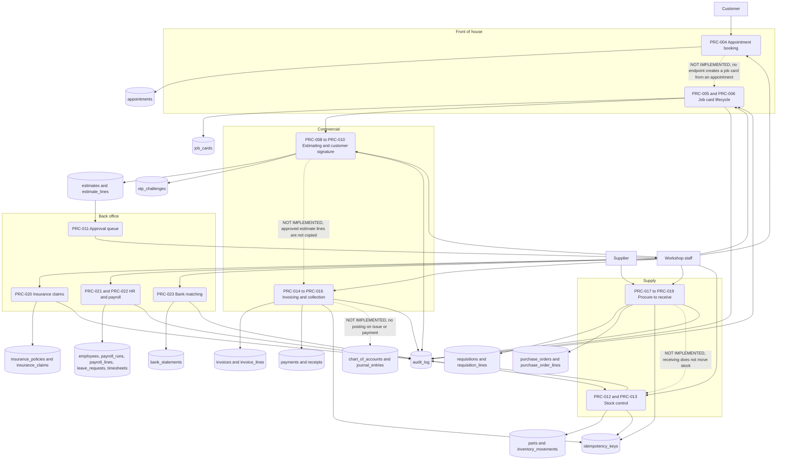
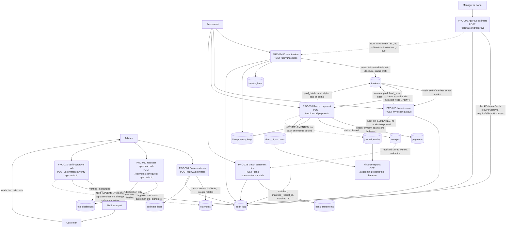
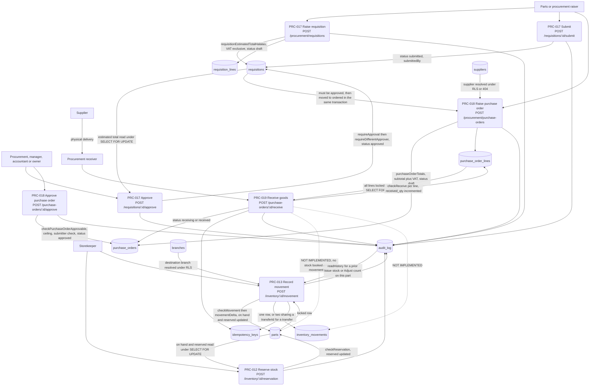

**Status:** NORMATIVE · **Owner:** Process architect

# Data flow diagrams

This file traces where data actually moves in SALIS AUTO: level 0 for the system in its context, level 1 for the major processes and the stores they read and write, and level 2 for the two flows where the detail earns its place — money from estimate to payment, and stock from requisition to inventory movement. Every data store named is a real table in `project-control/ENTITY_REGISTRY.json`, spelled as the database spells it. Every flow corresponds to an endpoint in `PROCESS_CATALOG.md`. Flows that a reader would expect and that do not exist are drawn as broken links and named, rather than omitted so the picture looks complete.

## Notation

- Rounded nodes are processes, each labelled with its PRC id.
- `DS` nodes are data stores, labelled with the real table name.
- Square nodes at the edges are external entities.
- A dashed arrow labelled NOT IMPLEMENTED is a flow the business needs and the code does not have.
- Every store access shown happens inside a transaction that has already run `SET LOCAL app.org_id`, so RLS narrows it to one tenant. That is not drawn per arrow.

---

## Level 0 — context

Four of the eight external interfaces are honest about not working. The SMS transport and the OBD bridge both default to refusing with a 503 that names the missing dependency rather than pretending. The ZATCA flow is one-directional: the system computes a hash chain and a TLV QR payload on issue and there is no submission or clearance call. Bank statement lines have a matching endpoint but no import endpoint, so they can only arrive by seed.

---

## Level 1 — major processes and stores

Two arrows out of `audit_log` run backwards into a process. That is not a drawing error: `requireSodClear` in `server/src/security/sod.ts` reads the trail as an input to the decision, because four of the six declared segregation-of-duties pairs cannot be expressed by any permission grant and only the history of who did what can answer them.

`chart_of_accounts` and `journal_entries` receive nothing. The double-entry ledger exists as tables and as read endpoints — `GET /api/v1/accounting/journal-entries`, `GET /api/v1/accounting/reports/trial-balance` — and no process writes to it.

---

## Level 2 — money: estimate to invoice to payment to accounting

What this diagram says plainly:

- **The money arithmetic is server-side and integral.** `computeInvoiceTotals` in `packages/contract/src/rules/money.ts` derives every figure from quantities and net unit prices; `roundHalfUp` is applied once at the subtotal and once at the tax, never per line; `VAT_RATE_BPS` is basis points so the rate is exact. No client-sent total is read at any point on this path.
- **The chain that binds documents together is missing.** An approved estimate does not become an invoice, and a verified customer signature does not move the estimate's status. Both handovers are a person re-keying.
- **The ledger is never written.** `journal_entries` and `chart_of_accounts` feed the trial balance and the tax return, and nothing on this path posts to them. `checkJournalBalanced` exists in the rules package with no caller.
- **Reconciliation is one-way and unvalidated.** A statement line can be matched to a `receiptId` that does not name a real `receipts` row, and there is no unmatch.

---

## Level 2 — stock: requisition to purchase order to receipt to inventory movement

What this diagram says plainly:

- **The approval chain is real and doubly guarded.** Both the requisition and the purchase order check the ceiling against a server-computed total and then check that the approver is not the submitter. A requisition raised from nothing cannot skip to a purchase order: the raise step refuses a requisition that is not `approved`, and marks it `ordered` in the same transaction so it cannot be drawn on twice.
- **The receipt does not touch stock.** This is the largest structural gap in the supply flow and it is deliberate rather than accidental — the route's own comment explains that a purchase order line's part reference is optional free text that need not resolve to a `parts` row, so booking the lines that happen to resolve and skipping the rest would be worse than not booking at all. The consequence stands regardless: `purchase_order_lines.received_qty` and `parts.on_hand` are two independent ledgers, and nothing reconciles them.
- **Both quantity-changing endpoints are idempotent by force.** Receiving and movement both refuse a request without an `Idempotency-Key`, because neither body carries a natural dedupe key and a retried request would otherwise book the quantity twice.
- **The audit log is an input, not just an output.** The movement endpoint reads it to answer whether this person already performed the counterpart duty on this part — the one segregation-of-duties pair that no permission grant can express, because both duties are `inventory:e`.

---

## Store inventory

Every data store referenced above, with the endpoint families that write it. Table names are as spelled in `project-control/ENTITY_REGISTRY.json`.

| Store | Written by | Read by |
| --- | --- | --- |
| `appointments` | PRC-004, generated collection routes | booking screens, workshop reports |
| `job_cards` | PRC-005, PRC-006, PRC-007 | workshop board, estimates, invoices, claims |
| `estimates`, `estimate_lines` | PRC-008, PRC-009 | PRC-011 approval queue |
| `invoices`, `invoice_lines` | PRC-014, PRC-015, PRC-016 | finance reports, tax return |
| `payments`, `receipts` | PRC-016 | invoice screens, PRC-023 |
| `parts`, `inventory_movements` | PRC-012, PRC-013 | stock screens, product reports |
| `requisitions`, `requisition_lines` | PRC-017 | PRC-018 |
| `purchase_orders`, `purchase_order_lines` | PRC-018, PRC-019 | supplier and procurement portals |
| `suppliers` | generated collection routes under `procurement` | PRC-018 |
| `insurance_policies`, `insurance_claims` | PRC-020, policies by seed only | claims summary report |
| `employees`, `payroll_runs`, `payroll_lines`, `timesheets`, `leave_requests` | PRC-021, PRC-022, generated collection routes under `hr` | HR screens |
| `bank_statements` | PRC-023 only, no import path | reconciliation screen |
| `chart_of_accounts`, `journal_entries`, `expenses` | nothing in the API | trial balance, tax return |
| `loan_contracts`, `loan_repayments` | nothing in the API | loans summary report |
| `leads`, `opportunities`, `crm_tasks`, `customer_feedback` | PRC-003, generated collection routes under `crm` | CRM screens |
| `public_leads` | PRC-002 | nothing — no endpoint reads this table |
| `otp_challenges` | PRC-001, PRC-010, auth OTP routes | the verify handlers |
| `idempotency_keys` | PRC-013, PRC-014, PRC-016, PRC-019 | the same endpoints on replay |
| `audit_log` | every mutating endpoint, append-only at the database level | PRC-006 and PRC-013 SOD checks, `GET /{collection}/:id/history` |
| `user_sessions` | login, refresh, logout, session revocation | refresh reuse detection |
| `organizations`, `branches`, `departments` | seed and admin routes | tenancy and RLS |

Five tables in the entity registry have no write path in the API at all: `chart_of_accounts`, `journal_entries`, `expenses`, `loan_contracts` and `loan_repayments`. Each has read endpoints and at least one report built on it — the trial balance, the tax return, the loans summary — so those reports render against seed data and against nothing else. `bank_statements` is a sixth near-miss: the only write it accepts is the reconciliation flag from PRC-023, and the lines themselves have no import endpoint.
