**Status:** NORMATIVE · **Owner:** Process architect

# System flows

This file shows what the software actually executes for the operations that matter, as sequence diagrams naming real files and real functions. It is the internal counterpart to `PROCESS_CATALOG.md`: where that file says what the business does, this one says what happens between the click and the row. Every participant is a module that exists, every call is a function or a SQL statement the code issues, and where a stage of the standard pipeline is skipped for a particular operation, the diagram says so rather than drawing it for symmetry.

## The standard request pipeline

Every authenticated request follows the same spine. Individual diagrams below elide the steps they do not change.

| # | Stage | Where |
| --- | --- | --- |
| 1 | Screen calls a repository or screen-level API module | `app/src/data/http/repository.ts`, `app/src/screens/*/api.ts` |
| 2 | `ApiClient.send` attaches the bearer token; on a 401 it refreshes once and replays | `app/src/data/http/client.ts` |
| 3 | helmet, CORS, rate limit — keyed on `orgId:ip` | `server/src/app.ts` |
| 4 | `onRequest` hook verifies the access token unless the path is in `PUBLIC_PATHS` or `isPublicAuthPath` | `server/src/app.ts`, `server/src/security/principal.ts` |
| 5 | `principalFromClaims` builds the `Principal`; `scope` is derived from the role, never read from the token | `server/src/security/principal.ts` |
| 6 | `requirePermission` checks the module and action grant | `server/src/security/permissions.ts` |
| 7 | `requireApproval` and `requireDifferentApprover` where the operation is a decision | `server/src/security/permissions.ts`, `server/src/security/approvals.ts` |
| 8 | Zod parse of the body — **outside** the transaction in every route | the route file |
| 9 | `withTenant` opens the transaction and runs `SET LOCAL app.org_id / branch_id / user_id / scope / customer_id` via `set_config` | `server/src/db/tenant.ts` |
| 10 | Row lock where concurrency matters — `SELECT ... FOR UPDATE` | the route file |
| 11 | `requireSodClear` over the audit trail, where a declared SOD pair applies | `server/src/security/sod.ts` |
| 12 | Rule guard from `packages/contract/src/rules/*` | the rule file |
| 13 | Drizzle read or write under the RLS policies | `server/drizzle/0001_rls.sql`, `server/drizzle/0014_customer_id_link.sql` |
| 14 | `writeAudit` in the same transaction as the change | `server/src/audit/audit.ts` |
| 15 | `presentRow` then `redact` on the way out | `server/src/routes/collections.ts`, `server/src/security/permissions.ts` |
| 16 | Commit, then `onSend` stamps `x-request-id` | `server/src/app.ts` |

Two things about stage 9 are load-bearing. `set_config` is called with `is_local = true`, so the settings live for the transaction and no further. And the mutation and its audit row share that transaction, so there is no state in which a change happened and the record of it did not.

## Login

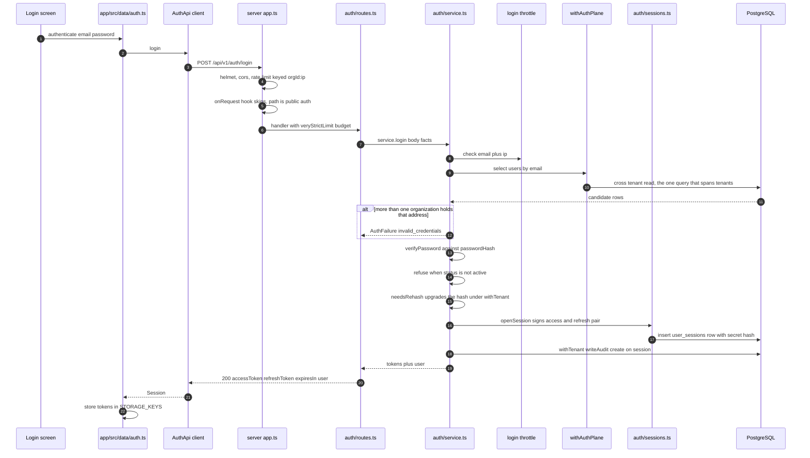

The failure paths are deliberately identical in shape: a wrong password, an unknown address and a disabled account all answer `invalid_credentials` or `account_disabled` through `authFailureReply`, and the throttle is failed for each.

## Token refresh with rotation and reuse detection

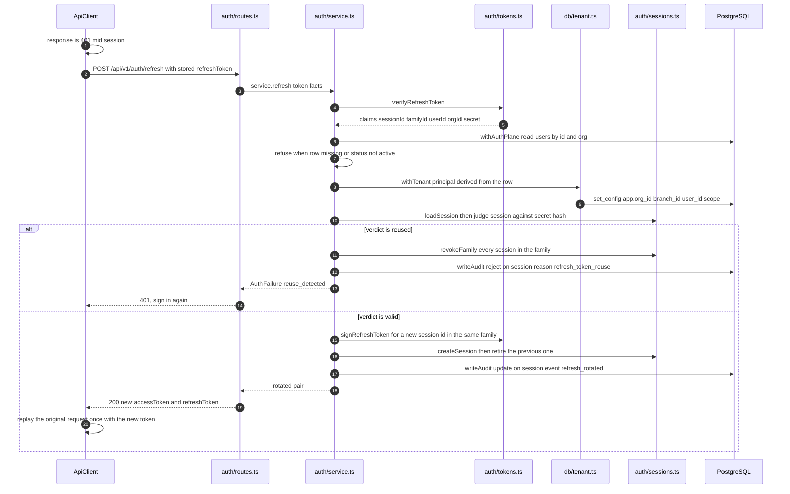

The role on the refresh token is never used. It is re-read from the `users` row every time, so a role change takes effect on the next rotation rather than waiting out an access token's lifetime.

## A generated collection read

This is the path every generated collection endpoint takes — the `GENERATED` rows in `project-control/API_REGISTRY.json`. The example is `GET /api/v1/inventory`.

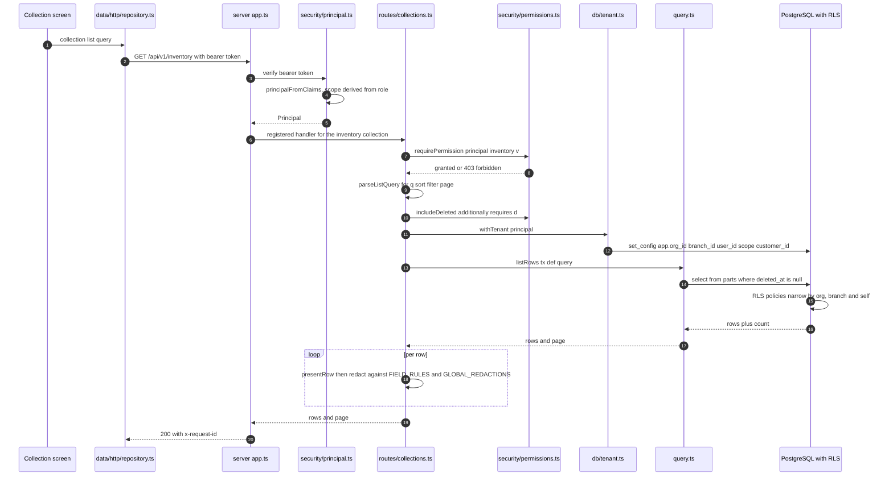

No audit row is written for a read. The registry marks generated read endpoints `audited: true`, which describes the collection's write side rather than this handler — `GET` calls no `writeAudit`.

## An estimate created

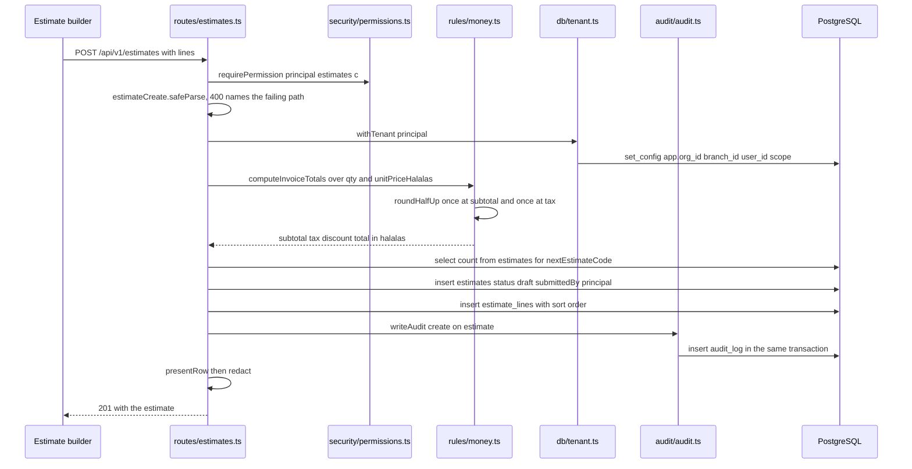

`VAT_RATE_BPS` is stored in basis points so the rate itself is exact, and every figure above is an integer count of halalas. No client-sent total is read anywhere in this path.

## An estimate approved over OTP

Two requests. The first sends the code, the second records the signature. Neither changes the estimate's status.

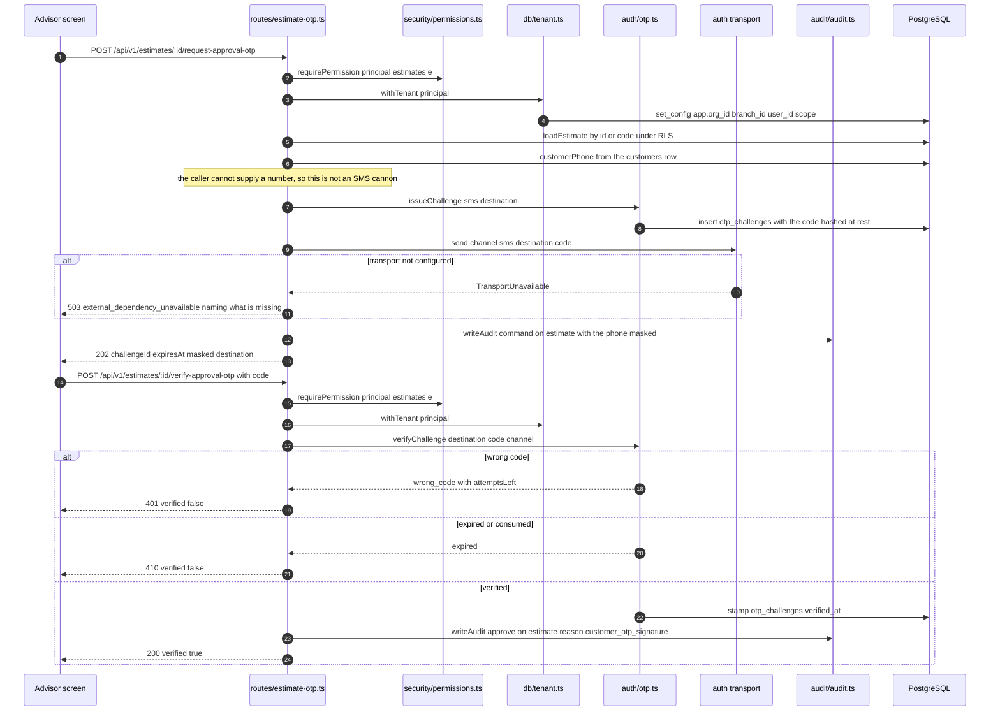

The verified challenge row plus that `approve` audit row are the persisted e-signature. `estimates.status` is untouched — the shop's own decision is the separate `/approve` route below.

## An estimate approved internally

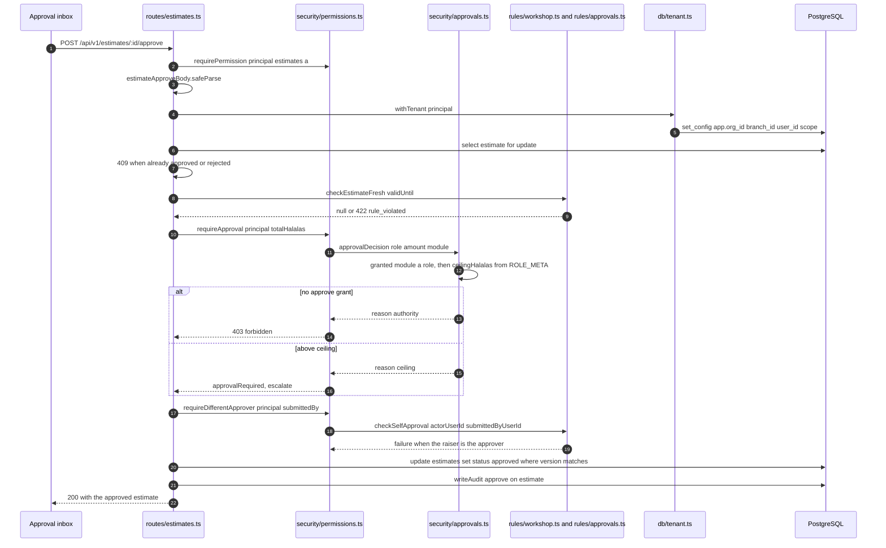

The order is deliberate. Ceiling first, then segregation of duties, because the two refusals mean different things: one says escalate, the other says find someone else.

## An invoice issued

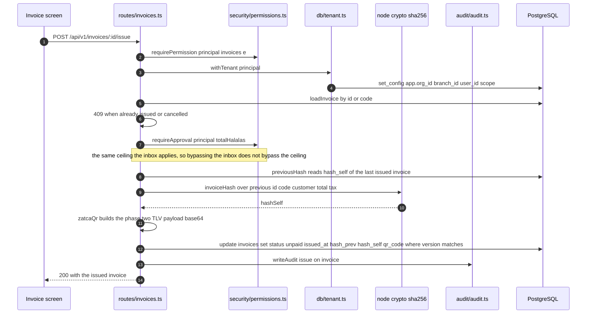

No journal entry is written here. NOT IMPLEMENTED — nothing in this path touches `journal_entries` or `chart_of_accounts`, so issuing an invoice does not post a receivable.

## A payment recorded

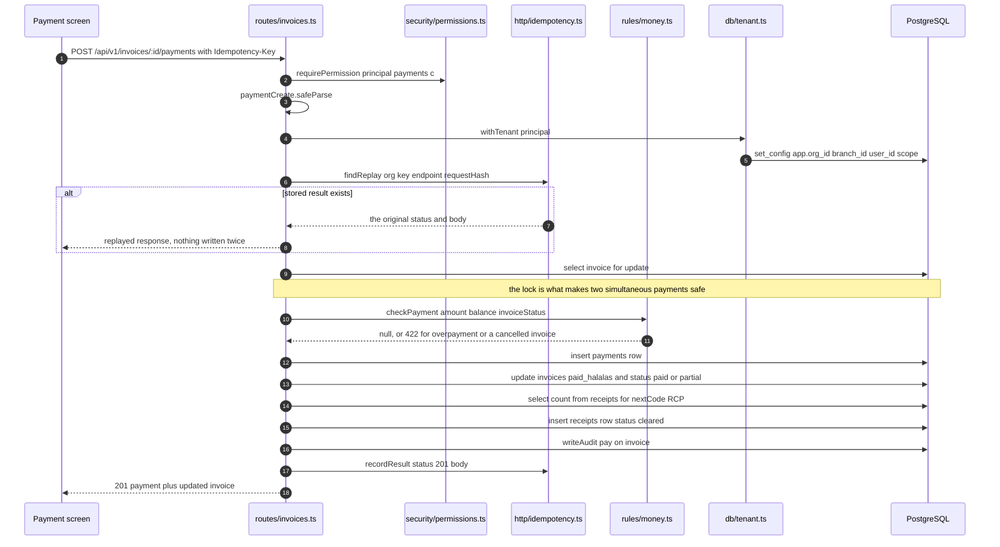

The same key with a different body answers 409; that is a caller bug, not a replay.

## A purchase order approved

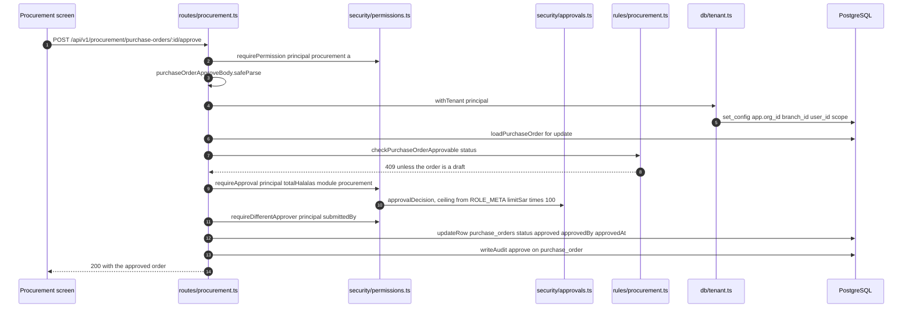

The total checked is the server's own `purchaseOrderTotals` figure, never a client-sent one. `requireSodClear` is **not** called here; the `Raise purchase order` and `Approve purchase order` signatures exist in `server/src/security/sod.ts` and only the `submittedBy` column check fires on this route.

## An inventory movement

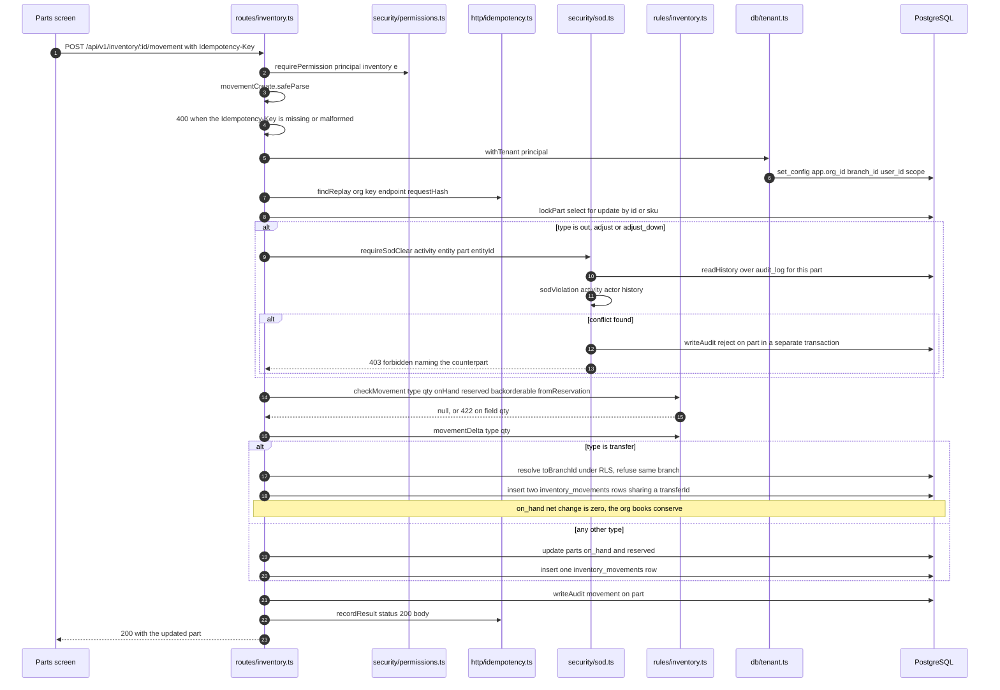

The SOD refusal is audited in its own transaction on purpose. The caller's transaction is about to roll back, and an audit row written inside it would roll back with it, losing the one event most worth keeping.

## A job card released through QC

The clearest example of the two-layer SOD control: one check on the record, one over the trail.

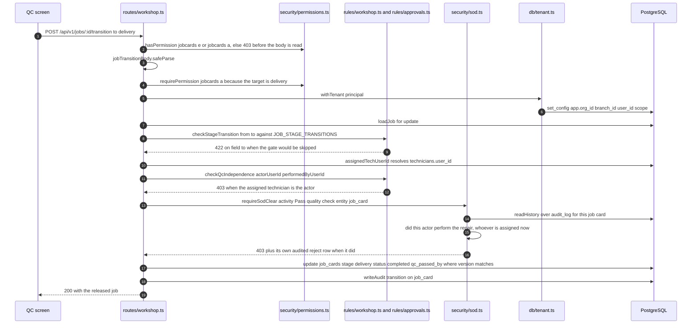

## Surface

`project-control/API_REGISTRY.json` is the authority for the endpoint surface and carries its own counts in `totals`; every route named in this document and in `PROCESS_CATALOG.md` resolves there, generated collection list and create routes included.
