**Status:** NORMATIVE · **Owner:** Process architect

# User flows

This file shows what each role can actually do, as a flowchart of the human's path through the product. The roles, their data scope and their approval ceiling are the fifteen in `packages/contract/src/rbac.ts`, which is the matrix `server/src/security/permissions.ts` enforces; every branch drawn below is permitted by that matrix, and where a role would expect a step it does not hold the grant for, the diagram says the gate refuses. Nothing here is drawn from a screen mock — a flow that the matrix denies is not shown as a flow, it is listed as a denial.

## Roles, scope and ceiling

`scope` and `limitSar` come from `ROLE_META` in `packages/contract/src/rbac.ts`, mirrored into `roleMeta` in `project-control/PERMISSION_REGISTRY.json`. The ceiling in halalas is `limitSar × 100`, computed in one place by `ceilingHalalas` in `server/src/security/approvals.ts`.

| Role | Data scope | Approval ceiling SAR | Ceiling halalas | Holds `a` on |
| --- | --- | --- | --- | --- |
| owner | all | unlimited | unlimited | jobcards, appointments, estimates, customers, vehicles, inventory, procurement, invoices, payments, accounting, hr, technicians, crm, approvals, ai, admin, settings, network |
| superadmin | platform | unlimited | unlimited | ai, admin, settings only — **not** on any business module |
| manager | branch | 50000 | 5000000 | jobcards, appointments, estimates, inventory, procurement, invoices, payments, technicians, approvals |
| advisor | branch | 5000 | 500000 | jobcards, approvals |
| technician | own | 0 | 0 | nothing |
| qc | branch | 0 | 0 | jobcards |
| parts | branch | 10000 | 1000000 | inventory, approvals |
| accountant | all | 25000 | 2500000 | procurement, invoices, payments, accounting, approvals |
| hr | all | 15000 | 1500000 | hr, approvals |
| frontdesk | branch | 0 | 0 | nothing |
| callcenter | all | 0 | 0 | nothing |
| procurement | all | 20000 | 2000000 | procurement, approvals, network |
| supplier | external | 0 | 0 | nothing |
| customer | self | 0 | 0 | nothing |
| test | all | unlimited | unlimited | every module — the QA account, not a business role |

Two consequences of `canApprove` in `server/src/security/approvals.ts` that the ceiling column alone does not show:

- **A ceiling of zero is not a licence.** `canApprove` returns true for a zero-ceiling role only when no amount is supplied. So qc may pass a quality check, which carries no amount, and may approve nothing that does.
- **An unlimited ceiling is not authority.** superadmin has no `a` grant on any business module, so despite the null ceiling it can approve no estimate, purchase order, invoice or claim. The refusal reason is `authority`, not `ceiling`.

## Field redaction by role

`FIELD_RULES` in `packages/contract/src/rbac.ts`, applied on the way out by `redact` in `server/src/security/permissions.ts`, so a hidden field is never serialised.

| Field | Hidden from |
| --- | --- |
| Part cost and margin | advisor, technician, qc, frontdesk, callcenter, customer, supplier |
| Labour cost rate | technician, qc, frontdesk, callcenter, customer, supplier |
| Employee salary | advisor, technician, qc, parts, frontdesk, callcenter, procurement, supplier, customer |
| Supplier purchase price | advisor, technician, qc, frontdesk, callcenter, customer |
| Customer contact details | technician, qc, supplier |
| Bank account details | advisor, technician, qc, parts, frontdesk, callcenter, hr, procurement, supplier, customer |
| Branch P and L | advisor, technician, qc, parts, frontdesk, callcenter, procurement, supplier, customer |

`Employee salary` and `Branch P and L` are recorded in `DEFENCE_IN_DEPTH_FIELDS`: they hide fields only from roles the module gate already turns away, so they protect nothing today and are swept globally in case a future payload starts carrying those keys.

---

## owner — scope all, unlimited ceiling

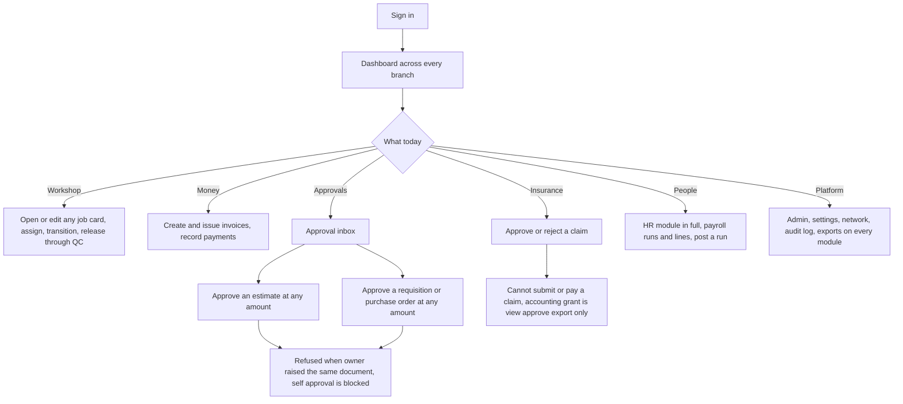

The owner's only routine refusal is segregation of duties: `requireDifferentApprover` blocks self-approval regardless of role, and `requireSodClear` blocks an owner who moved a job through repair from passing its quality check. The owner's grant on `accounting` is `vax`, so bank matching, claim submission and claim payment — all `accounting:e` — are refused.

## superadmin — scope platform, unlimited ceiling, no business approval

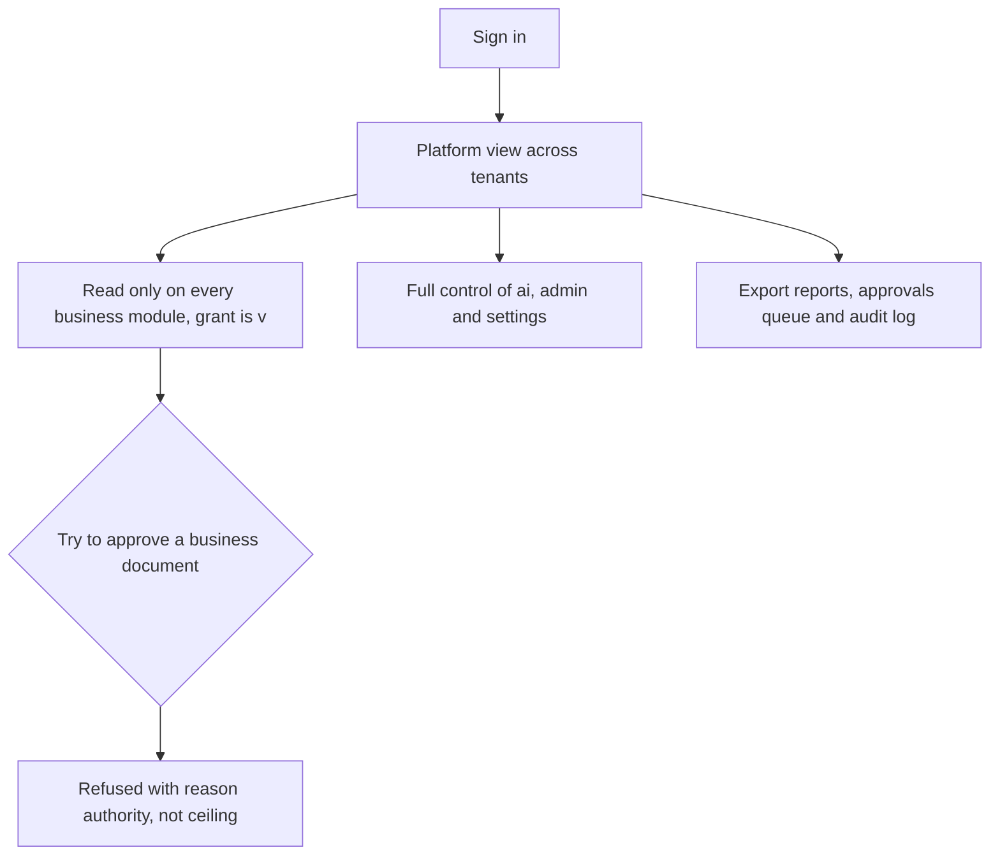

## manager — scope branch, ceiling 5000000 halalas

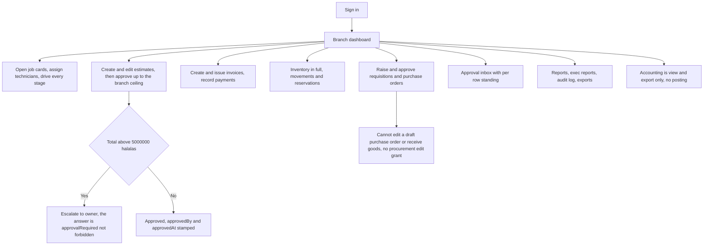

## advisor — scope branch, ceiling 500000 halalas

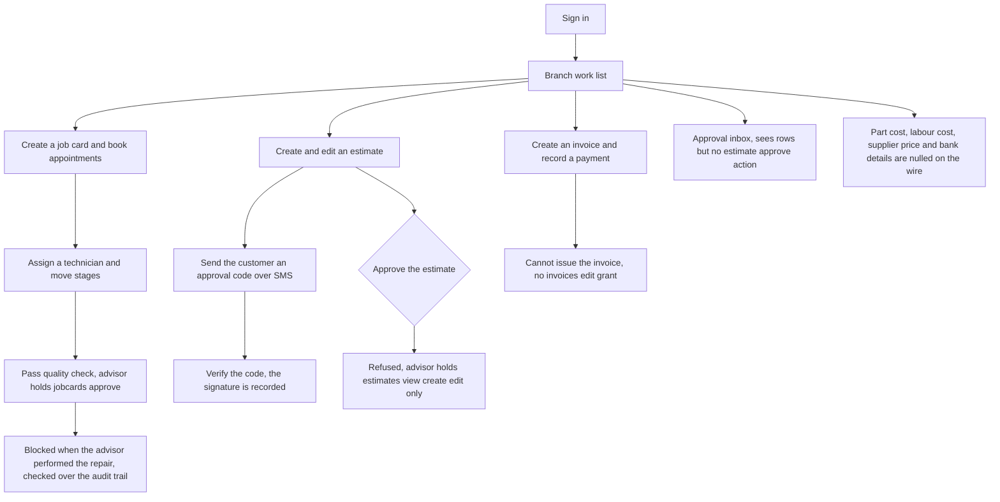

The advisor is the clearest case where the inbox and the action disagree by design: `approvals:va` puts the queue in front of them, `estimates:vce` keeps the decision away from them. The `approval.canApprove` flag the queue returns is computed per caller and will be false on every estimate row for this role.

## technician — scope own, ceiling zero

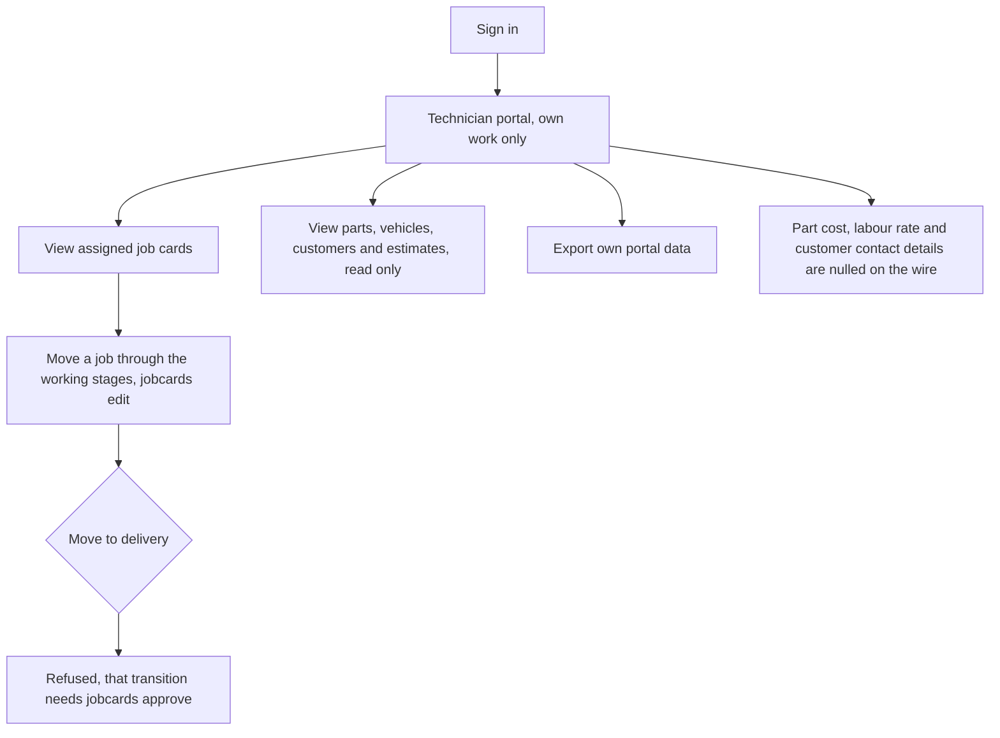

## qc — scope branch, ceiling zero

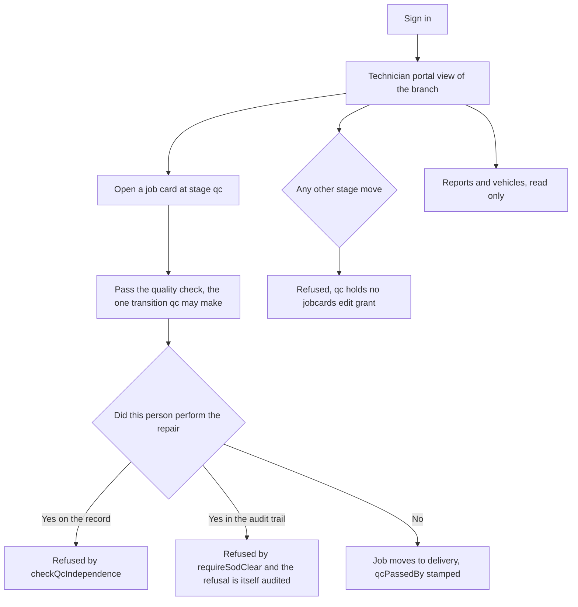

## parts — scope branch, ceiling 1000000 halalas

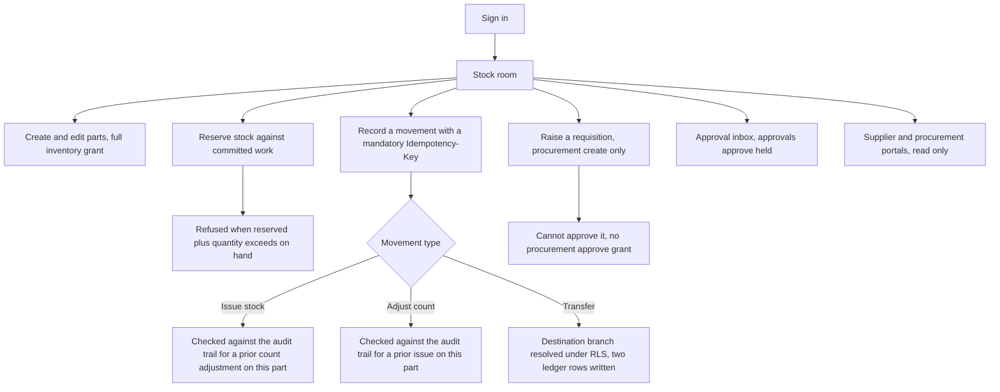

## accountant — scope all, ceiling 2500000 halalas

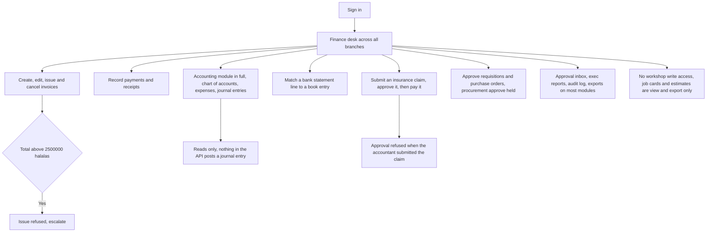

## hr — scope all, ceiling 1500000 halalas

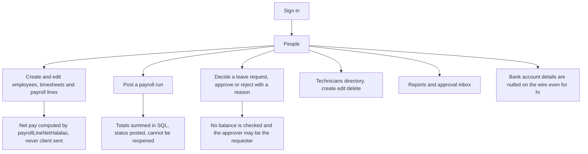

## frontdesk — scope branch, ceiling zero

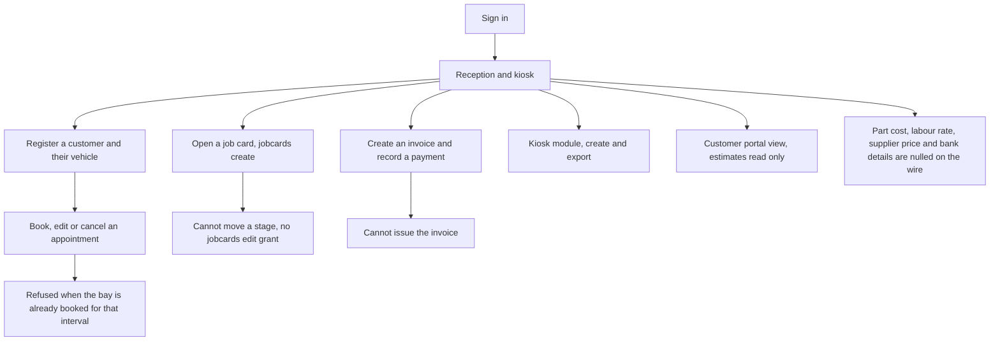

## callcenter — scope all, ceiling zero

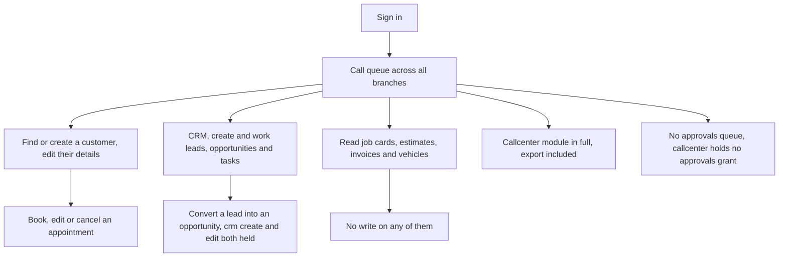

## procurement — scope all, ceiling 2000000 halalas

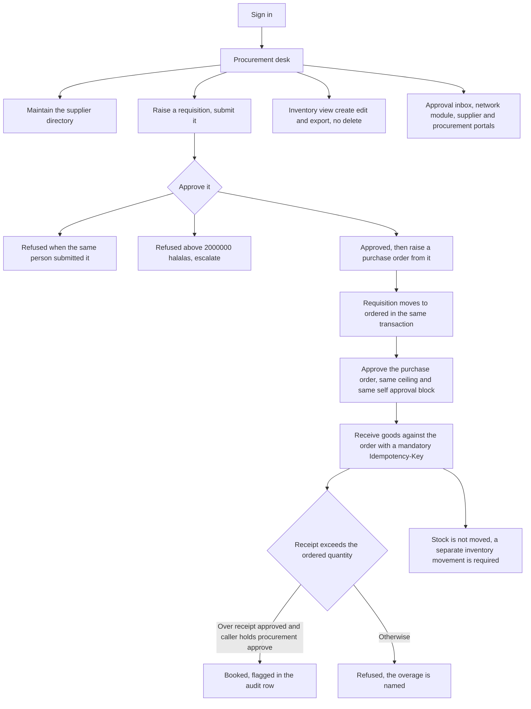

## supplier — scope external, ceiling zero

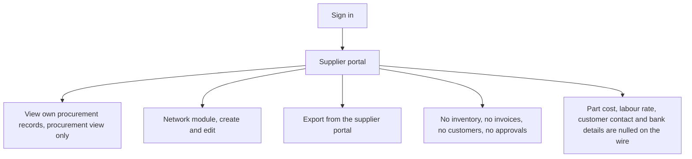

## customer — scope self, ceiling zero

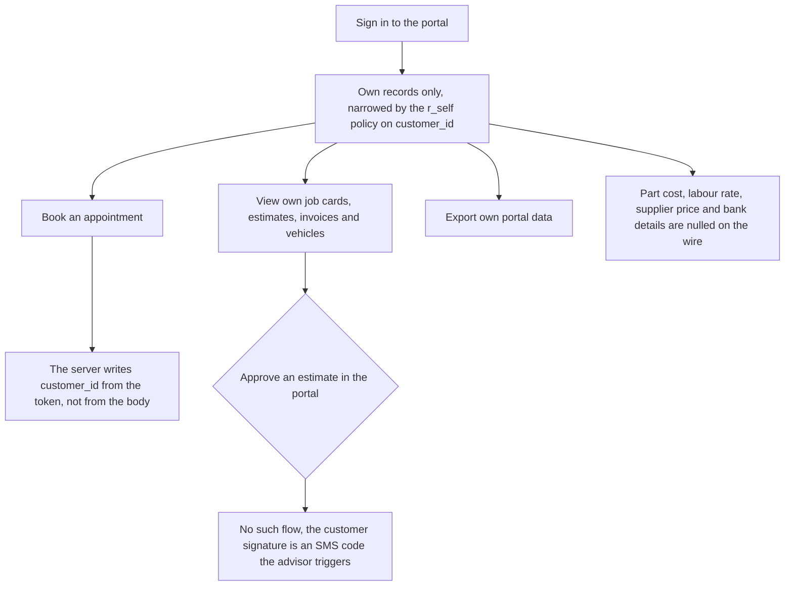

A self-scoped principal with no `customer_id` on its user row sees nothing rather than everything, because NULL matches no row under the `r_self` policies in `server/drizzle/0014_customer_id_link.sql`.

## test — scope all, unlimited, QA only

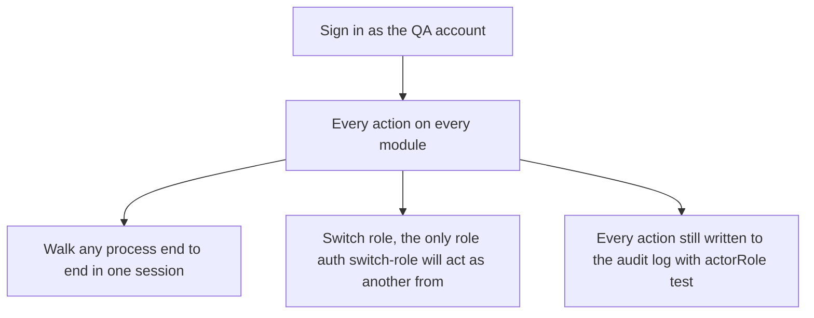

This is not a business role. Its breadth is the reason the audit module is enforced rather than assumed.

## Denials worth knowing

| Role | Wants to | Refused because |
| --- | --- | --- |
| advisor | approve an estimate | `estimates` grant is `vce`; only manager and owner hold `a` |
| advisor | issue an invoice | `invoices` grant is `vc`, issue needs `e` |
| superadmin | approve anything financial | holds no `a` on any business module; reason is `authority` |
| owner | match a bank statement, submit or pay an insurance claim | `accounting` grant is `vax`, all three need `e` |
| manager | edit a draft purchase order or receive goods | `procurement` grant is `vcax`, both need `e` |
| parts | approve the requisition they raised | `procurement` grant is `vc`, and self-approval is blocked anyway |
| qc | move a job through any stage other than the QC release | `jobcards` grant is `va`, every other transition needs `e` |
| technician | move a job to delivery | that one transition is gated on `jobcards:a` |
| frontdesk | move a job card stage | `jobcards` grant is `vc` |
| callcenter | open the approval inbox | holds no `approvals` grant |
| customer, supplier | see any cost, margin or bank detail | redacted server-side before serialisation |

## Source note

The grants above are `packages/contract/src/rbac.ts`, the matrix `server/src/security/actions.ts` reads and `server/src/security/permissions.ts` enforces. `project-control/PERMISSION_REGISTRY.json` is generated from that file and agrees with it cell for cell; either may be read, and the registry carries the cell counts in `totals`.
