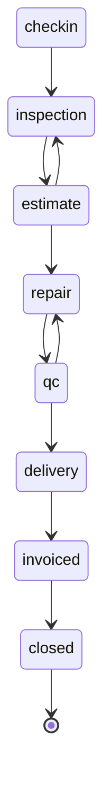

<!-- GENERATED FILE — DO NOT EDIT BY HAND.
     Generator: tools/docs/generators/architecture.mjs
     Regenerate: node tools/docs/generate.mjs
     Derived from:
       - packages/contract/src/entities/*.ts
       - packages/contract/src/rules/*.ts
-->

# State machines

**Status:** GENERATED · **Sources as of:** 2026-09-19

## What is and is not declared

21 lifecycles exist in the contract. **1 declares a machine-readable transition table**; the other 20 declare a set of states with no table of legal moves.

That distinction matters more than it looks. Where a transition table exists, an illegal move is refused by a single guard that every caller goes through. Where only a state enum exists, the legal moves are whatever the route handlers happen to check — which may be complete, may be partial, and cannot be verified by reading one file. Drawing a confident diagram for those would assert a guarantee the code does not make, so this document shows their states and names what actually guards them.

## jobCard — `JOB_STAGE_TRANSITIONS`

**DECLARED TRANSITION TABLE** · `packages/contract/src/entities/jobCard.ts` · 8 states, 10 legal transitions

The stage machine. A transition not listed here is refused with 422 — the client's stepper is a convenience, this is the rule.

| From | To |
| --- | --- |
| `checkin` | `inspection` |
| `inspection` | `estimate` |
| `estimate` | `repair` |
| `estimate` | `inspection` |
| `repair` | `qc` |
| `qc` | `delivery` |
| `qc` | `repair` |
| `delivery` | `invoiced` |
| `invoiced` | `closed` |
| `closed` | _terminal_ |

Terminal states: `closed`. Enforced by `canTransition` via `checkStageTransition` in `packages/contract/src/rules/workshop.ts`.

## Lifecycles with states but no declared transition table

### appointment — `appointmentStatus`

**STATE SET ONLY** · `packages/contract/src/entities/appointment.ts`

States: `confirmed` · `awaiting` · `no-show` · `cancelled` · `completed`

Guarded by: `overlaps` (packages/contract/src/rules/workshop.ts).

### crm — `crmTaskStatus`

**STATE SET ONLY** · `packages/contract/src/entities/crm.ts`

States: `todo` · `in_progress` · `done`

No rule guard in `packages/contract/src/rules` names this lifecycle. Any transition constraint is in the route handler, or absent.

### declined-job — `declinedJobStatus`

**STATE SET ONLY** · `packages/contract/src/entities/declined-job.ts`

States: `declined` · `follow_up_scheduled` · `contacted` · `reconsidering` · `approved_later` · `permanently_declined` · `expired`

No rule guard in `packages/contract/src/rules` names this lifecycle. Any transition constraint is in the route handler, or absent.

### estimate — `estimateStatus`

**STATE SET ONLY** · `packages/contract/src/entities/estimate.ts`

States: `draft` · `sent` · `approved` · `rejected` · `expired`

Guarded by: `requisitionEstimatedTotalHalalas` (packages/contract/src/rules/procurement.ts), `checkEstimateFresh` (packages/contract/src/rules/workshop.ts).

### fleet — `fleetContractStatus`

**STATE SET ONLY** · `packages/contract/src/entities/fleet.ts`

States: `active` · `renewal` · `expired` · `suspended`

No rule guard in `packages/contract/src/rules` names this lifecycle. Any transition constraint is in the route handler, or absent.

### hr — `employmentStatus`

**STATE SET ONLY** · `packages/contract/src/entities/hr.ts`

States: `active` · `on_leave` · `terminated`

Guarded by: `payrollLineNetHalalas` (packages/contract/src/rules/hr.ts), `sumPayrollLines` (packages/contract/src/rules/hr.ts).

### hr — `payrollRunStatus`

**STATE SET ONLY** · `packages/contract/src/entities/hr.ts`

States: `draft` · `posted`

Guarded by: `payrollLineNetHalalas` (packages/contract/src/rules/hr.ts), `sumPayrollLines` (packages/contract/src/rules/hr.ts).

### hr — `timesheetStatus`

**STATE SET ONLY** · `packages/contract/src/entities/hr.ts`

States: `submitted` · `approved` · `rejected`

Guarded by: `payrollLineNetHalalas` (packages/contract/src/rules/hr.ts), `sumPayrollLines` (packages/contract/src/rules/hr.ts).

### inspection — `inspectionMediaStage`

**STATE SET ONLY** · `packages/contract/src/entities/inspection.ts`

States: `before` · `after`

No rule guard in `packages/contract/src/rules` names this lifecycle. Any transition constraint is in the route handler, or absent.

### insurance — `insurancePolicyStatus`

**STATE SET ONLY** · `packages/contract/src/entities/insurance.ts`

States: `active` · `expired` · `cancelled`

No rule guard in `packages/contract/src/rules` names this lifecycle. Any transition constraint is in the route handler, or absent.

### insurance — `insuranceClaimStatus`

**STATE SET ONLY** · `packages/contract/src/entities/insurance.ts`

States: `submitted` · `under_review` · `approved` · `rejected` · `paid`

No rule guard in `packages/contract/src/rules` names this lifecycle. Any transition constraint is in the route handler, or absent.

### invoice — `invoiceStatus`

**STATE SET ONLY** · `packages/contract/src/entities/invoice.ts`

States: `draft` · `unpaid` · `partial` · `paid` · `overdue` · `cancelled`

Guarded by: `checkPayment` (packages/contract/src/rules/money.ts), `computeInvoiceTotals` (packages/contract/src/rules/money.ts).

### jobCard — `jobStatus`

**STATE SET ONLY** · `packages/contract/src/entities/jobCard.ts`

States: `pending` · `in_progress` · `completed` · `delivered` · `cancelled`

No rule guard in `packages/contract/src/rules` names this lifecycle. Any transition constraint is in the route handler, or absent.

### loan — `loanContractStatus`

**STATE SET ONLY** · `packages/contract/src/entities/loan.ts`

States: `active` · `settled` · `defaulted` · `cancelled`

Guarded by: `amortisedInstalmentHalalas` (packages/contract/src/rules/loans.ts), `buildRepaymentPlan` (packages/contract/src/rules/loans.ts).

### loan — `loanRepaymentStatus`

**STATE SET ONLY** · `packages/contract/src/entities/loan.ts`

States: `due` · `paid` · `overdue`

Guarded by: `amortisedInstalmentHalalas` (packages/contract/src/rules/loans.ts), `buildRepaymentPlan` (packages/contract/src/rules/loans.ts).

### procurement — `supplierStatus`

**STATE SET ONLY** · `packages/contract/src/entities/procurement.ts`

States: `active` · `inactive`

Guarded by: `checkPurchaseOrderApprovable` (packages/contract/src/rules/procurement.ts), `checkReceive` (packages/contract/src/rules/procurement.ts), `purchaseOrderTotals` (packages/contract/src/rules/procurement.ts), `requisitionEstimatedTotalHalalas` (packages/contract/src/rules/procurement.ts).

### procurement — `requisitionStatus`

**STATE SET ONLY** · `packages/contract/src/entities/procurement.ts`

States: `draft` · `submitted` · `approved` · `rejected` · `ordered`

Guarded by: `checkPurchaseOrderApprovable` (packages/contract/src/rules/procurement.ts), `checkReceive` (packages/contract/src/rules/procurement.ts), `purchaseOrderTotals` (packages/contract/src/rules/procurement.ts), `requisitionEstimatedTotalHalalas` (packages/contract/src/rules/procurement.ts).

### procurement — `purchaseOrderStatus`

**STATE SET ONLY** · `packages/contract/src/entities/procurement.ts`

States: `draft` · `approved` · `sent` · `receiving` · `received` · `closed`

Guarded by: `checkPurchaseOrderApprovable` (packages/contract/src/rules/procurement.ts), `checkReceive` (packages/contract/src/rules/procurement.ts), `purchaseOrderTotals` (packages/contract/src/rules/procurement.ts), `requisitionEstimatedTotalHalalas` (packages/contract/src/rules/procurement.ts).

### vehicle — `vehicleStatus`

**STATE SET ONLY** · `packages/contract/src/entities/vehicle.ts`

States: `active` · `service` · `inactive`

No rule guard in `packages/contract/src/rules` names this lifecycle. Any transition constraint is in the route handler, or absent.

### warranty — `warrantyStatus`

**STATE SET ONLY** · `packages/contract/src/entities/warranty.ts`

States: `active` · `claimed` · `expired`

No rule guard in `packages/contract/src/rules` names this lifecycle. Any transition constraint is in the route handler, or absent.
