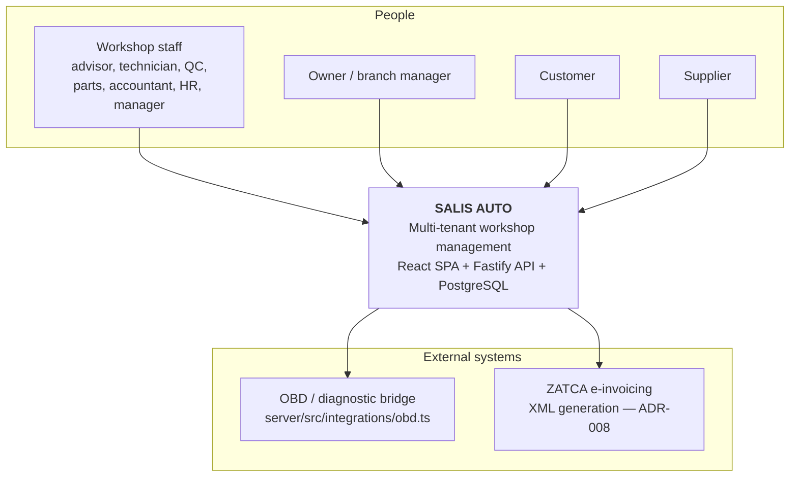
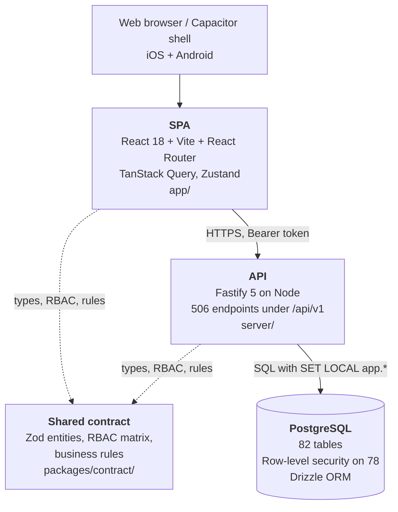
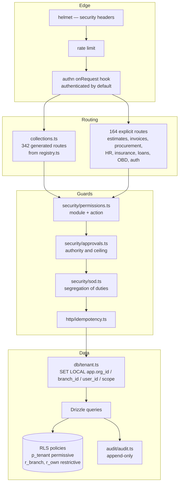
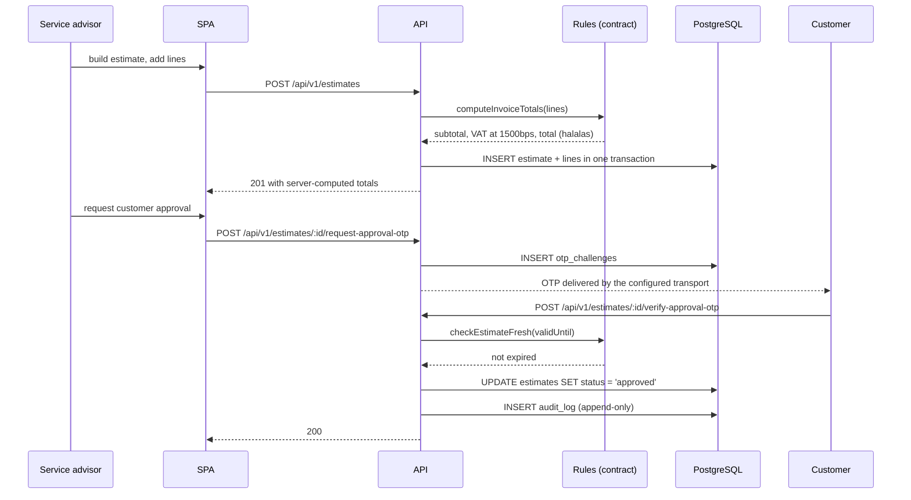

<!-- GENERATED FILE — DO NOT EDIT BY HAND.
     Generator: tools/docs/generators/architecture.mjs
     Regenerate: node tools/docs/generate.mjs
     Derived from:
       - server/src/app.ts
       - server/src/registry.ts
       - app/src/data/http/*
       - server/drizzle/*.sql
-->

# C4 model

**Status:** GENERATED · **Sources as of:** 2026-09-19 · **Scope:** CURRENT implementation

Everything on these diagrams exists in the repository today. Nothing planned is drawn.

## Level 1 — System context

## Level 2 — Containers

The contract package is the load-bearing piece. Both sides read the same permission matrix and the same rule functions, and `server/tests/rbac-parity.test.ts` asserts the two copies are identical rather than merely similar. Frontend RBAC hides and disables; the server decides.

## Level 3 — Components inside the API

## Dynamic view — an estimate approved by a customer over OTP

## Domains served by the API

| Domain | Endpoints | Capability |
| --- | --- | --- |
| accounting | 37 | CAP-ACCOUNTING |
| admin | 2 | CAP-PLATFORM |
| ai | 8 | CAP-AI |
| appointments | 9 | CAP-WORKSHOP |
| approvals | 5 | CAP-GOVERNANCE |
| audit | 1 | CAP-GOVERNANCE |
| auth | 26 | CAP-IDENTITY |
| crm | 51 | CAP-CRM |
| customers | 20 | CAP-CUSTOMERS |
| dashboard | 13 | CAP-PLATFORM |
| departments | 9 | CAP-PLATFORM |
| estimates | 29 | CAP-WORKSHOP |
| hr | 48 | CAP-HR |
| insurance | 22 | CAP-ACCOUNTING |
| inventory | 22 | CAP-INVENTORY |
| invoices | 14 | CAP-BILLING |
| jobcards | 90 | CAP-WORKSHOP |
| network | 37 | CAP-PLATFORM |
| payments | 11 | CAP-BILLING |
| platform | 3 | CAP-PLATFORM |
| procurement | 28 | CAP-PROCUREMENT |
| settings | 8 | CAP-PLATFORM |
| technicians | 4 | CAP-HR |
| vehicles | 9 | CAP-VEHICLES |
