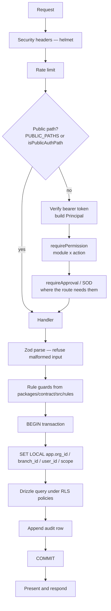

<!-- GENERATED FILE — DO NOT EDIT BY HAND.
     Generator: tools/docs/generators/design.mjs
     Regenerate: node tools/docs/generate.mjs
     Derived from:
       - server/src/app.ts
       - server/src/security/*.ts
       - server/src/http/*.ts
       - server/src/db/tenant.ts
       - server/src/audit/audit.ts
       - server/src/registry.ts
       - packages/contract/src/rules/*.ts
       - server/drizzle/*.sql
-->

# Request pipeline design

**Status:** GENERATED · **Sources as of:** 2026-09-15

Covers: authentication, authorization, approval, segregation of duties, tenancy, validation, error handling, idempotency, concurrency, audit.

## The pipeline

Order is load-bearing. Each stage refuses before the next one runs, so an unauthorized request never reaches a query and a failed rule never reaches a write.

## Why each stage is where it is

| Stage | Design decision | What it prevents |
| --- | --- | --- |
| Authentication as an `onRequest` hook | Applied to everything, with an explicit public allow-list | A route added later cannot quietly skip authentication — it is authenticated by default and must be named to be public |
| Permission before any query | The check runs before the transaction opens | An unauthorized caller never reaches the database, so timing and error shape leak nothing about what exists |
| Approval distinct from permission | Authority *and* ceiling, returning `approval_required` rather than `forbidden` above the ceiling | A user being told "forbidden" when the real answer is "escalate this" — which sends them to ask for a permission that would not help |
| SOD after permission | The actor may hold the grant and still be the wrong person | One person raising and approving the same document |
| Validation before rules | Zod refuses malformed input first | A rule function receiving a shape it was never written for |
| Rules before the transaction | Pure functions, no I/O | A half-applied write that a rule would have refused |
| `SET LOCAL` inside the transaction | Context is transaction-scoped | Context leaking to the next request on a pooled connection |
| Audit inside the same transaction | The audit row commits with the change | A change with no audit row, or an audit row for a change that rolled back |

## Error design

| Condition | Status | Why that status |
| --- | --- | --- |
| Malformed input | 400 | Zod issues are returned with their paths, so a client can point at the field |
| No token, or an invalid one | 401 | — |
| Grant absent | 403 | Names the role, the action and the module — a message a user can act on |
| Above the approval ceiling | approval-required | Distinct from 403 on purpose: the answer is escalate, not deny |
| Row outside the data scope | **404, not 403** | A 403 confirms the row exists, which leaks across the tenant or branch boundary |
| Stale `version` | 409 | Someone else changed it; the screen should offer to reload rather than show a generic failure |
| Unique violation (SQLSTATE 23505) | 409 | Dug out of the driver error chain — see below |
| Foreign-key violation (23503) | 409 | As above |
| Idempotency key reused with a different body | refused | A caller-side bug; replaying would produce a wrong result silently |

### The driver-error unwrapping, and why it is written down

drizzle-orm 0.44 began wrapping every driver failure in a `DrizzleQueryError` whose message is the generated SQL and whose `code` is undefined; the `PostgresError` carrying the SQLSTATE moved to `.cause`. Reading `error.code` directly therefore stopped seeing 23505 and 23503, and **a duplicate phone number started answering 500 instead of 409**.

The failure was silent because both shapes are plain objects — neither TypeScript nor the driver complains about a property that is simply absent. `server/src/app.ts` walks the cause chain rather than importing the wrapper class, so it keeps working across driver versions and if a future one adds another layer. `code` is trusted only in SQLSTATE shape.

This is the kind of thing that belongs in a design document: it is not recoverable from reading the current code, and the next person to touch error handling needs it.

## Idempotency

| Property | Design |
| --- | --- |
| Key scope | `(org_id, key, endpoint)`, unique index — a key is meaningful only within its tenant and its endpoint |
| Body binding | A digest of the request body is stored. The same key with a different body is refused, never replayed |
| Replay | Returns the stored response and status. No second business effect occurs |
| Storage | `idempotency_keys`, holding the response body as `jsonb` |

## Concurrency

Optimistic, on `version`. The value is incremented by the `bump_version` trigger, not by the statement, so a hand-written `UPDATE` cannot leave a stale version behind and let the next writer overwrite a change they never saw. `updated_at` is set by the same trigger for the same reason.
