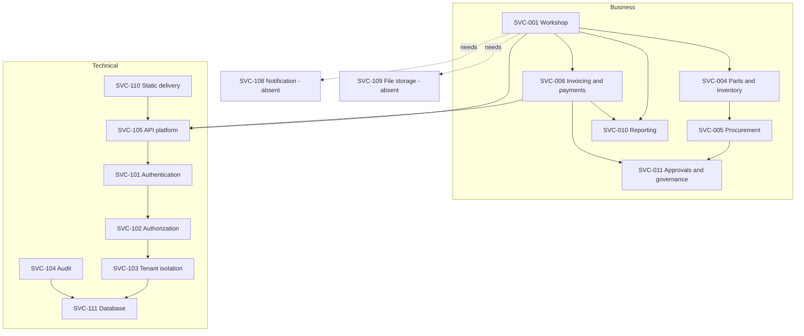

**Status:** NORMATIVE · **Owner:** Service architect

# Service catalogue

This catalogue describes services SALIS AUTO is **designed** to offer its tenants. It is not a record of an operating service: this workspace contains no production deployment, no tenant contracts and no operating history, so nothing here reports attainment, volume or availability achieved. Every service level in this document is a **TARGET**. Each service is labelled CURRENT where the realising code exists in the repository today, PARTIAL where it exists but is not wired end to end, and ABSENT where the capability is named by the product but nothing in the repository implements it.

Derived from `project-control/CAPABILITY_REGISTRY.json` (18 capabilities, 424 of 424 screens mapped, 372 of 372 endpoints mapped), `project-control/PERMISSION_REGISTRY.json` (15 roles, 28 permission modules), `server/src/registry.ts` and the route files.

## Reading the columns

| Column | Meaning |
| --- | --- |
| Realisation | CURRENT — code exists and is reachable. PARTIAL — code exists, one or more dependencies are unconfigured or the screens still read fixtures. ABSENT — no implementation in this repository. |
| Criticality | Designed business criticality: **Vital** (workshop stops without it), **Important** (business degrades), **Supporting** (internal or deferrable). No operating evidence backs these; they are an architect's assignment. |
| Service level | TARGET only. Quantified availability, response-time and support targets are stated once, in `docs/system/sla-document.md`, and are not restated here. No attainment against them has ever been measured. |

Consumer roles are the real role identifiers from `packages/contract/src/rbac.ts` as published in `project-control/PERMISSION_REGISTRY.json`: `owner`, `superadmin`, `manager`, `advisor`, `technician`, `qc`, `parts`, `accountant`, `hr`, `frontdesk`, `callcenter`, `procurement`, `supplier`, `customer`, `test`. `test` is a fixture role and is excluded from the consumer lists below; it is not a business consumer.

---

## 1. Business services

These realise the capability registry one-to-one. The registry is the source of truth for the endpoint, screen and entity counts quoted.

### SVC-001 Workshop operations

| Field | Value |
| --- | --- |
| Capability | CAP-WORKSHOP — objective OBJ-THROUGHPUT |
| Description | Appointment booking, job cards and their state transitions, estimates with customer approval, inspection, QC and delivery, and the OBD diagnostic surfaces. |
| Consumers | owner, superadmin, manager, advisor, technician, qc, parts, accountant, frontdesk, callcenter, customer |
| Supporting components | `server/src/routes/workshop.ts`, `routes/estimates.ts`, `routes/estimate-otp.ts`, `routes/obd.ts`, `routes/workshop-reports.ts`; 16 screens and 76 endpoints in this capability |
| Dependencies | SVC-101 Identity, SVC-102 Authorization, SVC-103 Tenant isolation, SVC-104 Audit, SVC-111 Database, SVC-107 OBD bridge (unconfigured), SVC-108 Notification (absent — blocks estimate-approval OTP delivery) |
| Realisation | PARTIAL — 12 of 16 screens data-backed; estimate approval OTP cannot be delivered because no transport is configured |
| Criticality | Vital |
| Service level | TARGET — highest availability tier; see `docs/system/sla-document.md` |

### SVC-002 Customer management

| Field | Value |
| --- | --- |
| Capability | CAP-CUSTOMERS — OBJ-RETENTION |
| Description | Customer and fleet records, contact history, fleet contract renewal, customer feedback. |
| Consumers | owner, superadmin, manager, advisor, technician, accountant, frontdesk, callcenter |
| Supporting components | `routes/collections.ts` (generated customer and fleet routes), `routes/fleets.ts`; 3 screens and 19 endpoints in this capability; entities `customers`, `fleets` |
| Dependencies | SVC-101, SVC-102, SVC-103, SVC-104, SVC-111 |
| Realisation | CURRENT — 3 of 3 screens data-backed |
| Criticality | Vital |
| Service level | TARGET |

### SVC-003 Vehicle management

| Field | Value |
| --- | --- |
| Capability | CAP-VEHICLES — OBJ-THROUGHPUT |
| Description | Vehicle master data, service history, fleet assignment and fleet contracts. |
| Consumers | owner, superadmin, manager, advisor, technician, qc, accountant, frontdesk, callcenter, customer |
| Supporting components | generated vehicle routes in `routes/collections.ts`; 4 screens and 9 endpoints in this capability |
| Dependencies | SVC-101, SVC-102, SVC-103, SVC-104, SVC-111 |
| Realisation | CURRENT — 4 of 4 screens data-backed |
| Criticality | Vital |
| Service level | TARGET |

### SVC-004 Parts and inventory

| Field | Value |
| --- | --- |
| Capability | CAP-INVENTORY — OBJ-MARGIN |
| Description | Part master data, stock movements, reservations and releases, receiving. |
| Consumers | owner, superadmin, manager, advisor, technician, parts, accountant, procurement |
| Supporting components | `routes/inventory.ts`; 7 screens and 13 endpoints in this capability; business rules `BR-INVENTORY-*` in `packages/contract` |
| Dependencies | SVC-101, SVC-102, SVC-103, SVC-104, SVC-111, SVC-001 (consumption against job cards) |
| Realisation | PARTIAL — 1 of 7 screens data-backed; the parts-network screens read fixtures |
| Criticality | Vital |
| Service level | TARGET |

### SVC-005 Procurement

| Field | Value |
| --- | --- |
| Capability | CAP-PROCUREMENT — OBJ-MARGIN |
| Description | Requisitions, approval against role ceilings, purchase orders, supplier records, goods receipt. |
| Consumers | owner, superadmin, manager, parts, procurement, accountant (approval ceilings per role in `PERMISSION_REGISTRY.roleMeta`); `supplier` is an external-scope consumer of the supplier portal only |
| Supporting components | `routes/procurement.ts`, `security/approvals.ts`, `security/sod.ts`; 1 screen and 28 endpoints in this capability |
| Dependencies | SVC-101, SVC-102, SVC-103, SVC-104, SVC-011 Governance, SVC-111 |
| Realisation | PARTIAL — API present and rule-backed; 1 screen |
| Criticality | Important |
| Service level | TARGET |

### SVC-006 Invoicing and payments

| Field | Value |
| --- | --- |
| Capability | CAP-BILLING — OBJ-CASH |
| Description | Invoice drafting and issue, invoice lines, payment capture, receipts, invoice summary. |
| Consumers | owner, superadmin, manager, advisor, accountant, frontdesk, callcenter, customer |
| Supporting components | `routes/invoices.ts`; 6 screens and 24 endpoints in this capability; money held as integer halalas (ADR-006) |
| Dependencies | SVC-101, SVC-102, SVC-103, SVC-104, SVC-111, SVC-001 |
| Realisation | CURRENT — 6 of 6 screens data-backed. **No payment gateway is integrated in this repository**; `docs/system/integration/payment-gateway.md` describes an intended integration, not a wired one |
| Criticality | Vital |
| Service level | TARGET |

### SVC-007 Accounting and finance

| Field | Value |
| --- | --- |
| Capability | CAP-ACCOUNTING — OBJ-CASH |
| Description | Chart of accounts, journal entries, expenses, bank statements, insurance policies and claims, loan contracts and repayments, saved reports. |
| Consumers | owner, superadmin, manager, accountant |
| Supporting components | `routes/bank.ts`, `routes/finance-reports.ts`, `routes/insurance-claims.ts`; 7 screens and 50 endpoints in this capability |
| Dependencies | SVC-101, SVC-102, SVC-103, SVC-104, SVC-006, SVC-111 |
| Realisation | PARTIAL — 5 of 7 screens data-backed |
| Criticality | Important |
| Service level | TARGET |

### SVC-008 HR and payroll

| Field | Value |
| --- | --- |
| Capability | CAP-HR — OBJ-CAPACITY |
| Description | Employees, timesheets, leave requests and approval, payroll runs and lines, technician capacity. |
| Consumers | owner, superadmin, manager, advisor, technician, qc, hr, frontdesk |
| Supporting components | `routes/payroll.ts`, `routes/leave.ts`; 5 screens and 52 endpoints in this capability |
| Dependencies | SVC-101, SVC-102, SVC-103, SVC-104, SVC-011, SVC-111 |
| Realisation | CURRENT — 5 of 5 screens data-backed |
| Criticality | Important |
| Service level | TARGET |

### SVC-009 CRM and sales

| Field | Value |
| --- | --- |
| Capability | CAP-CRM — OBJ-RETENTION |
| Description | Leads, opportunities, campaigns, segments, CRM tasks, customer feedback. Includes the public unauthenticated lead endpoint. |
| Consumers | owner, superadmin, manager, advisor, callcenter |
| Supporting components | `routes/crm.ts`, `routes/public.ts`; 12 screens and 45 endpoints in this capability |
| Dependencies | SVC-101, SVC-102, SVC-103, SVC-104, SVC-111; SVC-108 Notification (absent — campaign send has no transport) |
| Realisation | PARTIAL — 10 of 12 screens data-backed; campaign execution has no delivery channel |
| Criticality | Important |
| Service level | TARGET |

### SVC-010 Reporting and analytics

| Field | Value |
| --- | --- |
| Capability | CAP-REPORTING — OBJ-VISIBILITY |
| Description | Workshop, product and finance report surfaces and saved reports. |
| Consumers | owner, superadmin, manager, advisor, qc, parts, accountant, hr, procurement |
| Supporting components | `routes/workshop-reports.ts`, `routes/product-reports.ts`, `routes/finance-reports.ts`; 11 screens in this capability; the registry attributes 0 endpoints to the capability itself because the report endpoints are counted under the capability whose data they read |
| Dependencies | every business service above; SVC-111 |
| Realisation | PARTIAL — 9 of 11 screens data-backed |
| Criticality | Important |
| Service level | TARGET |

### SVC-011 Approvals and governance

| Field | Value |
| --- | --- |
| Capability | CAP-GOVERNANCE — OBJ-CONTROL |
| Description | Approval routing against per-role monetary ceilings, segregation-of-duties checks, approval lines. |
| Consumers | owner, superadmin, manager, advisor, parts, accountant, hr, procurement |
| Supporting components | `routes/approvals.ts`, `security/approvals.ts`, `security/sod.ts`; ceilings in `PERMISSION_REGISTRY.roleMeta`; six SoD pairs in `PERMISSION_REGISTRY.segregationOfDuties`; 2 screens and 5 endpoints in this capability |
| Dependencies | SVC-102, SVC-104, SVC-111 |
| Realisation | PARTIAL — rules enforced server-side; 1 of 2 screens data-backed |
| Criticality | Vital — it is the control that makes SVC-005, SVC-006 and SVC-008 auditable |
| Service level | TARGET |

### SVC-012 Portals and channels

| Field | Value |
| --- | --- |
| Capability | CAP-PORTALS — OBJ-RETENTION |
| Description | Customer portal, supplier portal, technician portal, procurement portal, call-centre console, kiosk. |
| Consumers | customer, supplier (external data scope), technician, procurement, callcenter, frontdesk, plus the internal roles that supervise them |
| Supporting components | 11 screens in this capability, across the `portal`, `kiosk` and `call-center` surfaces in `project-control/STATUS.json` |
| Dependencies | SVC-101, SVC-102, SVC-103, and the business service behind each portal |
| Realisation | PARTIAL — 7 of 11 screens data-backed |
| Criticality | Important |
| Service level | TARGET |

### SVC-013 AI and automation

| Field | Value |
| --- | --- |
| Capability | CAP-AI — OBJ-THROUGHPUT |
| Description | AI agent definitions and conversation surfaces. |
| Consumers | owner, superadmin, manager, advisor, accountant |
| Supporting components | 10 screens and 8 endpoints in this capability; entities `aiAgents`, `conversations` |
| Dependencies | SVC-101, SVC-102, SVC-103, SVC-111; **an external model provider, which is not configured in this repository** |
| Realisation | PARTIAL — 3 of 10 screens data-backed; no model provider credential or adapter exists |
| Criticality | Supporting |
| Service level | TARGET |

### SVC-014 Administration and platform

| Field | Value |
| --- | --- |
| Capability | CAP-PLATFORM — OBJ-CONTROL |
| Description | Organisation, branch and department administration, integration registry, OEM tool registry, settings. |
| Consumers | owner, superadmin, manager, and read-only surfaces for most operational roles |
| Supporting components | 36 screens and 19 endpoints in this capability; `GET /api/v1/diagnostics/integrations` reports which integrations are live |
| Dependencies | SVC-101, SVC-102, SVC-103, SVC-104, SVC-111 |
| Realisation | PARTIAL — 5 of 36 screens data-backed |
| Criticality | Important |
| Service level | TARGET |

### SVC-015 Identity and access (business-facing)

| Field | Value |
| --- | --- |
| Capability | CAP-IDENTITY — OBJ-CONTROL |
| Description | Sign-in, sign-out, session listing and revocation, password recovery, OTP challenge, role and permission administration. The tenant-facing face of SVC-101. |
| Consumers | every role; administration restricted to owner and superadmin |
| Supporting components | `server/src/auth/*`; 18 screens and 24 endpoints in this capability |
| Dependencies | SVC-111; SVC-108 Notification (absent — OTP and password-reset codes have no delivery transport) |
| Realisation | PARTIAL — API complete; 0 of 18 auth screens are data-backed in `STATUS.json`; SSO and WebAuthn have configuration keys but no wired provider |
| Criticality | Vital |
| Service level | TARGET |

### SVC-016 Public website and acquisition

| Field | Value |
| --- | --- |
| Capability | CAP-WEBSITE — OBJ-RETENTION |
| Description | Public marketing surfaces and the unauthenticated lead capture form. |
| Consumers | unauthenticated public; leads land in the single organisation named by `PUBLIC_LEAD_ORG_ID` |
| Supporting components | 31 screens in this capability, all public; `routes/public.ts` with its own tighter per-IP rate limit (`PUBLIC_LEAD_RATE_LIMIT`) |
| Dependencies | SVC-110 Static delivery, SVC-009 CRM, SVC-111 |
| Realisation | PARTIAL — screens render from fixtures; the lead endpoint is real |
| Criticality | Supporting |
| Service level | TARGET |

### SVC-017 Customer mobile application

| Field | Value |
| --- | --- |
| Capability | CAP-CUSTOMERAPP — OBJ-RETENTION |
| Description | Capacitor-packaged customer application over the same SPA. |
| Consumers | customer |
| Supporting components | 11 screens in this capability; `@capacitor/*` in `app/package.json`; `cap:sync`, `cap:android`, `cap:ios` scripts |
| Dependencies | SVC-101, SVC-012, SVC-110 |
| Realisation | PARTIAL — 3 of 11 screens data-backed; **no store release pipeline exists in `.github/workflows/`** |
| Criticality | Supporting |
| Service level | TARGET |

### SVC-018 Design system and reference surfaces

| Field | Value |
| --- | --- |
| Capability | CAP-DESIGNSYSTEM — OBJ-VISIBILITY |
| Description | Component reference, token reference and design documentation surfaces. Internal, not offered to tenants. |
| Consumers | internal delivery roles only |
| Supporting components | 233 screens in this capability, 24 data-backed; `check-tokens` gate |
| Dependencies | SVC-110 |
| Realisation | CURRENT for its internal purpose |
| Criticality | Supporting |
| Service level | Not applicable — internal surface, no tenant-facing target |

---

## 2. Technical and supporting services

Listed only where the repository shows an implementation. Two commonly assumed services are explicitly recorded as absent rather than omitted.

| ID | Service | Realisation | Evidence | Consumers | Criticality |
| --- | --- | --- | --- | --- | --- |
| SVC-101 | Authentication and session management — Argon2id password verification, HS256 access tokens, revocable refresh sessions, OTP challenge, login lockout | CURRENT | `server/src/auth/` (jwt, otp, password, sessions, tokens, providers); `JWT_SECRET` required outside development or the process refuses to boot (`server/src/env.ts`) | all services | Vital |
| SVC-102 | Authorization — module plus action grants, data scope, approval ceilings, segregation of duties, field redaction | CURRENT | `server/src/security/permissions.ts`, `sod.ts`, `approvals.ts`; frontend copy asserted identical by `server/tests/rbac-parity.test.ts`; frontend RBAC is not a security boundary | all services | Vital |
| SVC-103 | Tenant and branch isolation — PostgreSQL row-level security keyed on transaction-local context | CURRENT | `server/drizzle/0001_rls.sql`; 64 of the schema's 68 tables have row-level security enabled, all of them with FORCE, and 63 of those are tenant-scoped; see `docs/19_SECURITY/TENANT_ISOLATION.md`. The application connects as a non-superuser role created by `server/scripts/migrate.ts` | all services | Vital |
| SVC-104 | Audit trail — one append-only row per mutation, written inside the same transaction as the change | CURRENT | `server/src/audit/audit.ts`; UPDATE and DELETE blocked by trigger in `drizzle/0011_audit_log_statement_immutability.sql`; the grant is also revoked from the application role in `scripts/migrate.ts` | SVC-011, compliance, support | Vital |
| SVC-105 | API delivery platform — Fastify with security headers, CORS allow-list, per-IP rate limiting, uniform error envelope, request ids | CURRENT | `server/src/app.ts`; `@fastify/helmet`, `@fastify/cors`, `@fastify/rate-limit`; authentication applied as an `onRequest` hook so a new route is authenticated by default | all services | Vital |
| SVC-106 | Bulk data export — per-collection `GET .../export` on every registered collection | CURRENT | `server/src/routes/collections.ts` generated from `server/src/registry.ts`; export is a distinct `x` action in the permission matrix | owner, superadmin, manager, accountant and other export-granted roles | Important |
| SVC-107 | OBD diagnostic bridge integration | PARTIAL — adapter interface and labelled mock exist; the default transport is `unconfigured` and **refuses with 503 naming the missing credentials** rather than fabricating a scan | `server/src/integrations/obd.ts`, `integrations/config.ts`; `GET /api/v1/diagnostics/integrations` reports live status | technician, qc, advisor | Important |
| SVC-108 | Notification delivery (SMS, email, push) | **ABSENT** | No email or SMS provider, client or adapter exists anywhere in `server/`. `OTP_TRANSPORT` defaults to `unconfigured` and refuses to send; `log` writes the code to the server log and labels itself a development transport. No notifications table exists in `server/src/db/schema.ts` | would be required by SVC-001, SVC-009, SVC-015 | Vital when it exists |
| SVC-109 | File and document storage (attachments, signatures, inspection photos) | **ABSENT** | No attachment or document table in the schema, no multipart handler, no object-storage client or credential in `server/.env.example`. The workshop inspection and signature screens have no persistence target for binary content | would be required by SVC-001 | Important when it exists |
| SVC-110 | Static application delivery — built SPA served with the full security-header set | CURRENT | `Dockerfile` plus `nginx.conf`, `netlify.toml`, `vercel.json`, `.github/workflows/deploy-pages.yml`, `.github/workflows/deploy-hostinger.yml`; headers defined once in `app/security-headers.mjs` and drift-checked by `npm run check-headers` | every browser and mobile consumer | Vital |
| SVC-111 | Database platform — PostgreSQL 16, Drizzle migrations, two-role model, optimistic concurrency on `version` | CURRENT | `server/drizzle/` (15 migrations), `server/scripts/migrate.ts`, `server/scripts/seed.ts` | all services | Vital |

### Services a reader might expect and will not find

| Expected service | Status in this repository |
| --- | --- |
| Notification / messaging | Absent — SVC-108 above. |
| File and object storage | Absent — SVC-109 above. |
| Payment gateway | Absent as an integration. `docs/system/integration/payment-gateway.md` is design intent; no gateway client, credential name or webhook route exists. |
| ZATCA e-invoicing submission | Documented in `docs/system/integration/zatca-integration.md` and reflected in `VAT_RATE_BPS`, but no submission client or certificate handling exists in `server/src/`. |
| Scheduled jobs / background workers | Absent — no scheduler, queue or worker process exists. The audit source enum names a `job` source, but nothing produces it. |
| Search service | Absent as a separate service — `?q=` filtering is executed in PostgreSQL by the generated collection routes. |

---

## 3. Service dependency summary

## 4. Related documents

| Document | Relationship |
| --- | --- |
| `docs/system/sla-document.md` | The single place quantified service-level targets are stated. No attainment has been measured against them. |
| `docs/28_ITIL_SERVICE_MANAGEMENT/SERVICE_MANAGEMENT_MODEL.md` | The practices that would operate this catalogue. |
| `docs/19_SECURITY/TENANT_ISOLATION.md` | The isolation guarantee SVC-103 rests on. |
| `docs/17_API_INTEGRATION/API_OVERVIEW.md` | The endpoint surface every business service is delivered through. |
| `project-control/CAPABILITY_REGISTRY.json` | The capability source this catalogue is derived from. Regenerate rather than hand-edit. |
| `project-control/PERMISSION_REGISTRY.json` | The role and permission source for every consumer list above. |
