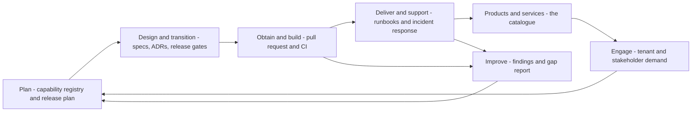

**Status:** NORMATIVE · **Owner:** Service architect

# Service management model

This document describes how SALIS AUTO **intends** to be managed as a service, and what of that intent exists in the repository today. It is a designed model, not an operating record. There is no production deployment in this workspace, no ticket system, no on-call rotation and no incident history, so no practice below reports volumes, durations, attainment or outcomes. Every practice is labelled **CURRENT** (a mechanism exists in this repository and can be pointed at), **TARGET** (intended, with the shape decided but nothing implemented), or **ABSENT** (named by the product documentation but neither implemented nor designed here).

Where a register already exists, this document references it and does not copy it. Risks live in `project-control/RISK_REGISTER.json`. Delivery blockers live in `project-control/BLOCKERS.json`. Release gate outcomes live in `project-control/RELEASE_GATES.json`. Copying any of them here would create a second, stale copy.

---

## 1. Service value chain

The chain below is the intended flow. Only the parts marked CURRENT in section 3 actually operate.

| Value chain activity | What carries it today | State |
| --- | --- | --- |
| Plan | `project-control/CAPABILITY_REGISTRY.json`, `docs/MASTER_RELEASE_PLAN.md`, `project-control/tracker/` | CURRENT |
| Improve | `project-control/FINDINGS.json`, `docs/MASTER_GAP_REPORT.md`, the ratcheted baselines in `project-control/BASELINE.json` | CURRENT |
| Engage | Nothing. No tenant, no support channel, no demand intake exists in this repository | ABSENT |
| Design and transition | ADRs in `docs/system/adr/`, the specification set under `docs/`, `project-control/release-gates.mjs` | CURRENT |
| Obtain and build | GitHub pull requests and `.github/workflows/ci.yml` | CURRENT |
| Deliver and support | Runbooks under `docs/system/runbooks/` and `docs/system/operations/` — written, never executed against a live system | TARGET |

---

## 2. How to read the evidence column

Evidence names a file, a script or a workflow that exists in this repository at the stated path. A practice with no such reference is not CURRENT, regardless of how much prose describes it. Approved prose documents describing an intended practice are evidence of **design**, not of **operation**, and are labelled TARGET accordingly.

---

## 3. Practices

### 3.1 Incident management

| Aspect | Detail |
| --- | --- |
| State | **TARGET** |
| Designed | `docs/system/incident-response.md` defines severity classification, response playbooks, an incident commander role, a post-mortem process and a communication plan. |
| Exists today | The classification and playbook design, and six response runbooks under `docs/system/runbooks/`. `GET /health` and `GET /ready` give a detection surface (`server/src/routes/health.ts`). Structured logs with request ids give a diagnosis surface (`server/src/logger.ts`). |
| Absent | No incident record store, no ticket system, no alerting, no paging, no on-call rotation, no measured detection or resolution time. The incident response plan names roles; no person is assigned to any of them in this repository. |
| First step to make it CURRENT | An incident record store and an alert source. Detection today depends on a human looking. |

### 3.2 Major incident management

| Aspect | Detail |
| --- | --- |
| State | **TARGET** |
| Designed | Severity 1 handling, escalation and tenant communication in `docs/system/incident-response.md`; failover and minimum-viable-service definition in `docs/system/business-continuity.md`. |
| Exists today | The two runbooks a major incident would invoke: `runbooks/database-failover.md` and `runbooks/security-breach-response.md`. |
| Absent | No declared major-incident authority, no bridge or conference procedure that names a real channel, no drill has ever been run. `RELEASE_GATES.json` records gate RB-12 (backup restore drill) as UNCHECKABLE precisely because no drill against real infrastructure is possible from this repository. |

### 3.3 Problem management

| Aspect | Detail |
| --- | --- |
| State | **PARTIAL — CURRENT for defect analysis, TARGET for problem control** |
| Exists today | `project-control/FINDINGS.json` records analysed findings with severity and resolution state, and `project-control/BLOCKERS.json` records delivery blockers with severity, owner and wave. `docs/MASTER_GAP_REPORT.md` is the generated standing analysis. These are the closest thing to a problem register that exists. |
| Absent | No causal linkage from an incident to a problem, because there are no incidents. No workaround register. No problem review cadence. |
| Note | `BLOCKERS.json` is computed from the registry, not maintained as a defect log — `release-gates.mjs` says so explicitly when it reports RB-01 and RB-02 UNCHECKABLE for want of a defect tracker. Treat it as a derived view, not a problem register. |

### 3.4 Known error database

| Aspect | Detail |
| --- | --- |
| State | **ABSENT as a practice; two partial surfaces exist** |
| Exists today | Two things behave a little like one and neither is a KEDB. `project-control/RISK_REGISTER.json` (11 risks) records known conditions and their handling. `project-control/FINDINGS.json` records unresolved findings. The `kbProcedures` and `dtcCodes` entities in CAP-WORKSHOP are a *vehicle* knowledge base for technicians, not a service KEDB. |
| Absent | No record of a known service error with a documented workaround and a permanent-fix reference. |

### 3.5 Service request management

| Aspect | Detail |
| --- | --- |
| State | **ABSENT** |
| Exists today | Nothing. There is no request catalogue, no request intake, no fulfilment workflow and no self-service portal for service requests. |
| Closest related mechanism | Two in-product approval flows resemble request fulfilment but are business transactions, not service requests: procurement requisitions (`server/src/routes/procurement.ts`) and leave requests (`server/src/routes/leave.ts`). The data-subject request procedure in `runbooks/data-export-deletion.md` is the one genuine service-request procedure that is written down, and it is TARGET. |

### 3.6 Change enablement

| Aspect | Detail |
| --- | --- |
| State | **CURRENT** |
| Mechanism | Every change reaches `main` through a GitHub pull request. `.github/workflows/ci.yml` runs on every push and pull request: typecheck, unit and integration tests, build, registry-freshness (`npm run registry` followed by `git diff --exit-code`), `check-no-fake`, `check-tokens`, Playwright smoke, ratcheted golden paths, an axe accessibility sweep, server typecheck, the server suite against a real PostgreSQL 16 with a separate non-superuser application role, gitleaks secret scanning, and `npm audit --audit-level=high` on all three lockfiles. `.github/workflows/pr-report.yml` posts the per-check outcome onto the pull request. |
| Change authority | The release gates in `project-control/release-gates.mjs`, which evaluate fourteen named release blockers and write `project-control/RELEASE_GATES.json`. Its status vocabulary is deliberately three-valued: PASS, FAIL, and UNCHECKABLE with the human action that would settle it. It refuses to read prose status documents. |
| Change types | Not formalised. There is no standard/normal/emergency classification, no change advisory forum and no change calendar. |
| Gap | An emergency change path — what may bypass which gate, authorised by whom — is undefined. Branch protection settings are not visible in this repository, so it cannot be asserted here that the gates are actually enforced on merge. |

### 3.7 Release management

| Aspect | Detail |
| --- | --- |
| State | **PARTIAL** |
| Exists today | `project-control/release-gates.mjs` and its output `RELEASE_GATES.json` decide fourteen release blockers against real evidence. At its last recorded run the summary was 8 PASS, 3 FAIL, 3 UNCHECKABLE with `certifiable: false`. `docs/MASTER_RELEASE_PLAN.md` and `docs/30_RELEASE_CERTIFICATION/` carry the release plan and certification intent. |
| Absent | No versioned release artefact, no tagging convention enforced anywhere, no release notes generator, no staged rollout mechanism. The frontend deploys on every push to `main`, so release and deployment are currently the same event. |
| Caution | Read gate outcomes from `RELEASE_GATES.json` only, and check its `generatedAt` against the registers it quotes — the file quotes blocker counts from a run older than the current `BLOCKERS.json`, and `STATUS.json` and `GOLDEN_PATHS.json` carry a later golden-path result than the one gate RB-03 was decided on. Registers are regenerated at different times and the newest file wins. |

### 3.8 Deployment management

| Aspect | Detail |
| --- | --- |
| State | **PARTIAL — frontend CURRENT, API and database TARGET** |
| Exists today | Frontend deployment is automated in three independent directions: `deploy-pages.yml` (GitHub Pages on every push to `main`), `deploy-hostinger.yml` (FTPS or SFTP upload of `app/dist` and `site/`, path-filtered so an app change and a site change do not trigger each other), and the committed `netlify.toml` and `vercel.json` for hosted builds. The container image in `Dockerfile` is an nginx image serving the built SPA. |
| Absent | **There is no deployment path for the API.** `.dockerignore` excludes `server/`, so the container image contains no API. No workflow builds, tests-for-release or deploys the Fastify server, and no workflow runs `db:migrate` against any environment. Database migration is therefore a manual act with no recorded execution path. |
| Rollback | Designed in `runbooks/deployment-rollback.md`. The static deploys are re-deployable by re-running a workflow; no API or database rollback mechanism exists because no API deployment exists. |

### 3.9 Service configuration management

| Aspect | Detail |
| --- | --- |
| State | **PARTIAL** |
| Exists today | The closest thing to a CMDB is the generated register set under `project-control/`: `MASTER_REGISTRY.json`, `API_REGISTRY.json`, `ENTITY_REGISTRY.json`, `PERMISSION_REGISTRY.json`, `CAPABILITY_REGISTRY.json`, `DEPENDENCIES.json`, `RELATIONSHIP_REGISTRY.json`, `SECURITY_REGISTRY.json`, `STATE_MACHINE_REGISTRY.json`. Each declares its generator and carries `handEdit: "Never. Edit the source, then regenerate."` CI fails when the committed registry is stale, which makes drift a build failure rather than a discovery. |
| Absent | These are configuration items of the *software*, not of running infrastructure. No infrastructure inventory exists: no server, host, cluster, DNS record, certificate or managed-service instance is recorded anywhere in this repository. Environment configuration exists only as variable names in `server/.env.example` and `app/.env.example`; no environment's actual settings are recorded. |

### 3.10 Availability management

| Aspect | Detail |
| --- | --- |
| State | **TARGET** |
| Designed | Availability targets in `docs/system/sla-document.md`; redundancy and minimum-viable-service design in `docs/system/business-continuity.md`. |
| Exists today | Two probes — `GET /health` (never touches the database, so a database blip cannot restart healthy containers) and `GET /ready` (executes `select 1`, returns 503 on failure) — and `restart: unless-stopped` in `docker-compose.yml`. |
| Absent | No availability is measured, because nothing is deployed and nothing is monitored. No uptime figure exists or may be quoted. No redundancy is configured: `docker-compose.yml` defines a single service with no database, no replica and no load balancer. |

### 3.11 Capacity and performance management

| Aspect | Detail |
| --- | --- |
| State | **TARGET** |
| Exists today | Demand controls rather than capacity management: `DATABASE_POOL_MAX` (default 10), `RATE_LIMIT_MAX` per IP per minute, tighter per-route budgets for authentication and the public lead form, and pagination on the generated collection routes. `runbooks/performance-degradation.md` defines a response procedure against numeric thresholds. |
| Absent | No load testing, no capacity model, no resource metrics, no growth forecast, no autoscaling configuration. The thresholds the performance runbook triggers on cannot currently be observed by anything — see `docs/29_OPERATIONS_DEVOPS/OBSERVABILITY.md`. |

### 3.12 Service continuity management

| Aspect | Detail |
| --- | --- |
| State | **TARGET** |
| Designed | `docs/system/business-continuity.md` (recovery objectives, risk scenarios, backup strategy, geographic redundancy, minimum viable service, a DR testing schedule) and `docs/system/operations/backup-recovery.md` (data tiers and recovery sources). |
| Exists today | Two architectural properties that genuinely aid recovery: the audit log is append-only at the database level, and the frontend is fully reproducible from the git repository plus a build. `server/scripts/migrate.ts` and `scripts/seed.ts` can rebuild a database from nothing. |
| Absent | No backup is configured, scheduled or taken anywhere in this repository. No restore has been performed. Release gate RB-12 (backup restore drill) is UNCHECKABLE for that reason and will stay UNCHECKABLE until real infrastructure exists. Stated RPO and RTO figures in the continuity plan are targets that nothing has been tested against. |

### 3.13 Supplier management

| Aspect | Detail |
| --- | --- |
| State | **ABSENT as a practice** |
| Exists today | Third parties are *named* in `docs/system/integration/third-party-services.md`, `payment-gateway.md` and `zatca-integration.md`, and technical dependencies are pinned in three lockfiles and audited by CI. Actual platform suppliers visible in configuration: GitHub (source, CI, Pages), Hostinger (FTP target), Netlify and Vercel (committed configs), cdnjs (the one CSP script-src exception, for three.js on the public landing page), and PostgreSQL as a self-managed or managed dependency. |
| Absent | No supplier register, no contracts, no supplier service levels, no review cadence, no exit plan. **Do not read the integration documents as evidence that any supplier relationship exists** — no payment gateway, SMS provider, email provider or ZATCA submission credential is configured in this repository. |
| Related | `RISK_REGISTER.json` R-09 records that twelve capabilities depend on hardware or paid services that are not held. |

### 3.14 Knowledge management

| Aspect | Detail |
| --- | --- |
| State | **CURRENT for engineering knowledge, ABSENT for service knowledge** |
| Exists today | A large, mostly generated documentation estate under `docs/`, with ADRs in `docs/system/adr/`, a documentation index, and generated documents that carry their generator and source list in a banner so a reader can tell derived text from authored text. Registers under `project-control/` are machine-generated from source and CI-checked for staleness. |
| Absent | No support knowledge base, no article lifecycle, no tenant-facing help content, no feedback loop from support into documentation — all three depend on a support function that does not exist. |

### 3.15 Continual improvement

| Aspect | Detail |
| --- | --- |
| State | **CURRENT in an unusual form** |
| Mechanism | Improvement is enforced by ratchets rather than reviews. `project-control/BASELINE.json` holds counts that may fall and never rise; `npm run golden -- --ratchet`, `check-no-fake`, `check-tokens` and the axe sweep fail the build when a count regresses. `docs/MASTER_GAP_REPORT.md` and `project-control/FINDINGS.json` are the standing improvement backlog. The three-valued release gate vocabulary — with UNCHECKABLE as a first-class result — is itself a continual-improvement device: it converts "we cannot tell" into a named human action instead of a green tick. |
| Absent | No improvement register with owners and dates, no service review, no post-incident improvement input (no incidents), no measured improvement outcome. |

---

## 4. Summary

| Practice | State |
| --- | --- |
| Incident management | TARGET |
| Major incident management | TARGET |
| Problem management | PARTIAL |
| Known error database | ABSENT |
| Service request management | ABSENT |
| Change enablement | CURRENT |
| Release management | PARTIAL |
| Deployment management | PARTIAL — frontend only; no API or database deployment path |
| Service configuration management | PARTIAL — software CIs only; no infrastructure inventory |
| Availability management | TARGET |
| Capacity and performance management | TARGET |
| Service continuity management | TARGET — no backup configured, no restore ever performed |
| Supplier management | ABSENT |
| Knowledge management | CURRENT for engineering, ABSENT for service |
| Continual improvement | CURRENT |

The pattern is consistent: everything upstream of deployment is mechanised and evidence-backed; everything downstream of deployment is written but has never run. The single change that would move the most practices from TARGET to CURRENT is a real deployed environment with monitoring attached to it.

## 5. Related documents

| Document | Relationship |
| --- | --- |
| `docs/28_ITIL_SERVICE_MANAGEMENT/SERVICE_CATALOG.md` | The services these practices would manage. |
| `docs/29_OPERATIONS_DEVOPS/RUNBOOK_INDEX.md` | What is written to support the delivery activities, and what is missing. |
| `docs/29_OPERATIONS_DEVOPS/ENVIRONMENTS_AND_DEPLOYMENT.md` | The deployment mechanisms behind 3.8. |
| `docs/29_OPERATIONS_DEVOPS/OBSERVABILITY.md` | Why 3.1, 3.10 and 3.11 cannot currently be operated. |
| `project-control/RISK_REGISTER.json` | The canonical risk register. Not duplicated here. |
| `project-control/BLOCKERS.json`, `FINDINGS.json` | The canonical blocker and finding registers. Not duplicated here. |
| `project-control/RELEASE_GATES.json` | The canonical gate outcomes. Not duplicated here. |
