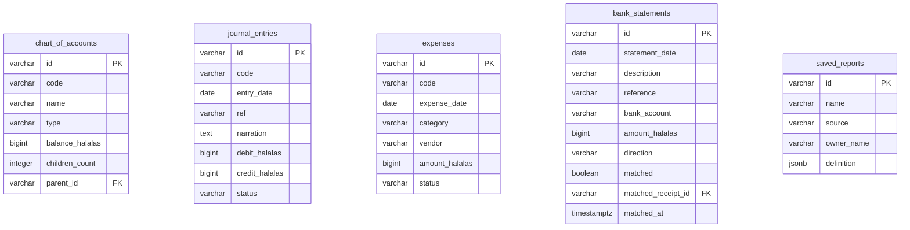

<!-- GENERATED FILE — DO NOT EDIT BY HAND.
     Generator: tools/docs/generators/data.mjs
     Regenerate: npm run docs:generate
     Derived from:
       - server/src/db/schema.ts
       - server/drizzle/*.sql
-->

# ACCOUNTING ERD

**Status:** GENERATED · **Generated:** 2026-09-13 · 5 tables

### ACCOUNTING

| Table | Purpose |
| --- | --- |
| `chart_of_accounts` | — |
| `journal_entries` | — |
| `expenses` | — |
| `bank_statements` | Bank statement lines (F-028). The *bank* side of a reconciliation — one row per line on an imported statement — so BankReconciliation has something to match the |
| `saved_reports` | Saved report definitions (F-028). Lets CustomReports persist a report — its name, the source it runs over, and the filter/column selection as JSON — so a user c |
