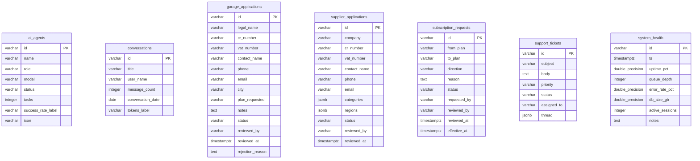

<!-- GENERATED FILE — DO NOT EDIT BY HAND.
     Generator: tools/docs/generators/data.mjs
     Regenerate: node tools/docs/generate.mjs
     Derived from:
       - server/src/db/schema.ts
       - server/drizzle/*.sql
-->

# ADMIN ERD

**Status:** GENERATED · **Sources as of:** 2026-09-14 · 7 tables

### ADMIN

| Table | Purpose |
| --- | --- |
| `ai_agents` | — |
| `conversations` | — |
| `garage_applications` | — |
| `supplier_applications` | — |
| `subscription_requests` | — |
| `support_tickets` | — |
| `system_health` | — |
