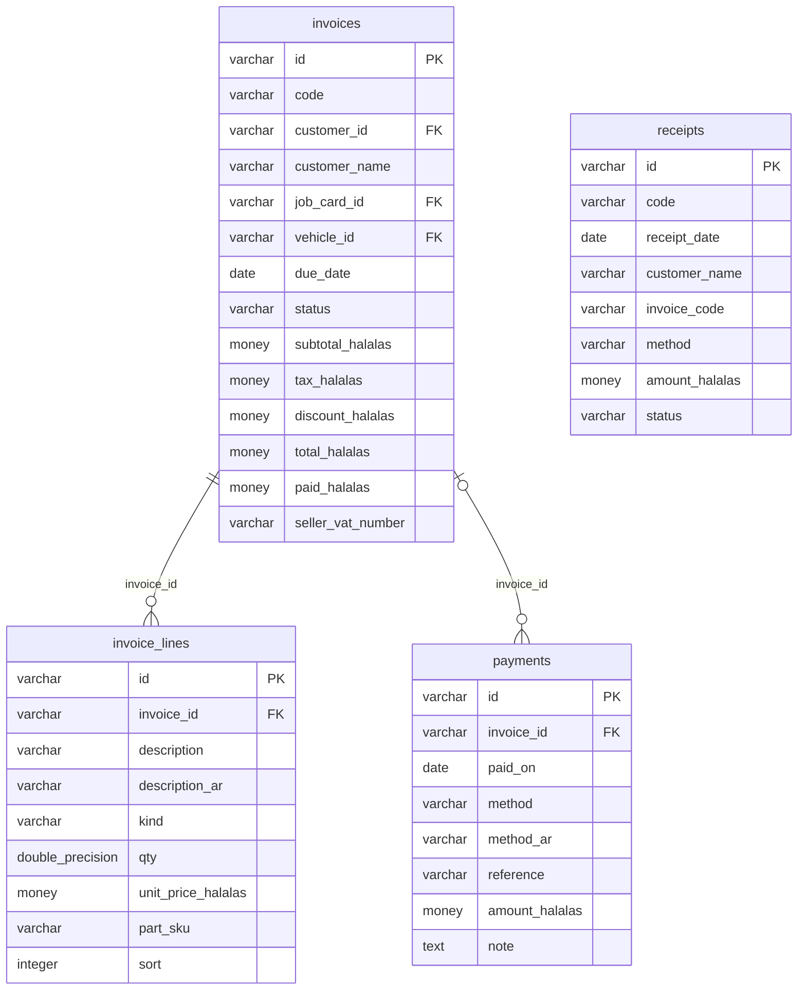

<!-- GENERATED FILE — DO NOT EDIT BY HAND.
     Generator: tools/docs/generators/data.mjs
     Regenerate: npm run docs:generate
     Derived from:
       - server/src/db/schema.ts
       - server/drizzle/*.sql
-->

# BILLING ERD

**Status:** GENERATED · **Generated:** 2026-09-13 · 4 tables

### BILLING

| Table | Purpose |
| --- | --- |
| `invoices` | — |
| `invoice_lines` | — |
| `payments` | — |
| `receipts` | — |
