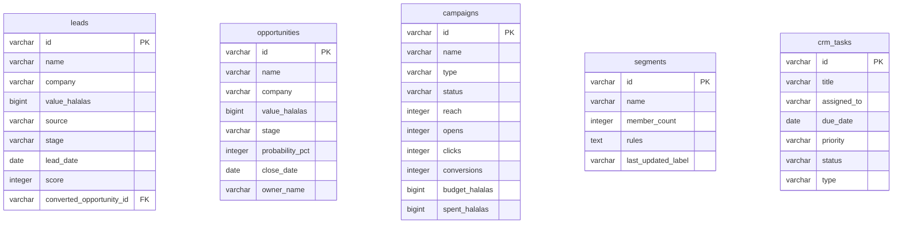

<!-- GENERATED FILE — DO NOT EDIT BY HAND.
     Generator: tools/docs/generators/data.mjs
     Regenerate: node tools/docs/generate.mjs
     Derived from:
       - server/src/db/schema.ts
       - server/drizzle/*.sql
-->

# CRM ERD

**Status:** GENERATED · **Sources as of:** 2026-09-09 · 5 tables

### CRM

| Table | Purpose |
| --- | --- |
| `leads` | — |
| `opportunities` | — |
| `campaigns` | — |
| `segments` | — |
| `crm_tasks` | — |
