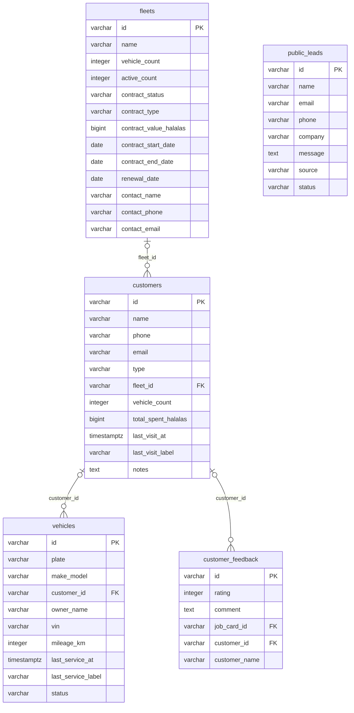

<!-- GENERATED FILE — DO NOT EDIT BY HAND.
     Generator: tools/docs/generators/data.mjs
     Regenerate: node tools/docs/generate.mjs
     Derived from:
       - server/src/db/schema.ts
       - server/drizzle/*.sql
-->

# CUSTOMER ERD

**Status:** GENERATED · **Sources as of:** 2026-09-18 · 5 tables

### CUSTOMER

| Table | Purpose |
| --- | --- |
| `customers` | — |
| `vehicles` | — |
| `fleets` | — |
| `customer_feedback` | Customer feedback (F-027). A rating and optional comment against a job card / customer, tenant-scoped like everything else. |
| `public_leads` | Public marketing intake (F-025). A raw, unauthenticated web submission — it carries a contact channel and a message and has earned no score or pipeline stage, w |
