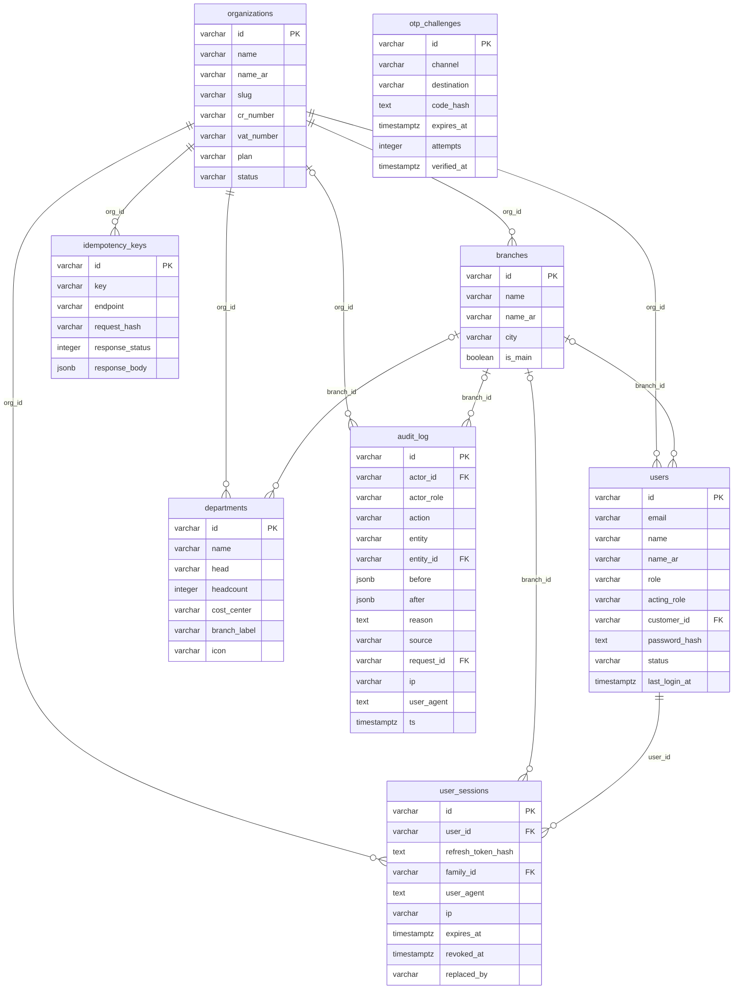

<!-- GENERATED FILE — DO NOT EDIT BY HAND.
     Generator: tools/docs/generators/data.mjs
     Regenerate: node tools/docs/generate.mjs
     Derived from:
       - server/src/db/schema.ts
       - server/drizzle/*.sql
-->

# ENTERPRISE ERD

**Status:** GENERATED · **Sources as of:** 2026-09-16 · 8 tables

### ENTERPRISE

| Table | Purpose |
| --- | --- |
| `organizations` | Organizations sit above tenancy — a row *is* the tenant. |
| `branches` | — |
| `users` | — |
| `user_sessions` | — |
| `departments` | — |
| `audit_log` | Append-only. A trigger refuses UPDATE and DELETE, so an application user cannot edit history even holding the application role. |
| `idempotency_keys` | A replayed `Idempotency-Key` returns the stored response and creates no second business effect. |
| `otp_challenges` | — |
