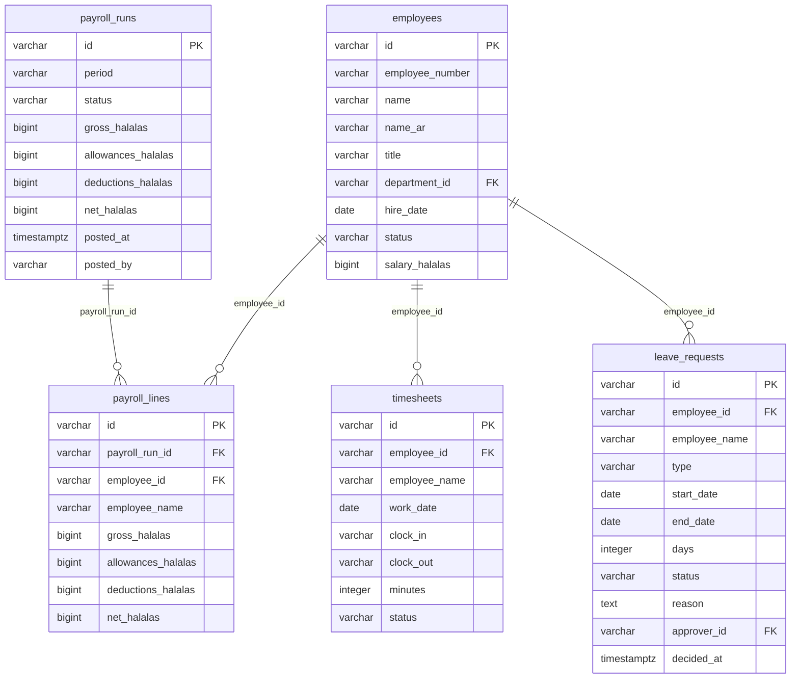

<!-- GENERATED FILE — DO NOT EDIT BY HAND.
     Generator: tools/docs/generators/data.mjs
     Regenerate: node tools/docs/generate.mjs
     Derived from:
       - server/src/db/schema.ts
       - server/drizzle/*.sql
-->

# HR ERD

**Status:** GENERATED · **Sources as of:** 2026-09-18 · 5 tables

### HR

| Table | Purpose |
| --- | --- |
| `employees` | Employees — a member of staff who belongs to a department (the existing `departments` collection) and a branch. **Salary is sensitive**: the `Employee salary` f |
| `payroll_runs` | Payroll runs — one calendar month. The totals (gross, allowances, deductions, net) are the column sums of the run's lines, computed by the server and **frozen w |
| `payroll_lines` | Payroll lines — one employee's pay within a run. The net is computed by the server as `gross + allowances − deductions`, never sent by the client. Money is inte |
| `timesheets` | Timesheets — a day's clock-in/out or worked minutes for one employee. Worked minutes are stored as an integer, so no fractional-hour float. Gated on `hr`. |
| `leave_requests` | Leave requests — a range of days an employee asks off. The approval (approve / reject) is the bespoke router, gated on the `hr` `a` grant and audited; the appro |
