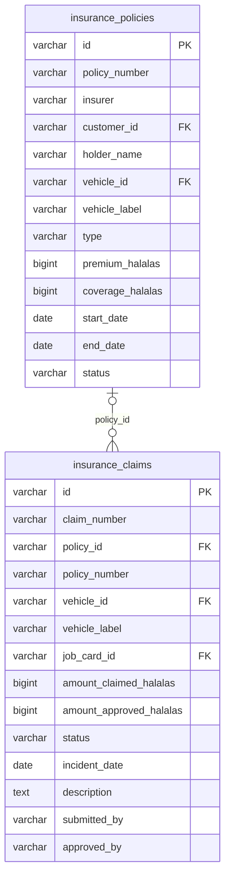

<!-- GENERATED FILE — DO NOT EDIT BY HAND.
     Generator: tools/docs/generators/data.mjs
     Regenerate: node tools/docs/generate.mjs
     Derived from:
       - server/src/db/schema.ts
       - server/drizzle/*.sql
-->

# INSURANCE ERD

**Status:** GENERATED · **Sources as of:** 2026-09-18 · 2 tables

### INSURANCE

| Table | Purpose |
| --- | --- |
| `insurance_policies` | Insurance policies — the cover a customer holds on a vehicle. Money is integer halalas (premium, coverage). Read-only through the generic router; gated on `acco |
| `insurance_claims` | Insurance claims — a request against a policy, which may relate to a repair. Read-only through the generic router; the lifecycle (submit, approve, reject, pay)  |
