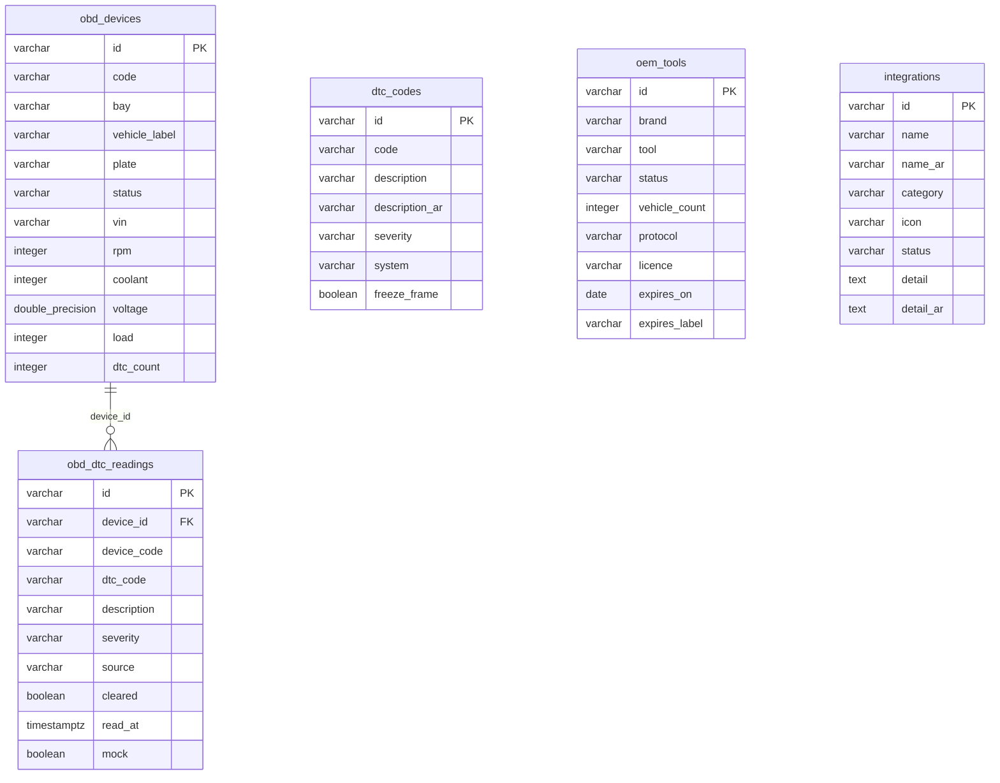

<!-- GENERATED FILE — DO NOT EDIT BY HAND.
     Generator: tools/docs/generators/data.mjs
     Regenerate: node tools/docs/generate.mjs
     Derived from:
       - server/src/db/schema.ts
       - server/drizzle/*.sql
-->

# INTEGRATIONS ERD

**Status:** GENERATED · **Sources as of:** 2026-09-18 · 5 tables

### INTEGRATIONS

| Table | Purpose |
| --- | --- |
| `integrations` | — |
| `obd_devices` | — |
| `obd_dtc_readings` | Per-device DTC readings (F-029). The device↔dtc link a re-scan or a clear-codes command records: which trouble codes a specific OBD device read, when, and wheth |
| `dtc_codes` | — |
| `oem_tools` | — |
