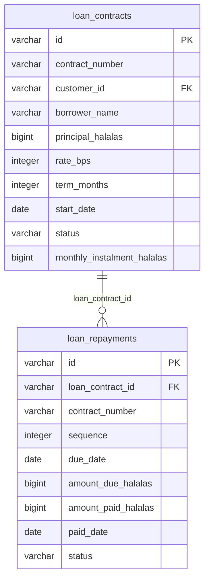

<!-- GENERATED FILE — DO NOT EDIT BY HAND.
     Generator: tools/docs/generators/data.mjs
     Regenerate: node tools/docs/generate.mjs
     Derived from:
       - server/src/db/schema.ts
       - server/drizzle/*.sql
-->

# LOANS ERD

**Status:** GENERATED · **Sources as of:** 2026-09-09 · 2 tables

### LOANS

| Table | Purpose |
| --- | --- |
| `loan_contracts` | Auto-loan contracts — a financed principal at a rate over a term. The monthly instalment is a real amortised figure the server computes at origination (`rules/l |
| `loan_repayments` | Loan repayments — the month-by-month schedule a contract's instalment implies. Money is integer halalas; the amounts sum to principal + interest across the sche |
