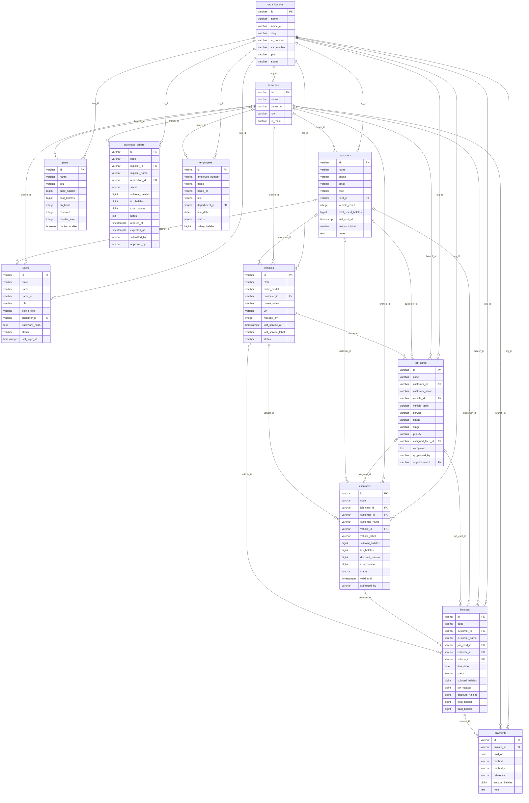

<!-- GENERATED FILE — DO NOT EDIT BY HAND.
     Generator: tools/docs/generators/data.mjs
     Regenerate: node tools/docs/generate.mjs
     Derived from:
       - server/src/db/schema.ts
       - server/drizzle/*.sql
-->

# Master ERD — the tenancy spine

**Status:** GENERATED · **Sources as of:** 2026-09-19

The twelve tables a reader needs to understand how a tenant, a customer, a vehicle, a job and its money hang together. Every other table hangs off this spine; the domain ERDs show those.

Solid connectors are mandatory, open ones optional. **Only `org_id` links are database foreign keys** — see the relationship catalogue.

### Spine

