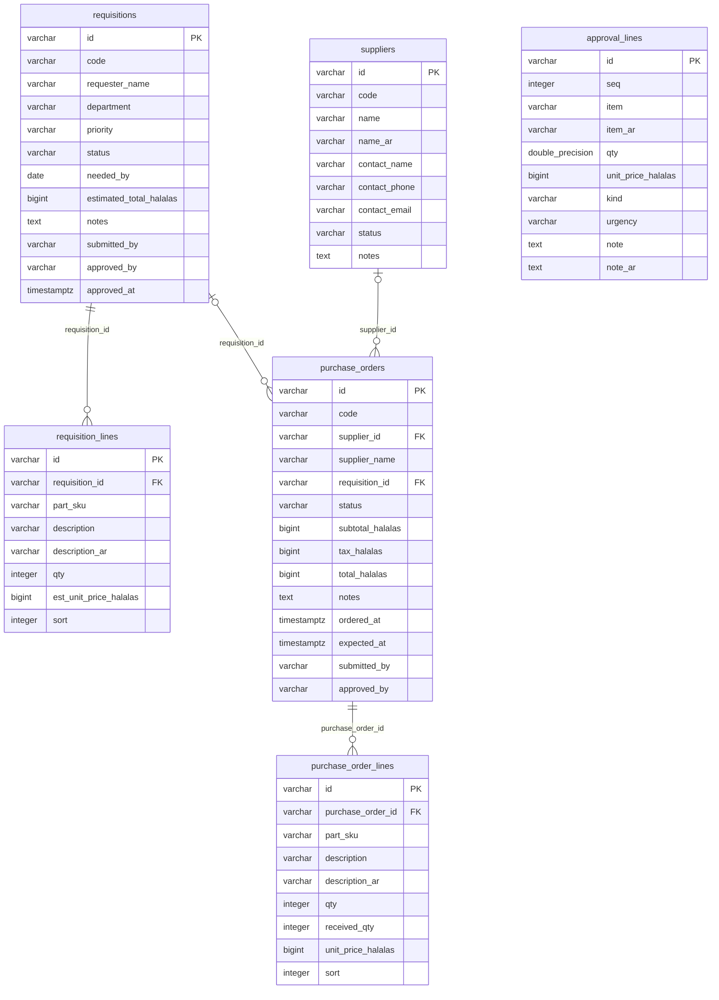

<!-- GENERATED FILE — DO NOT EDIT BY HAND.
     Generator: tools/docs/generators/data.mjs
     Regenerate: npm run docs:generate
     Derived from:
       - server/src/db/schema.ts
       - server/drizzle/*.sql
-->

# PROCUREMENT ERD

**Status:** GENERATED · **Generated:** 2026-09-13 · 6 tables

### PROCUREMENT

| Table | Purpose |
| --- | --- |
| `suppliers` | A tenant-owned vendor directory. The parts network carried only free-text supplier names; a purchase order references a supplier row by id (F-022). |
| `requisitions` | A request to buy, raised into a purchase order once approved (F-022). The estimated total is summed from the lines by the server, never sent. |
| `requisition_lines` | — |
| `purchase_orders` | — |
| `purchase_order_lines` | — |
| `approval_lines` | — |
