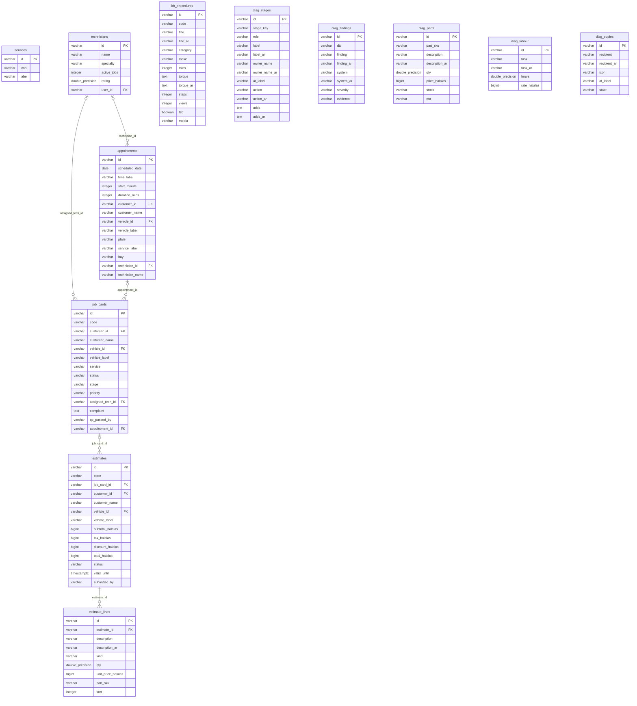

<!-- GENERATED FILE — DO NOT EDIT BY HAND.
     Generator: tools/docs/generators/data.mjs
     Regenerate: node tools/docs/generate.mjs
     Derived from:
       - server/src/db/schema.ts
       - server/drizzle/*.sql
-->

# WORKSHOP ERD

**Status:** GENERATED · **Sources as of:** 2026-09-09 · 12 tables

### WORKSHOP

| Table | Purpose |
| --- | --- |
| `job_cards` | — |
| `appointments` | — |
| `services` | — |
| `technicians` | — |
| `estimates` | — |
| `estimate_lines` | — |
| `diag_stages` | — |
| `diag_findings` | — |
| `diag_parts` | — |
| `diag_labour` | — |
| `diag_copies` | — |
| `kb_procedures` | — |
