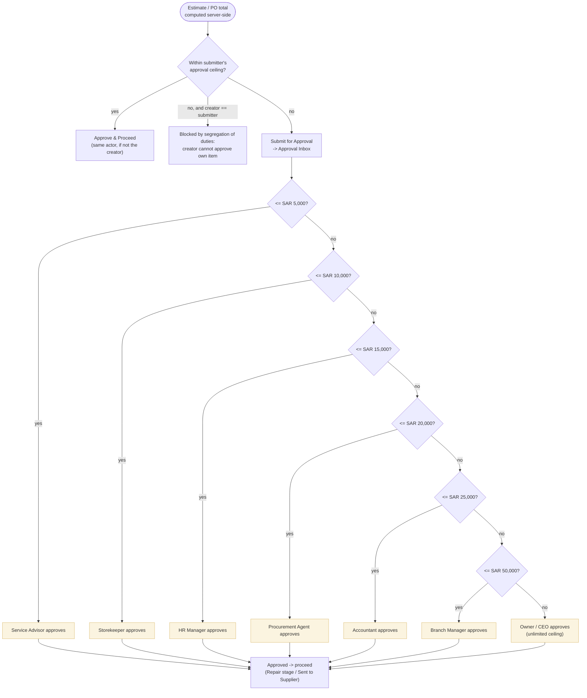

# Approval Escalation Ladder

When a job card estimate or purchase order total exceeds the creator's own approval ceiling, it escalates up this SAR ladder until it lands within an approver's authority. Source: `docs/user-documentation/workflows/job-lifecycle.md` §Stage 3, `docs/knowledge-base/reference/rbac-matrix.md`, `docs/system/architecture/auth-architecture.md` §7.

## Ladder reference

| Step | Role | Ceiling (SAR) | Ceiling (halalas) |
|---|---|---|---|
| 1 | Service Advisor | 5,000 | 500,000 |
| 2 | Storekeeper | 10,000 | 1,000,000 |
| 3 | HR Manager | 15,000 | 1,500,000 |
| 4 | Procurement Agent | 20,000 | 2,000,000 |
| 5 | Accountant | 25,000 | 2,500,000 |
| 6 | Branch Manager | 50,000 | 5,000,000 |
| 7 | Owner / CEO (also Super Admin) | Unlimited | — |

Notes:
- Above the submitter's own ceiling, the API responds **422 `approval_required`** (an escalation), never **403 `forbidden`** (a denial) — the distinction matters because 403 means "never allowed" while 422 means "not yet, needs a higher approver."
- **Segregation of duties**: the person who submitted an estimate, requisition, purchase order, or insurance claim can never also be its approver, even if their role's ceiling would otherwise cover the amount.
- Roles with a SAR 0 ceiling (Technician, QC Inspector, Receptionist, Call Center Agent, Supplier, Customer) hold no monetary approval authority at all — QC's "approval" is the non-monetary pass/fail gate on job cards, not a SAR ceiling.
