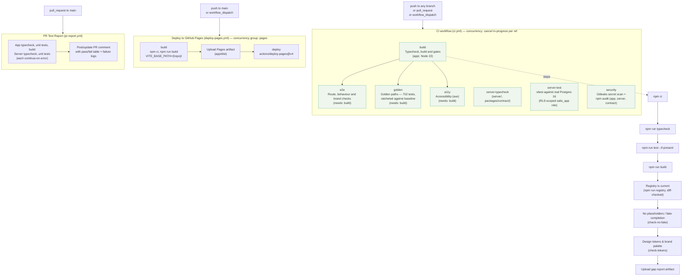

# CI/CD Pipeline

The three real GitHub Actions workflows in `.github/workflows/`: continuous integration (`ci.yml`), GitHub Pages deployment (`deploy-pages.yml`), and an automated PR test-report comment (`pr-report.yml`).

## Job summary (`ci.yml`)

| Job | Runs against | Key checks |
|---|---|---|
| `build` | `app/`, Node 22 | typecheck, tests, build, registry freshness, no-fake-completion guard, design token guard |
| `e2e` | `app/` (needs `build`) | Playwright smoke suite — routes, behaviour, mobile, brand guard |
| `golden` | `app/` (needs `build`) | 702 golden-path tests over two viewports, ratcheted against a baseline (not required to be all-green yet) |
| `a11y` | `app/` (needs `build`) | axe-core sweep per shell family/viewport; contrast findings ratcheted, other serious/critical findings fail outright |
| `server-typecheck` | `server/`, `packages/contract/` | TypeScript typecheck |
| `server-test` | `server/` + Postgres 16 service container | vitest, with RLS enforced via a non-superuser `salis_app` DB role distinct from the migration-owner role |
| `security` | all three lockfiles | Gitleaks secret scan, `npm audit --audit-level=high` per workspace (app, server, packages/contract) |

## Notes

- The CI pipeline deliberately **omits suites that don't exist yet** (unit, component, API, mobile, RTL, a11y-full, visual, golden-full) rather than stubbing them green — see the header comment in `ci.yml`.
- `deploy-pages.yml` triggers only on push to `main` or manual dispatch, builds with `VITE_BASE_PATH` set to the repo name, and deploys via `actions/deploy-pages@v4`; the `pages` concurrency group with `cancel-in-progress: true` means a new push cancels any in-flight deployment.
- `pr-report.yml` runs app + server typecheck/test/build independently (`continue-on-error: true` per step) and posts a single consolidated pass/fail comment on the PR, updating it in place on re-runs.
