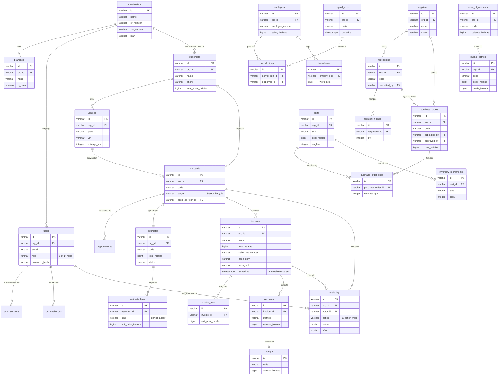
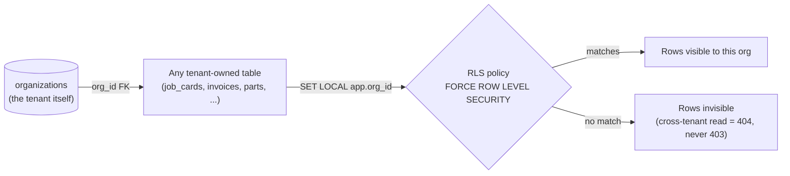

# Database ER Diagram

Key entities and relationships from the 50+ table PostgreSQL schema (Drizzle ORM). Every tenant-owned table carries the universal `tenant` column set (`id` ULID PK, `org_id`, `branch_id`, `created_at`/`updated_at`, `created_by`/`updated_by`, `deleted_at`, `version`) — omitted below per entity for readability and shown once in the multi-tenant pattern note. Source: `docs/system/architecture/database-design.md`, `docs/knowledge-base/reference/data-dictionary.md`.

## Multi-tenant `org_id` pattern

Every tenant-owned table (53 of them, per `TENANT_TABLES`) spreads the same universal column set and is protected by a `FORCE` row-level-security policy filtering on `current_setting('app.org_id')`:

Additional notes:
- All primary keys are **ULIDs** (`varchar(26)`), lexicographically sortable by creation time (ADR-004 / database-design.md §3.1).
- All money columns are **integer halalas** (`bigint`, 1 SAR = 100 halalas) — never floats (ADR-006).
- **Soft deletes** everywhere via `deleted_at`; **optimistic concurrency** via an incrementing `version` column.
- **Segregation-of-duties** columns (`submitted_by` / `approved_by`) appear on `estimates`, `requisitions`, `purchase_orders`, and `insurance_claims`.
