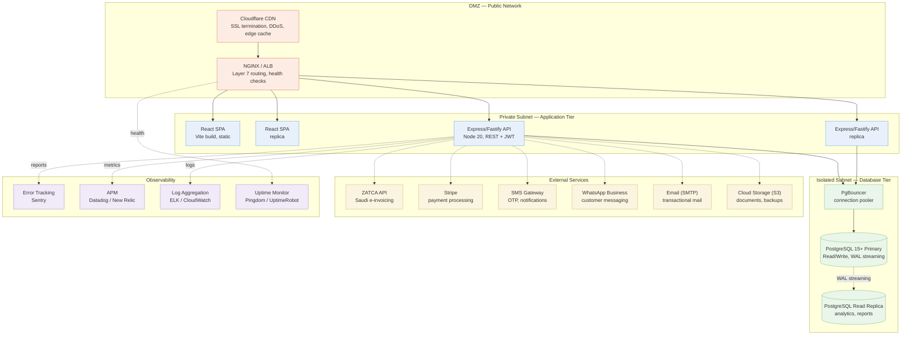

# Deployment Architecture

Deployment topology by security zone — DMZ, application tier, and isolated database tier — plus the external services and observability stack around them. Source: `docs/visualizations/deployment-architecture.html`, `docs/system/operations/devops-guide.md`, `docs/system/operations/environment-setup.md`.

## Notes

- **Three real deployment targets are documented** for the SPA build itself: GitHub Pages (`.github/workflows/deploy-pages.yml`), Vercel (`vercel.json`), and Netlify (`netlify.toml`) — all static-file hosts with SPA fallback to `/index.html`. The zoned topology above (CDN / LB / app tier / DB tier / observability) is the target production architecture illustrated in `docs/visualizations/deployment-architecture.html`.
- **Health probes**: `/health` (liveness — never touches the database) and `/ready` (readiness — runs `SELECT 1`) are the two endpoints an orchestrator or load balancer should watch.
- **Database tier isolation**: PostgreSQL runs with `FORCE` row-level security on all 53 tenant tables; even the table owner is subject to the policy.
- **Rate limiting** at the API tier is keyed `orgId:IP` (default 300/min), with a tighter 5/min/IP limit on the unauthenticated public lead endpoint.
