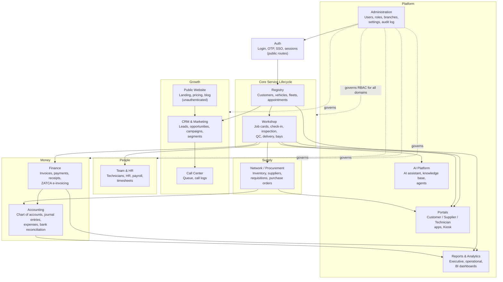

# Domain Model

The application is organized into 13 functional (bounded-context) domains plus the Authentication domain and the public Website, sharing the tenant-scoped data model. Source: `docs/domains.md`, `docs/architecture.md`.

## Domain reference

| # | Domain | RBAC module(s) | Key entities |
|---|--------|-----------------|---------------|
| 1 | Workshop (Operations) | `jobcards`, `appointments`, `estimates`, `checkin`, `inspection`, `qc`, `delivery` | job_cards, appointments, estimates, estimate_lines |
| 2 | Registry (Customers & Vehicles) | `customers`, `vehicles`, `feedback` | customers, vehicles, fleets, services |
| 3 | Finance | `invoices`, `payments` | invoices, invoice_lines, payments, receipts |
| 4 | Accounting | `accounting` | chart_of_accounts, journal_entries, expenses, bank_statements |
| 5 | CRM & Marketing | `crm` | leads, opportunities, campaigns, segments, crm_tasks |
| 6 | Administration | `admin`, `settings`, `integrations` | organizations, branches, users, integrations, audit_log |
| 7 | Authentication | (public) | users, user_sessions, otp_challenges |
| 8 | AI Platform | `ai` | kb_procedures (knowledge base), agents |
| 9 | Parts & Inventory Network | `inventory`, `network`, `procurement` | parts, inventory_movements, suppliers, requisitions, purchase_orders |
| 10 | Call Center | `callcenter` | call queue, call logs |
| 11 | Reports & Analytics | `reports`, `execreports` | saved_reports |
| 12 | Team & HR | `technicians`, `hr` | employees, payroll_runs, timesheets |
| 13 | Portals | `portalcustomer`, `portalsupplier`, `portaltech`, `portalprocure`, `kiosk` | customer/supplier/technician app screens |
| — | Public Website | (ungated) | landing, about, pricing, blog |
