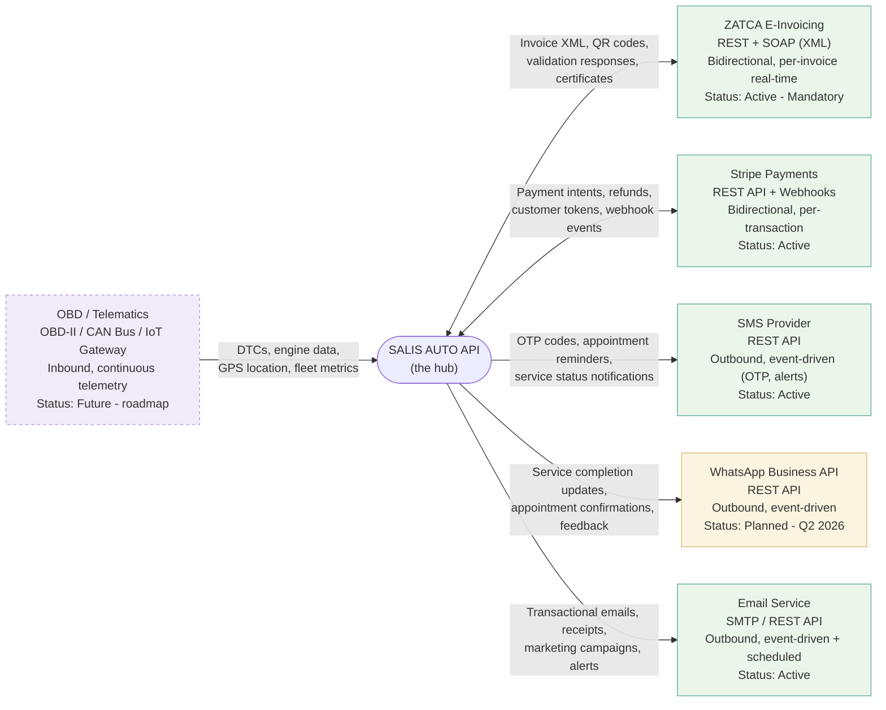
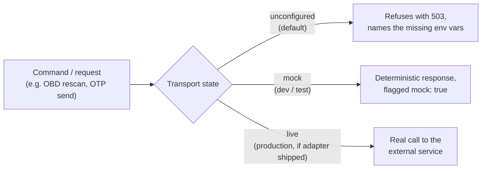

# Integration Architecture

Hub-and-spoke view of SALIS AUTO's external integrations. Every integration follows the same "no silent fakes" contract: **unconfigured** (refuses with 503, names the missing credentials), **mock** (deterministic, flagged `mock: true`), or **live** (real credentials, not all shipped yet). Source: `docs/visualizations/integration-architecture.html`, `docs/system/integration/*.md`.

## Integration status

| Integration | Protocol | Direction | Frequency | Status |
|---|---|---|---|---|
| ZATCA E-Invoicing | REST + SOAP (XML) | Bidirectional | Per invoice (real-time) | Active — mandatory |
| Stripe Payments | REST API + Webhooks | Bidirectional | Per transaction + webhook callbacks | Active |
| SMS Provider | REST API | Outbound | Event-driven (OTP, alerts) | Active |
| WhatsApp Business API | REST API | Outbound | Event-driven | Planned — Q2 2026 |
| Email Service | SMTP / REST API | Outbound | Event-driven + scheduled | Active |
| OBD / Telematics | OBD-II / CAN Bus / IoT Gateway | Inbound | Continuous telemetry | Future — roadmap |

## No-silent-fakes contract (`docs/system/integration/third-party-services.md`)

Every integration exposes an `IntegrationStatus` object (`id`, `configured`, `requires[]`, `state`, `dependency`) so "is this live?" is answerable through the API and the diagnostics screen — no integration secret ever has a default literal in the codebase.
