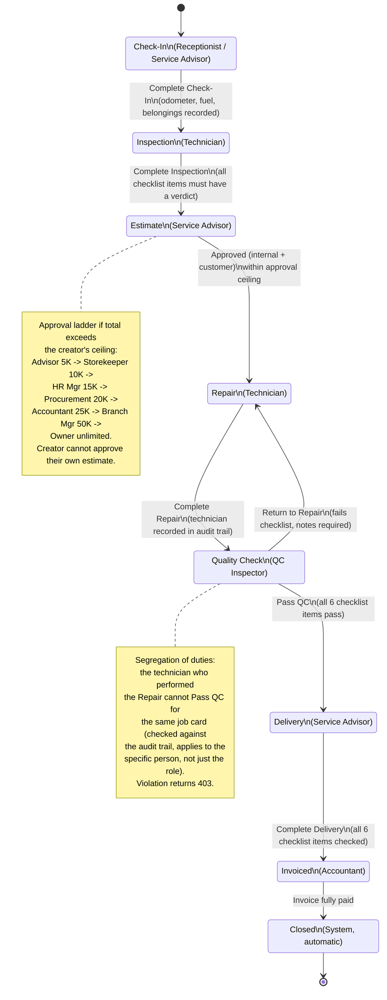

# Job Card State Machine

The 8-stage job card lifecycle, from vehicle check-in through closure. Stages cannot be skipped (server returns 422 on an invalid transition), and QC can bounce work back to Repair. Source: `docs/user-documentation/workflows/job-lifecycle.md`.

## Rules and constraints

| Rule | Enforcement |
|---|---|
| Stages cannot be skipped | Server-side; returns 422 on an invalid transition |
| Inspection must be 100% complete | All checklist items need a verdict before submission (estimate is built from findings) |
| QC must pass before Delivery | Server-side enforcement |
| Repair technician cannot pass QC on the same job | Segregation of duties, server-side, checked against the audit trail |
| Estimate above the creator's ceiling must escalate | Routed to the Approval Inbox |
| Customer contact hidden from technicians | Field-level redaction |

## Stage detail

| Stage | Who acts | Screen | What happens |
|---|---|---|---|
| Check-In | Receptionist / Service Advisor | `/workshop-checkin` | Vehicle received, odometer/fuel/belongings/issues recorded |
| Inspection | Technician | `/workshop-inspection` | Multi-point inspection across 6 vehicle systems (engine, brakes, tires, electrical, fluids, body) |
| Estimate | Service Advisor | `/workshop-estimate` | Parts + labour line items, VAT 15%, approval-ceiling check |
| Repair | Technician | Technician Portal | Approved work performed; parts requested from Storekeeper |
| QC | QC Inspector | `/workshop-qc` | 6-item QC checklist; pass or return-to-repair decision |
| Delivery | Service Advisor | `/workshop-delivery` | 6-item delivery checklist; vehicle handed to customer |
| Invoiced | Accountant | `/invoice-create` | Invoice generated from job card line items |
| Closed | System (automatic) | — | Permanent record; cannot be reopened or modified |
