# Organization Chart

The 14 RBAC roles grouped into 8 departments, all reporting to the Owner/CEO. SAR figures are each role's approval ceiling. Source: `docs/visualizations/department-org-chart.html`, `docs/knowledge-base/reference/rbac-matrix.md`, `docs/project-management/pmp/stakeholder-register.md`.

```mermaid
flowchart TB
    CEO["Owner / CEO\nUnlimited SAR ceiling, all branches\nand tenants, direct oversight of all depts"]

    SUPERADMIN["Super Admin\nPlatform-wide admin within tenant"]
    WORKSHOP["Workshop Operations\nVehicle intake, diagnostics, repair, QC, delivery"]
    FINANCE["Finance & Accounting\nInvoicing, payments, journal entries,\nVAT, ZATCA compliance"]
    HRADMIN["HR & Admin\nPersonnel, attendance, payroll, front desk"]
    IT["IT & Technology\nInfrastructure, config, integrations, support"]
    SALES["Sales & Marketing\nCRM, lead gen, campaigns, call center"]
    SUPPLY["Supply Chain\nParts procurement, vendors, inventory, POs"]
    EXTERNAL["External Portals\nSelf-service, read-only own-record access"]

    CEO --> SUPERADMIN
    CEO --> WORKSHOP
    CEO --> FINANCE
    CEO --> HRADMIN
    CEO --> IT
    CEO --> SALES
    CEO --> SUPPLY
    CEO --> EXTERNAL

    WORKSHOP --> MGR["Branch Manager\nSAR 50,000"]
    WORKSHOP --> ADV["Service Advisor\nSAR 5,000"]
    WORKSHOP --> TECH["Technician\nSAR 0"]
    WORKSHOP --> QC["QC Inspector\nSAR 0"]

    FINANCE --> ACC["Accountant\nSAR 25,000"]

    HRADMIN --> HR["HR Manager\nSAR 15,000"]
    HRADMIN --> FD["Receptionist / Front Desk\nSAR 0"]

    IT --> SA2["Super Admin / IT\nUnlimited"]

    SALES --> CC["Call Center Agent\nSAR 0"]

    SUPPLY --> PROC["Procurement Agent\nSAR 20,000"]
    SUPPLY --> PM["Storekeeper / Parts Manager\nSAR 10,000"]

    EXTERNAL --> CUST["Customer\nSAR 0 (self scope)"]
    EXTERNAL --> SUP["Supplier\nSAR 0 (external scope)"]
```

## Departments and their roles

| Department | Description | Roles (approval ceiling) |
|---|---|---|
| Owner / Executive | Top-level authority; unlimited ceiling across all branches and tenants | Owner/CEO (unlimited) |
| IT & Technology | Platform infrastructure, config, integrations, support | Super Admin (unlimited) |
| Workshop Operations | Core service delivery: intake, diagnostics, repair, QC, delivery | Branch Manager (50K), Service Advisor (5K), Technician (0), QC Inspector (0) |
| Finance & Accounting | Invoicing, payments, journal entries, VAT/ZATCA compliance | Accountant (25K) |
| HR & Admin | Personnel, attendance, payroll, front-desk operations | HR Manager (15K), Receptionist (0) |
| Sales & Marketing | CRM, lead generation, campaigns, call center | Call Center Agent (0) |
| Supply Chain | Parts procurement, vendor management, inventory, POs | Procurement Agent (20K), Storekeeper/Parts Manager (10K) |
| External Portals | Self-service portals, read-only own-record access | Customer (0), Supplier (0) |
