# Purchase Order State Machine

9 states from requisition through closure, with SAR-ceiling approval, segregation of duties, and goods-receipt matching. Source: `docs/visualizations/state-machines.html` (Purchase Order Lifecycle diagram), corroborated by `docs/system/architecture/database-design.md` (`purchase_orders`, `requisitions` tables) and `docs/knowledge-base/reference/rbac-matrix.md`.

```mermaid
stateDiagram-v2
    [*] --> Draft

    Draft: Draft\n(parts requisition created;\nline items and quantities specified)
    Submitted: Submitted\n(parts_manager submits for review;\nquantities/pricing validated)
    UnderReview: Under Review\n(procurement checks supplier\nquotes and budget allocation)
    Approved: Approved\n(within SAR ceiling; SOD enforced —\napprover differs from requester)
    SentToSupplier: Sent to Supplier\n(PO transmitted; delivery date confirmed)
    PartiallyReceived: Partially Received\n(some line items received and matched)
    FullyReceived: Fully Received\n(all lines received/matched;\ninventory stock updated)
    Invoiced: Invoiced\n(supplier invoice matched to PO +\ngoods receipt — three-way match)
    Closed: Closed\n(archived; payment processed;\nsupplier performance logged)
    Rejected: Rejected\n(returns to Draft with feedback notes)

    Draft --> Submitted: parts_manager submits
    Submitted --> UnderReview: procurement reviews
    UnderReview --> Approved: SAR ceiling + SOD check pass
    UnderReview --> Rejected: fails review
    Rejected --> Draft: revise
    Approved --> SentToSupplier: procurement sends PO
    SentToSupplier --> PartiallyReceived: warehouse receives some lines
    PartiallyReceived --> FullyReceived: warehouse receives remaining lines
    FullyReceived --> Invoiced: accounts payable matches invoice
    Invoiced --> Closed: payment processed
    Closed --> [*]

    note right of UnderReview
        Guard: SAR CEILING
        Parts Manager up to 10,000 SAR
        Procurement up to 20,000 SAR
        Branch Manager up to 50,000 SAR
    end note

    note right of Approved
        Guard: SOD
        PO approver cannot be the same
        person who created the requisition.
    end note

    note right of PartiallyReceived
        Guard: PO MATCH
        Goods receipt quantities are
        matched against PO line quantities
        (received <= ordered).
    end note
```

## Roles by stage

| Stage transition | Actor |
|---|---|
| Draft -> Submitted | Storekeeper (parts_manager) |
| Submitted -> Under Review -> Approved -> Sent to Supplier | Procurement Agent |
| Sent to Supplier -> Partially/Fully Received | Warehouse (Storekeeper) |
| Fully Received -> Invoiced | Accounts Payable (Accountant) |

## Related approval ladder

The same SAR-ceiling escalation used for job-card estimates applies to purchase orders (see `approval-escalation-ladder.md`): Storekeeper 10K -> Procurement 20K -> Branch Manager 50K -> Owner unlimited.
