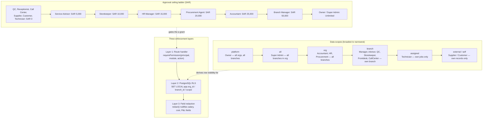

# RBAC Overview

14 roles, 28 permission modules, 5 grant letters (`v`/`c`/`e`/`x`/`a`), 8 data scopes, and role-based SAR approval ceilings enforced identically on the client (`can()`) and the server (`requirePermission()` + PostgreSQL RLS). Source: `docs/knowledge-base/reference/rbac-matrix.md`, `docs/system/architecture/auth-architecture.md`.

## Full permission matrix (28 modules x 14 roles)

`v`=view, `c`=create, `e`=edit, `x`=delete, `a`=approve. `.` = no access.

| Module | owner | superadmin | manager | advisor | technician | qc | parts | accountant | hr | frontdesk | callcenter | procurement | supplier | customer |
|--------|-------|------------|---------|---------|------------|-----|-------|------------|-----|-----------|------------|-------------|----------|----------|
| accounting | vax | v | vx | . | . | . | . | vcedax | . | . | . | . | . | . |
| admin | vcedax | vcedax | v | . | . | . | . | . | . | . | . | . | . | . |
| ai | vcedax | vcedax | vce | v | . | . | . | v | . | . | . | . | . | . |
| appointments | vcedax | v | vcedax | vced | v | . | . | . | . | vced | vced | . | . | . |
| approvals | vax | vx | vax | va | . | . | va | vax | va | . | . | vax | . | . |
| audit | vx | vx | vx | . | . | . | . | vx | . | . | . | . | . | . |
| callcenter | vx | v | vx | v | . | . | . | . | . | v | vcedx | . | . | . |
| crm | vcedax | v | vcedx | vce | . | . | . | . | . | . | vced | . | . | . |
| customers | vcedax | v | vcedx | vce | v | . | . | vx | . | vce | vce | . | . | . |
| dashboard | vx | vx | vx | v | v | v | v | vx | v | v | v | v | . | . |
| estimates | vcedax | v | vceax | vce | v | . | v | vx | . | v | v | . | . | . |
| execreports | vx | vx | vx | . | . | . | . | vx | . | . | . | . | . | . |
| hr | vcedax | v | vx | . | . | . | . | vx | vcedax | . | . | . | . | . |
| inventory | vcedax | v | vcedax | v | v | . | vcedax | vx | . | . | . | vcex | . | . |
| invoices | vcedax | v | vceax | vc | . | . | . | vcedax | . | vc | v | . | . | . |
| jobcards | vcedax | v | vcedax | vcea | ve | va | v | vx | . | vc | v | . | . | . |
| kiosk | v | v | v | v | . | . | . | . | . | vcex | v | . | . | . |
| network | vcedax | v | vcedx | . | . | . | vced | . | . | . | . | vcedax | vce | . |
| payments | vcedax | v | vcax | vc | . | . | . | vcedax | . | vc | . | . | . | . |
| portalcustomer | v | v | v | v | . | . | . | . | . | v | v | . | . | vx |
| portalprocure | v | v | v | . | . | . | v | v | . | . | . | vx | . | . |
| portalsupplier | v | v | v | . | . | . | v | . | . | . | . | v | vx | . |
| portaltech | v | v | v | v | vx | vx | . | . | . | . | . | . | . | . |
| procurement | vcedax | v | vcax | . | . | . | vc | vax | . | . | . | vcedax | v | . |
| reports | vx | vx | vx | v | . | v | vx | vx | vx | . | . | vx | . | . |
| settings | vcedax | vcedax | ve | . | . | . | . | . | . | . | . | . | . | . |
| technicians | vcedax | v | vcedax | v | v | v | . | . | vcedx | v | . | . | . | . |
| vehicles | vcedax | v | vcedx | vce | v | v | . | v | . | vce | v | . | . | . |

## Approval ceilings

| Role | Scope | Ceiling (SAR) |
|------|-------|---------------|
| Owner / CEO | all | Unlimited |
| Super Admin | platform | Unlimited |
| Branch Manager | branch | 50,000 |
| Accountant | all | 25,000 |
| Procurement Agent | all | 20,000 |
| HR Manager | all | 15,000 |
| Storekeeper | branch | 10,000 |
| Service Advisor | branch | 5,000 |
| Technician | own | 0 |
| QC Inspector | branch | 0 |
| Receptionist | branch | 0 |
| Call Center Agent | all | 0 |
| Supplier | external | 0 |
| Customer | self | 0 |

Above a role's ceiling, an approval attempt returns **422 `approval_required`** (escalate), never 403 (denied) — see `docs/system/architecture/auth-architecture.md` §7.

## Segregation of duties (6 pairs)

| Actor A | Actor B | Enforced via |
|---|---|---|
| Raise Purchase Order | Approve Purchase Order | `submitted_by` != `approved_by` on `purchase_orders` |
| Create Supplier | Approve Payment | Different users required |
| Post Journal Entry | Approve Journal Entry | `submitted_by` != `approved_by` on `journal_entries` |
| Perform Repair | Pass Quality Check | `assigned_tech_id` != `qc_passed_by` on `job_cards` |
| Issue Stock | Adjust Stock Count | Different users for issue vs. adjust movements |
| Create Employee | Approve Payroll | Different users for `employees` CRUD vs `payroll_runs` posting |
