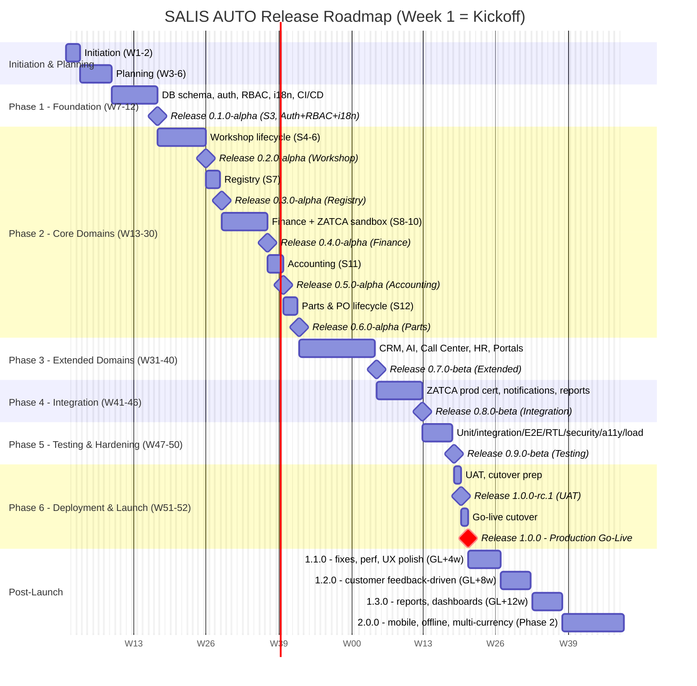

# Release Roadmap

52-week schedule across 8 project phases (2-week sprints, 46 weeks of sprints + 6 weeks buffer), mapped to the pre-launch release train from `0.1.0-alpha` through `1.0.0` go-live, plus the planned post-launch releases. Source: `docs/project-management/pmp/schedule-management.md`, `docs/project-management/planning/release-plan.md`.

Calendar dates below are illustrative only (anchored to an arbitrary kickoff date) — the source of truth is the **week number relative to project kickoff (W1)**, as documented in `schedule-management.md`.

## Pre-launch release train

| Version | Stage | Sprint | Content |
|---|---|---|---|
| 0.1.0-alpha | Foundation | S3 | Auth + RBAC + i18n framework |
| 0.2.0-alpha | Core: Workshop | S6 | Workshop lifecycle (Check-In through Delivery) |
| 0.3.0-alpha | Core: Registry | S7 | Customer + Vehicle CRUD + Saudi validations |
| 0.4.0-alpha | Core: Finance | S10 | Invoicing + ZATCA sandbox integration |
| 0.5.0-alpha | Core: Accounting | S11 | Chart of accounts + journal entries |
| 0.6.0-alpha | Core: Parts | S12 | Inventory + PO lifecycle + approval chain |
| 0.7.0-beta | Extended | S17 | CRM, AI, Call Center, HR, Portals |
| 0.8.0-beta | Integration | S20 | ZATCA prod cert + notifications + reports |
| 0.9.0-beta | Testing | S22 | All tests passing, security hardened |
| 1.0.0-rc.1 | Deployment | S23 | Release candidate for UAT |
| **1.0.0** | **Go-Live** | S23 | **Production release** |

## Post-launch release train

| Version | Target | Content |
|---|---|---|
| 1.1.0 | Go-live +4w | Post-launch fixes, performance tuning, UX polish |
| 1.2.0 | Go-live +8w | Customer feedback-driven improvements |
| 1.3.0 | Go-live +12w | Additional report types, dashboard enhancements |
| 2.0.0 | Phase 2 | Native mobile app, offline mode, multi-currency |

## Rollout phases (post-1.0.0)

| Phase | Scope | Duration | Success criteria |
|---|---|---|---|
| Internal dogfooding | Development team only | 1 week | No P1/P2 bugs in daily use |
| Pilot | 2-3 selected workshops | 2 weeks | >= 90% satisfaction; < 5 P3 bugs |
| Early access | 10-15 workshops | 2 weeks | Stable performance under load |
| General availability | All onboarded workshops | Ongoing | SLA metrics met |
