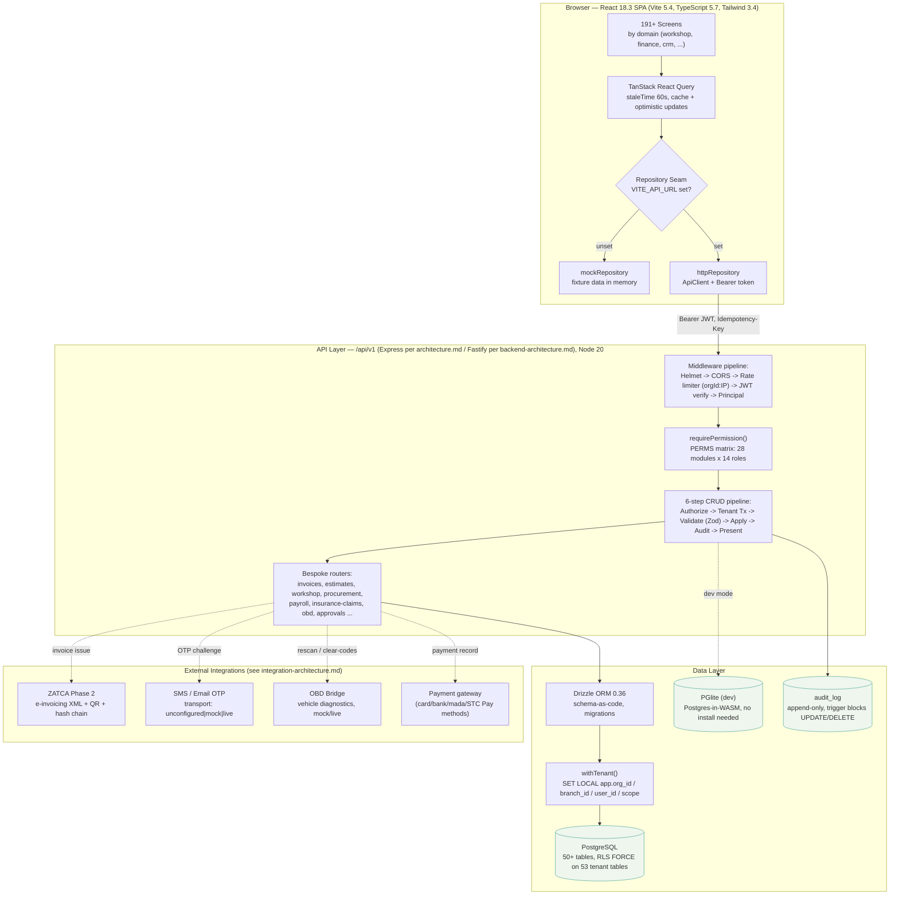

# System Architecture

Full-stack view of SALIS AUTO: the React SPA talks to the API through a repository seam (mock fixtures or live HTTP), the API enforces auth/RBAC/tenant isolation before reaching Drizzle ORM and PostgreSQL, and a handful of external services are integrated at the edges. Source: `docs/architecture.md`, `docs/system/architecture/*.md`.

## Notes

- **No cache/session store**: the architecture is request-response only — no Redis, no WebSocket/SSE layer (see `docs/system/architecture/data-flow.md` §9). React Query's 60s `staleTime` is the only caching layer.
- **Repository seam** (ADR-003): screens never import mock tables or HTTP clients directly; swapping `VITE_API_URL` swaps the entire data layer without touching any of the 191+ screens.
- **PGlite** (ADR-002) stands in for PostgreSQL in local development only — production always runs real PostgreSQL.
- The two architecture docs disagree on the framework name (`docs/architecture.md` says Express 4.21; `docs/system/architecture/backend-architecture.md` and `data-flow.md` say Fastify) — both are reproduced here rather than silently resolved.
