# Work Breakdown Structure

```mermaid
flowchart TB
    ROOT["SALIS AUTO WBS\n126 work packages, 892 story points"]

    P1["Phase 1: Foundation\n31 WPs, 192 SP"]
    P2["Phase 2: Core Domains\n44 WPs, 307 SP"]
    P3["Phase 3: Extended Domains\n27 WPs, 189 SP"]
    P4["Phase 4: Integration\n9 WPs, 78 SP"]
    P5["Phase 5: Testing & Hardening\n8 WPs, 76 SP"]
    P6["Phase 6: Deployment & Launch\n7 WPs, 50 SP"]

    ROOT --> P1
    ROOT --> P2
    ROOT --> P3
    ROOT --> P4
    ROOT --> P5
    ROOT --> P6

    P1 --> P1PM["SA-1.00 Project Management\ncharter, WBS, risk register, comms plan"]
    P1 --> P1AUTH["SA-1.07 Authentication\nJWT, refresh rotation, login, MFA, OTP"]
    P1 --> P1RBAC["SA-1.06 Admin / RBAC\n14 roles, 28 modules, RLS, SOD, redaction"]
    P1 --> P1INFRA["SA-1.14 Infrastructure\nVite, Tailwind, Router, Drizzle, PGlite, CI/CD"]

    P2 --> P2WS["SA-2.01 Workshop\njob card schema, 6-state lifecycle,\ncheck-in/inspection/estimate/repair/QC/delivery"]
    P2 --> P2REG["SA-2.02 Registry\ncustomers, vehicles, VIN decoder, service history"]
    P2 --> P2FIN["SA-2.03 Finance\ninvoices, ZATCA XML/QR/hash chain, payments"]
    P2 --> P2ACC["SA-2.04 Accounting\nchart of accounts, journals, trial balance"]
    P2 --> P2PARTS["SA-2.09 Parts & Inventory\nstock dashboard, PO lifecycle, approval chain"]

    P3 --> P3CRM["SA-3.05 CRM & Marketing\nsegmentation, campaigns, loyalty program"]
    P3 --> P3AI["SA-3.08 AI Platform\nOBD parser, diagnostic handoff, predictive maintenance"]
    P3 --> P3CC["SA-3.10 Call Center\ncall logging, SLA queue, escalation"]
    P3 --> P3HR["SA-3.12 Team & HR\nemployee records, attendance, leave, payroll"]
    P3 --> P3PORT["SA-3.13 Portals\ncustomer/supplier portals, e-sig, technician mobile"]

    P4 --> P4ITEMS["ZATCA prod cert, notification fan-out,\napproval orchestrator, event bus,\nonboarding, audit viewer, KPI/scheduled/export reports"]

    P5 --> P5ITEMS["Unit (Vitest >= 80%), integration (Supertest >= 70%),\nE2E (Playwright), RTL visual regression,\nperformance (Lighthouse >= 80), pen test, WCAG 2.1 AA, k6 load"]

    P6 --> P6ITEMS["Prod provisioning, PGlite -> Postgres migration,\nDNS/SSL, UAT, training materials,\ngo-live cutover, 30-day post-launch support"]
```

126 work packages / 892 story points across 6 phases (Foundation, Core Domains, Extended Domains, Integration, Testing & Hardening, Deployment & Launch), numbered `SA-<Phase>.<Domain>.<Feature>.<WorkPackage>`. Source: `docs/project-management/pmp/wbs.md`.



## Phase summary

| Phase | Work packages | Total story points |
|---|---|---|
| Foundation | 31 | 192 |
| Core Domains | 44 | 307 |
| Extended Domains | 27 | 189 |
| Integration | 9 | 78 |
| Testing & Hardening | 8 | 76 |
| Deployment & Launch | 7 | 50 |
| **Total** | **126** | **892** |

## WBS numbering convention

```
SA-<Phase>.<Domain>.<Feature>.<Work Package>
```

- **Phase**: 1 = Foundation, 2 = Core, 3 = Extended, 4 = Integration, 5 = Testing, 6 = Deployment
- **Domain**: two-digit domain code (01-13)
- **Feature**: sequential feature within domain
- **Work Package**: leaf-level task, estimated in story points and mapped to a Product Backlog entry
