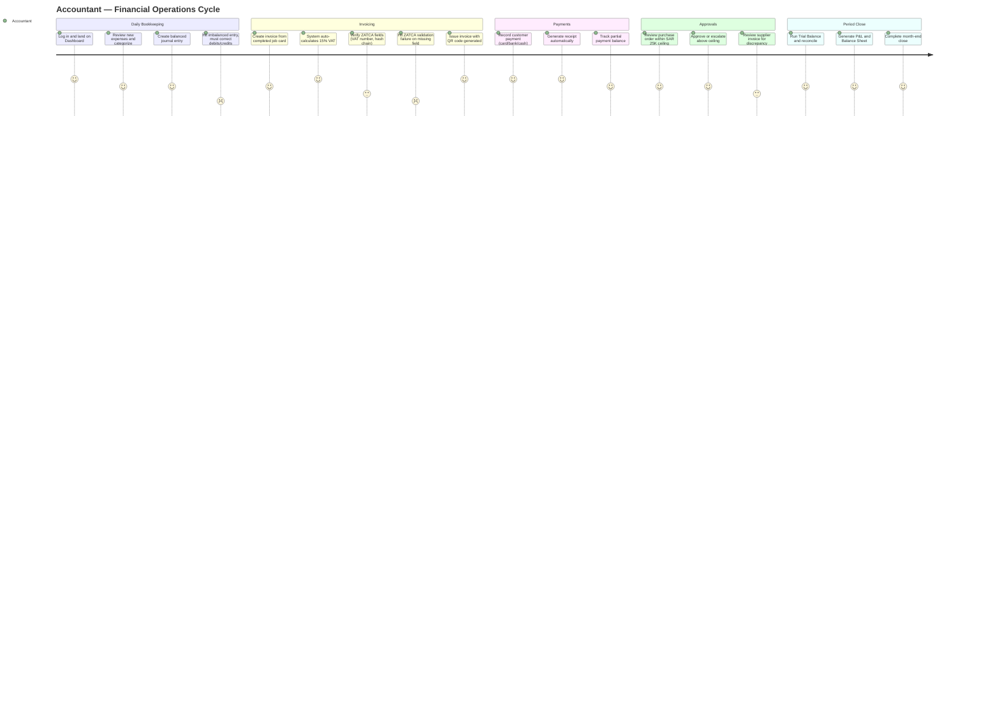

# Accountant — User Experience Journey

The Accountant's relationship with SALIS AUTO is one of precision and compliance: chart of accounts, journal entries that must balance to the halala, ZATCA-compliant e-invoicing with a cryptographic hash chain, and a SAR 25,000 approval ceiling. Their satisfaction comes from the system doing the compliance-heavy lifting (VAT, QR codes, hash chains) automatically and correctly, and dips whenever a manual step or validation error interrupts an otherwise routine close.

## Journey Detail

| Stage | Touchpoint/Screen | Pain Point | Opportunity/Mitigation |
|---|---|---|---|
| Journal Entries | `/journal-entries` | System correctly blocks imbalanced entries, but the block can feel abrupt without inline guidance on which side is short | Show the running debit/credit delta live as lines are added, not just at save-time |
| Invoice ZATCA compliance | `/invoices` | ZATCA validation failures (missing `vatNumber`, `sellerVatNumber`, or broken `hashPrev`/`hashSelf` chain) block invoice issuance (common-issues.md #15) | Pre-flight ZATCA readiness check on org settings, surfaced before the accountant starts building the invoice |
| Segregation of duties | Journal posting | "SOD: post != approve" — the person posting a journal entry cannot also approve it, which is correct but can stall small orgs with few finance staff | Document the minimum-staffing implication clearly in onboarding for small tenants |
| Approval ceiling | Purchase order / expense approval | SAR 25,000 ceiling means larger POs route elsewhere, adding a coordination step mid-workflow | Ceiling shown up front (already implemented per common-issues.md #7) reduces surprise; keep this pattern |
| Reports & Close | Trial Balance, P&L, Balance Sheet | CSV export capped at 50,000 rows; large multi-branch orgs may hit this during month-end close | Add row-count warning and support incremental/paginated export for month-end reporting |
