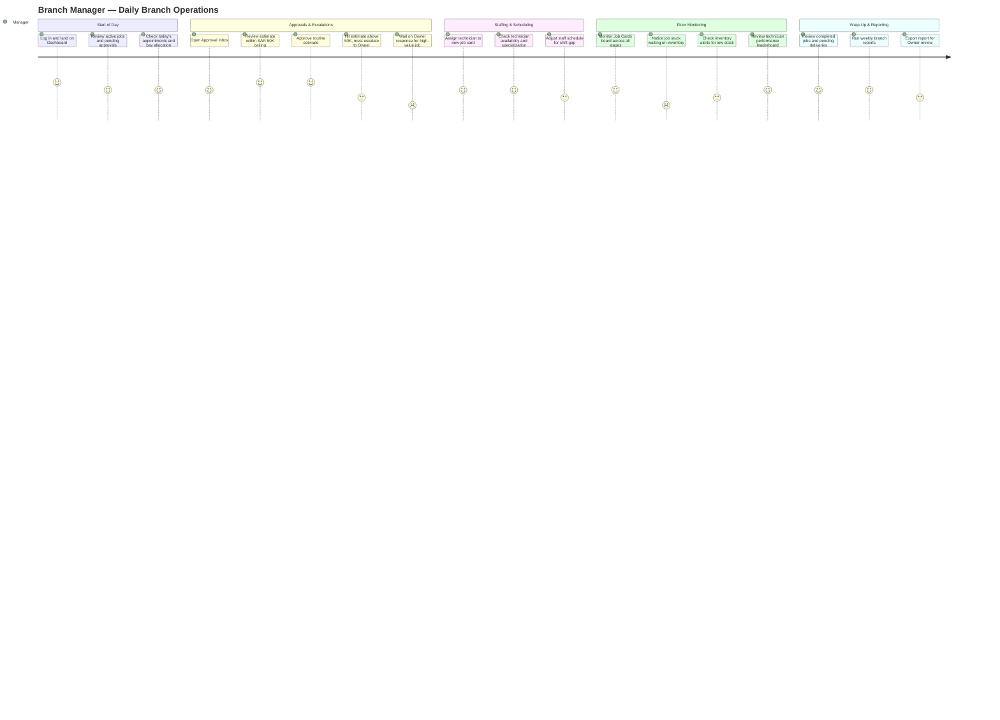

# Branch Manager — User Experience Journey

The Branch Manager runs a single branch end-to-end: staffing, scheduling, inventory, and approvals up to SAR 50,000, escalating only what exceeds that ceiling to the Owner. Their day is a rhythm of dashboard triage, approval-queue clearing, and floor supervision — the product's job is to make that rhythm fast and to make escalation feel like a safety net, not a bottleneck.

## Journey Detail

| Stage | Touchpoint/Screen | Pain Point | Opportunity/Mitigation |
|---|---|---|---|
| Dashboard | `/dashboard` | Branch-scoped only — Manager cannot see other branches even for benchmarking | By design (data isolation); could offer anonymized cross-branch benchmarks without exposing raw figures |
| Approval Inbox | `/approval-inbox` | Estimates above SAR 50,000 force an escalation with no SLA visibility into how fast the Owner will respond, stalling the job | Add an expected-response indicator or auto-notify escalation status to the job card timeline |
| Segregation of Duties | Estimate approval | Manager cannot approve an estimate they created themselves — occasionally surprises managers who both build and approve | Surface the SOD rule proactively at estimate-creation time, not just at approval-attempt time |
| Job Card board | `/job-cards` | Jobs "stuck" waiting on parts (common-issues.md #16/#17) are visually indistinguishable from normally-progressing jobs at a glance | Add a visual "blocked" indicator on the WorkflowStepper when a stage-gate prerequisite (stock, inspection) is unmet |
| Inventory Alerts | `/inventory-management` | Low-stock alerts are reactive; Manager only notices when checking manually mid-afternoon | Push alerts to Dashboard summary card rather than requiring a separate navigation |
| Reports | Branch-level Reports | Export permission gated by role; some managers hit `403 Forbidden` unexpectedly when a permission changed | Clearer inline messaging pointing to RBAC cause per common-issues.md #14 |
