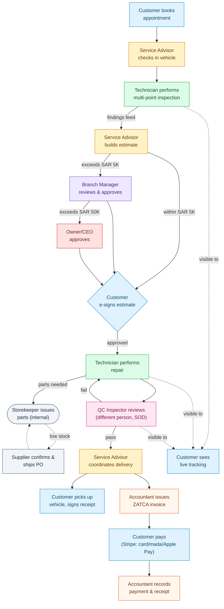

# Cross-Role Touchpoints — Moments of Truth

No SALIS AUTO persona experiences the platform in isolation. This map shows where the 8 roles' individual journeys hand off to one another — the "moments of truth" where one person's satisfaction depends entirely on another person (or the system) doing their part well and on time. A delay or friction point at any handoff ripples forward through the chain: a slow QC pass becomes a customer's unexplained wait; a late supplier delivery becomes a technician's idle bay.

## Moments of Truth

| Handoff | From → To | Why It Matters | Shared Risk |
|---|---|---|---|
| Check-in | Customer → Service Advisor | First impression of the whole visit; sets expectations for timing and cost | If odometer/belongings/issue notes are rushed or wrong, disputes surface at delivery |
| Inspection handoff | Service Advisor → Technician | Advisor's promises to the customer are only as good as the technician's inspection thoroughness | An incomplete inspection (blocked at 22/22 items) delays the estimate the customer is waiting on |
| Estimate escalation | Advisor → Manager → Owner | Every SAR ceiling boundary (5K / 50K) is a potential customer-facing delay, invisible to the customer | No shared SLA visibility across the escalation chain; customer just sees "waiting" |
| Customer e-signature | Advisor ⇄ Customer | The only step where the customer actively blocks the workflow — OTP + signature friction stalls the technician who is otherwise idle | Advisor fields the "why is it taking so long" call; technician's bay sits unused |
| Parts request | Technician → Storekeeper → Supplier | A technician's repair pace is capped by inventory the technician doesn't control | Supplier delivery delays cascade invisibly to the customer's pickup date |
| QC gate (SOD) | Technician → QC Inspector | Independent verification protects the customer, but a "Return to Repair" resets the clock for everyone downstream | Advisor must re-message the customer; no structured reason code shared automatically |
| Delivery → Invoice | Advisor → Accountant → Customer | ZATCA-compliant invoice must be correct and fast, or the customer waits at the counter after already being told the car is "ready" | ZATCA validation failures (missing VAT fields, broken hash chain) block the very last step of an otherwise-complete journey |
| Live tracking | Technician / QC → Customer (passive) | The customer's entire mid-journey experience is secondhand — they never see the workshop, only status updates | Any internal delay that isn't reflected in a stage update reads to the customer as silence, the single biggest driver of anxiety in service journeys |
