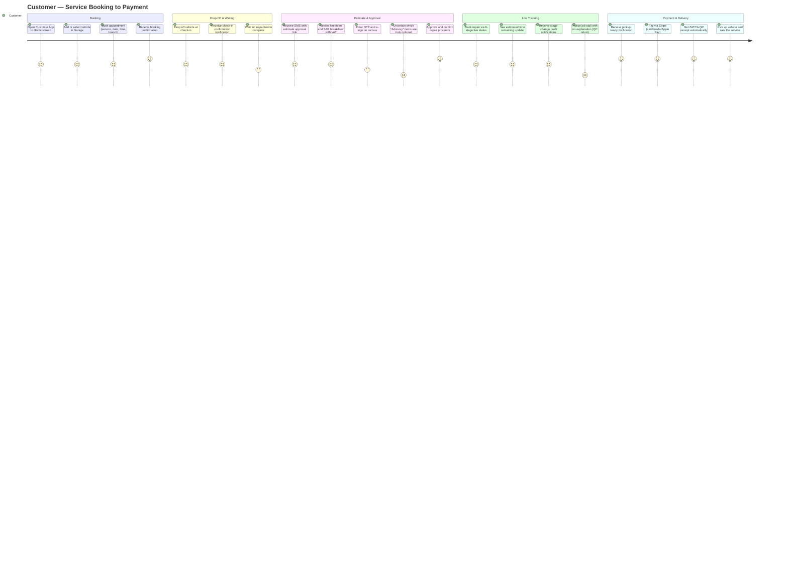

# Customer — User Experience Journey

The Customer experiences SALIS AUTO through a mobile-first Customer App: booking a service, watching their vehicle move through six real-time repair stages, approving costs by e-signature, and paying digitally. As an external, non-technical user, their trust is built or broken by transparency — clear pricing with VAT shown up front, live status instead of silence, and a smooth signature/payment flow with no jargon.

## Journey Detail

| Stage | Touchpoint/Screen | Pain Point | Opportunity/Mitigation |
|---|---|---|---|
| Booking | `/customer-app/appointments` | Calendar shows availability but doesn't explain *why* a date is unavailable (branch capacity vs. holiday) | Add a short reason label on greyed-out dates to reduce booking-flow confusion |
| Estimate approval | SMS link → e-signature flow | "Critical / Due now / Advisory" urgency labels are helpful but a first-time customer may not know these are the workshop's own risk categorization, not a hard requirement | Add a one-line explainer above the item list the first time a customer sees the approval screen |
| OTP + signature | CodeInput + signature canvas | Two-step verification (OTP then signature) is secure but adds friction on a small phone screen, especially for older customers per usability/accessibility goals | Ensure large touch targets (44px minimum, already required) and clear step indicators (1 of 2, 2 of 2) |
| Live tracking | `/customer-app/service-tracking` | When QC fails and a job regresses from QC back to Repair, the customer-facing tracker has no documented way to explain the "delay" gracefully | Add a customer-safe stage message ("finishing quality checks") that maps internally to a QC return without alarming detail |
| Payment | `/customer-app/wallet` | Multiple payment methods (Stripe: card/mada/Apple Pay) are a strength; no documented pain point here | Maintain current smooth flow as the benchmark for other transactional steps |
| Language/theme | Profile settings | RTL Arabic support and dark/light theme are well-covered by usability.md and accessibility.md — genuine strength for Saudi-market fit | Continue WCAG AA contrast testing in both themes for the customer-facing app specifically (highest-stakes screens per accessibility.md §2.2) |
