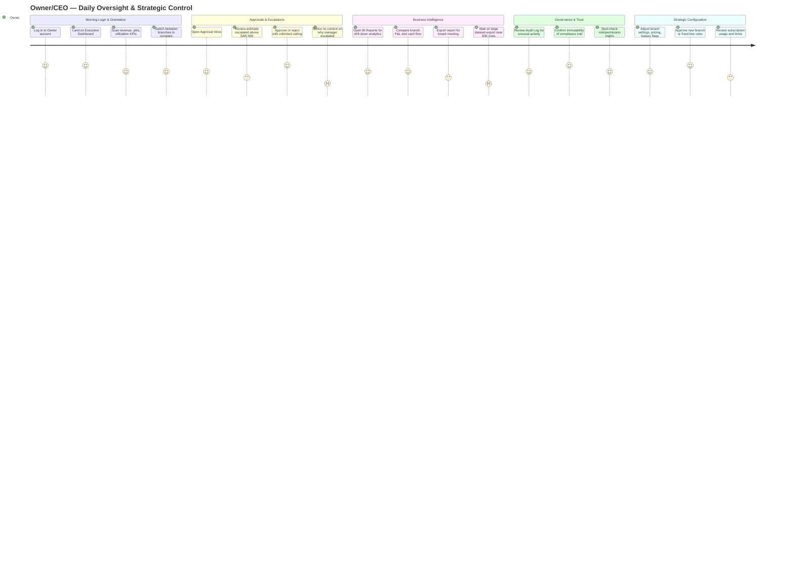

# Owner / CEO — User Experience Journey

The Owner/CEO is the platform's most privileged user: unlimited approval ceiling, visibility across every branch, and exclusive control over tenant configuration, pricing, and the 14-role permission matrix. Their relationship with SALIS AUTO is strategic rather than transactional — they check in daily for oversight (dashboard, approvals, audit) and periodically for deep configuration or franchise decisions, trusting the system to surface what needs their attention rather than hunting for it.

## Journey Detail

| Stage | Touchpoint/Screen | Pain Point | Opportunity/Mitigation |
|---|---|---|---|
| Morning Login | Login → Executive Dashboard | None significant; landing page is role-correct by default | Keep dashboard load fast — Owner checks this first thing daily per the guide's "daily operations" routine |
| Branch Comparison | Branch Comparison / Multi-Location Dashboard | Cross-branch visibility is a differentiator but large orgs may find KPI density overwhelming | Progressive disclosure (drill-down) already supported; ensure summary-first layout per usability.md §7 |
| Approval Inbox | `/approval-inbox` | Escalated items show amount and reference but the Owner cannot always see *why* the manager escalated (SOD rules restrict submitter context) | Surface the escalation reason and original approver's notes inline on the approval card |
| BI / Reports export | `/bi-dashboard`, Financial Reports | CSV export capped at 50,000 rows (common-issues.md #19); large multi-branch exports can silently truncate | Show a row-count warning before export triggers, and support server-side pagination for very large date ranges |
| Audit Log | `/audit-log` | None — log is immutable and filterable by design, a genuine trust-builder | Maintain as a north-star for compliance confidence |
| Strategic Settings | `/settings`, `/roles-permissions` | Owner-exclusive capabilities (feature flags, pricing, SOD-critical role assignment) carry high stakes with no visible "preview impact" before saving | Add a change-preview/confirmation step for role and pricing changes given blast radius across all 14 roles |
