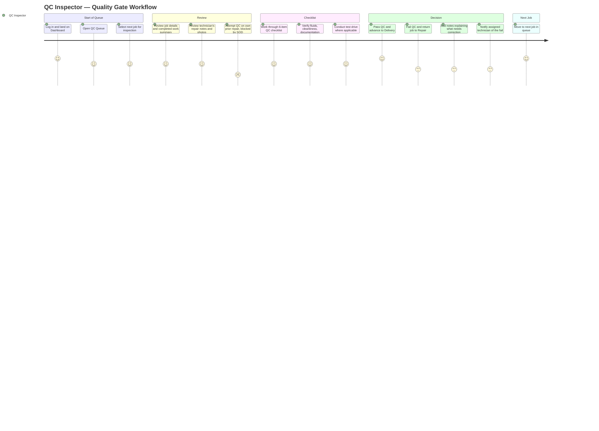

# QC Inspector — User Experience Journey

The QC Inspector exists to be the system's independent conscience: a segregation-of-duties gate that verifies repair quality before a vehicle reaches the customer, enforced so strictly that the server rejects a QC pass if the inspector was also the repairing technician. Their relationship with the product is narrow but high-trust — a focused queue, a checklist, and a binary outcome (Pass or Return to Repair) that carries real consequence for the customer's confidence.

## Journey Detail

| Stage | Touchpoint/Screen | Pain Point | Opportunity/Mitigation |
|---|---|---|---|
| QC Queue | `/workshop-qc` | Queue ordering isn't described as priority-aware; urgent jobs may sit behind routine ones | Surface job priority badge prominently in the QC queue list, not just on the job detail |
| SOD enforcement | Pass QC action | A 403 error when the inspector also performed the repair is correct but can feel like a dead end if the inspector didn't realize the conflict until after doing the review work | Detect and warn about the SOD conflict *before* the inspector starts the checklist, not only at submission |
| Checklist completion | QC Checklist (6 items) | Checklist items are somewhat coarse ("Quality Check" as its own item is circular/ambiguous) | Tighten checklist item wording so each maps to a distinct, verifiable criterion |
| Fail / Return to Repair | Return to Repair action | Returning a job creates rework and schedule slippage; the inspector bears the "bad news" role with the technician and, indirectly, the customer | Structured fail reasons (not just free text) speed up technician remediation and create better quality trend data |
| Segregation of duties visibility | Job history / audit trail | Accessibility and usability docs emphasize clear status communication (aria-live regions); a failed QC needs the same clarity for the inspector as for downstream advisor/technician | Reuse the Alert/Toast `aria-live="assertive"` pattern for QC-fail confirmation so the action is unambiguous |
