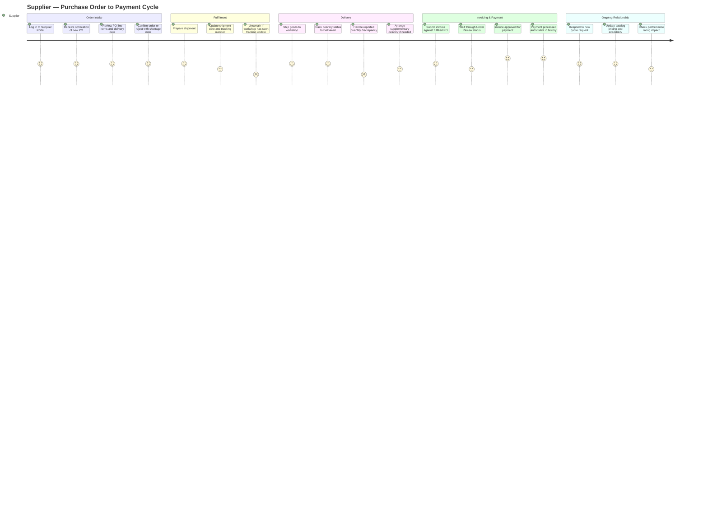

# Supplier — User Experience Journey

The Supplier is an external B2B user with a narrow, transactional relationship to SALIS AUTO: receive and confirm purchase orders, ship goods, submit invoices, and get paid — all scoped strictly to their own POs and payments, with zero approval authority (SAR 0 ceiling) and no visibility into workshop operations. Their satisfaction depends on the portal being predictable and fast to act on, since delays on their end directly affect their performance rating and future business.

## Journey Detail

| Stage | Touchpoint/Screen | Pain Point | Opportunity/Mitigation |
|---|---|---|---|
| Order confirmation | `/supplier-portal/orders` | No visible SLA for how quickly the supplier must confirm; quote requests "may have a deadline" per the guide but this isn't consistently surfaced | Show a countdown or due-by timestamp directly on pending POs and quote requests |
| Delivery updates | Update Delivery form | Supplier updates tracking info but has no confirmation that the Procurement Agent/Storekeeper actually saw it | Add a read-receipt or acknowledgment indicator once the workshop views the delivery update |
| Delivery discrepancy | Quantity mismatch handling | Discrepancy is reported *to* the supplier after the fact, putting them in a reactive, rating-at-risk position with limited context on what specifically was short | Include photos/line-level detail from the Storekeeper's receiving record in the discrepancy notification |
| Invoice review | Invoice status tracking | "Under Review" can sit indefinitely with no visible timeline, mirroring the internal Estimate Approval Timeout issue (common-issues.md #18 pattern) | Show expected review turnaround and escalate stale reviews automatically |
| Performance rating | Supplier profile | Rating factors (timeliness, quality, pricing, response time) are transparent in the guide, but not clearly exposed as a live, actionable score inside the portal itself | Surface a real-time rating breakdown so suppliers can self-correct before it affects future PO allocation |
| Scope restriction | General navigation | Supplier correctly cannot see workshop operations or customer data — a clean, appropriately narrow experience | Maintain strict scope; ensure error states (e.g., attempting to access a restricted route) read as "not applicable" rather than a broken link |
