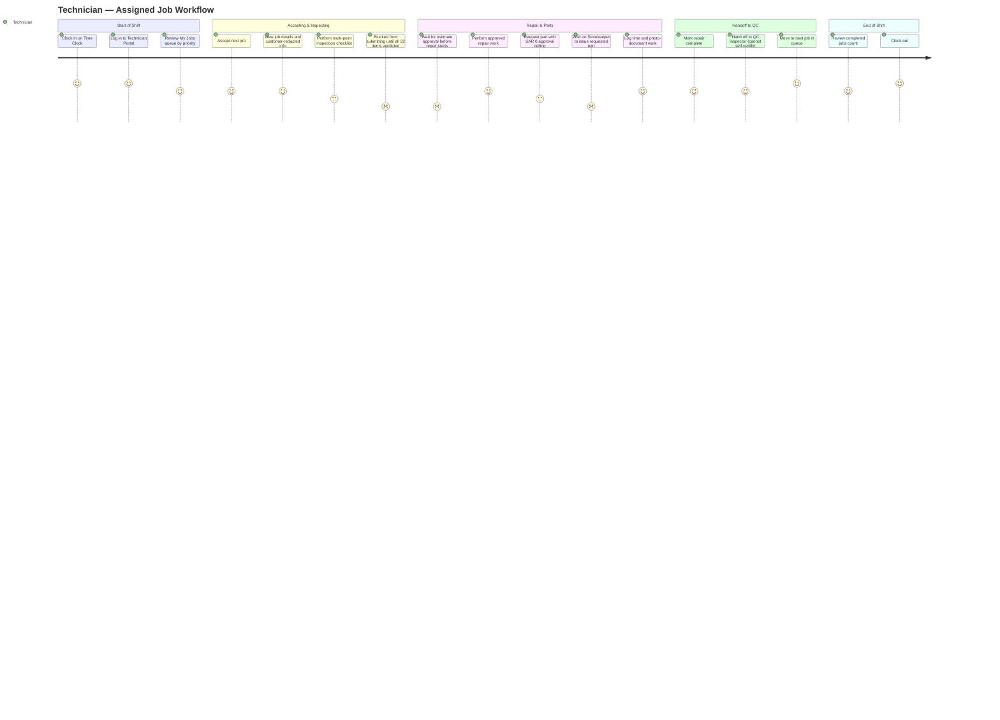

# Technician — User Experience Journey

The Technician's relationship with SALIS AUTO is a tool-for-the-hands-dirty-workday: a focused, tablet-friendly Technician Portal scoped to only their own assigned jobs, used to accept work, log inspections and repairs, request parts, and hand off to QC. Their satisfaction hinges on how little friction stands between "I finished the work" and "the system reflects that" — every extra tap on a greasy-gloved tablet is a small tax on an already physical job.

## Journey Detail

| Stage | Touchpoint/Screen | Pain Point | Opportunity/Mitigation |
|---|---|---|---|
| Job queue | Technician Portal Dashboard | Own-scope only (by design) — cannot see teammates' queues to offer help during a lull | Acceptable scope restriction; a "need a hand" broadcast to the Manager could route slack capacity |
| Inspection checklist | `/workshop-inspection` | Cannot submit a half-complete inspection (22 items); on a real vehicle with limited access, one unreachable item blocks the whole submission | Allow a justified "unable to inspect" verdict distinct from N/A, so genuine access issues don't block the gate |
| Waiting for estimate approval | Repair stage gate | Technician is idle once inspection is submitted until Advisor/Manager approves the estimate and (if required) the customer signs — no ETA shown | Show technician-facing status ("awaiting customer signature") so they can reprioritize to another job instead of waiting |
| Parts request | Technician Portal → Parts | SAR 0 ceiling means every part, however small, requires Storekeeper action; requests can sit "Pending" with no visible queue position | Show estimated fulfillment time or Storekeeper queue depth on the request status |
| Customer contact fields | Job Detail | Phone/email redacted for technicians (security rule) — occasionally technicians want to call about vehicle access and cannot | Document this rule visibly in the UI (not just the guide) so it reads as "by design" rather than a bug |
| QC handoff | Repair → QC transition | Technician has no visibility once handed to QC — cannot see if/why a job bounces back until reassigned | Read-only status ping back to the technician on QC pass/fail for closed-loop feedback |
