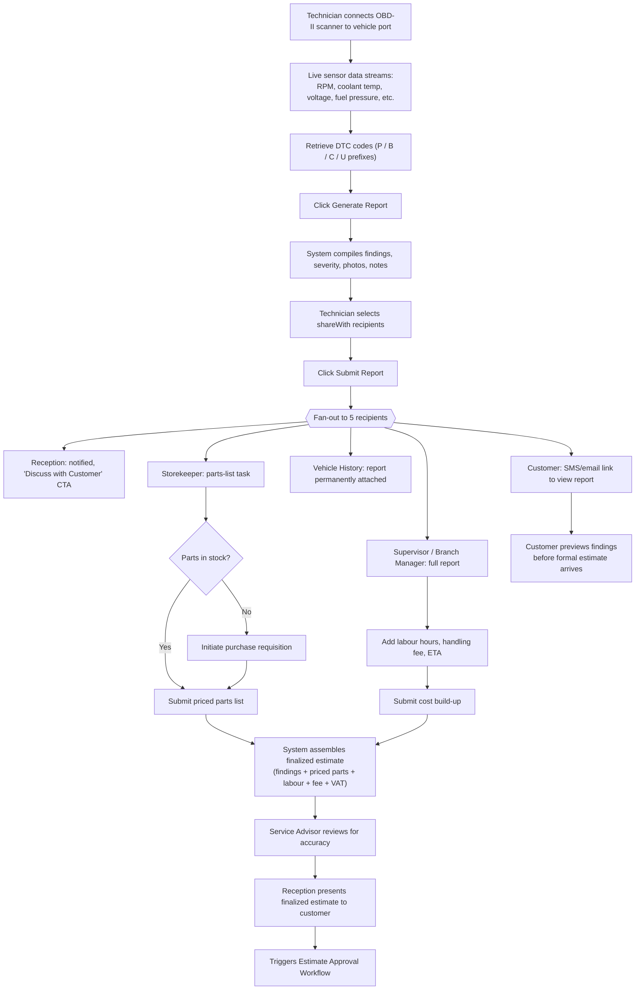
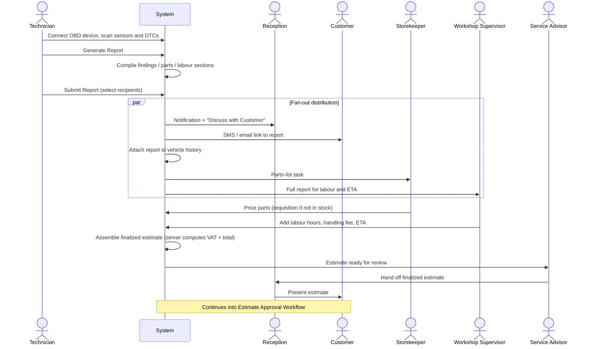

# Diagnostic Report Workflow

Diagrams for the OBD diagnostic chain: connecting the scanner, generating a report, fanning that report out to five recipients in parallel, and assembling their contributions into a finalized, customer-facing estimate.

Source: [`docs/user-documentation/workflows/diagnostic-report.md`](../../user-documentation/workflows/diagnostic-report.md)

---

## Process Flow: OBD Scan to Customer Presentation

---

## Actor Interaction: Fan-Out Distribution

