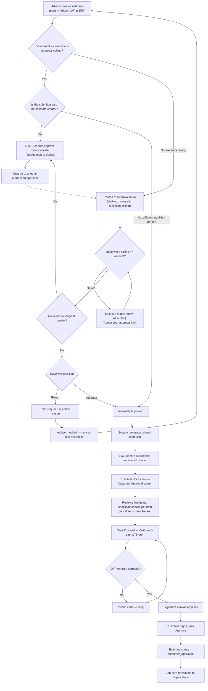
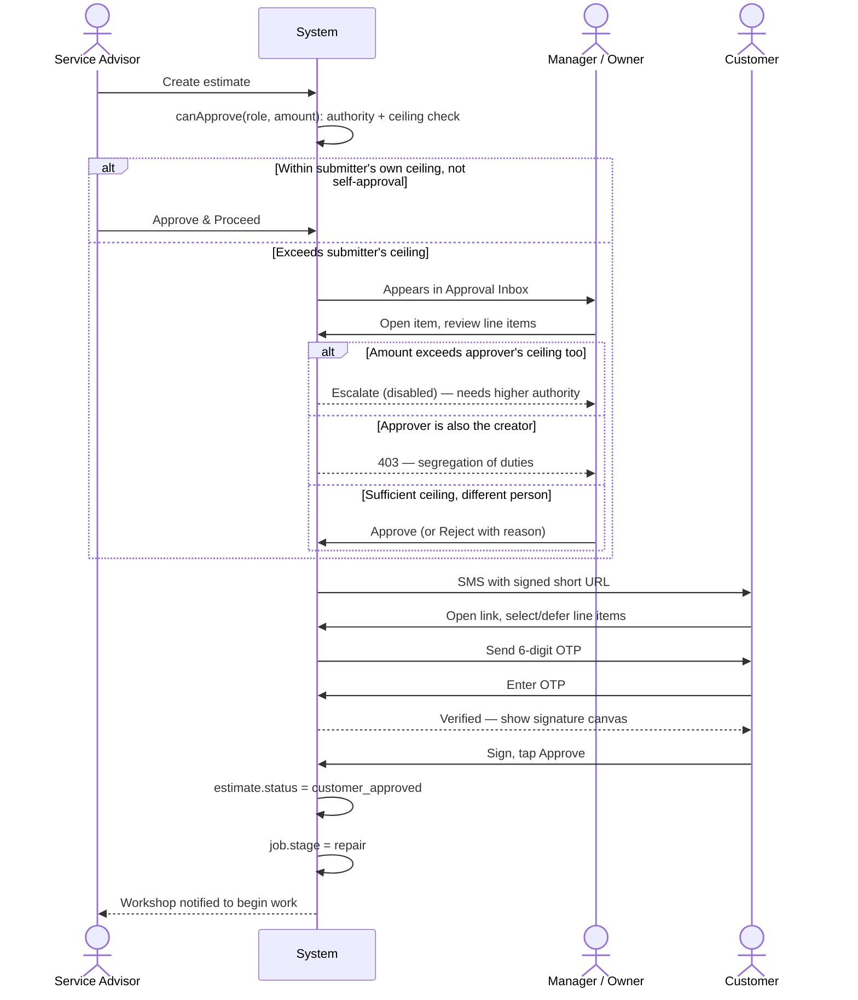

# Estimate Approval Workflow

Diagrams for the two-phase estimate approval process: internal approval against role-based SAR ceilings (with segregation of duties), followed by customer approval via SMS, OTP, and canvas e-signature.

Source: [`docs/user-documentation/workflows/estimate-approval.md`](../../user-documentation/workflows/estimate-approval.md)

---

## Process Flow: Internal Approval to Customer Signature

---

## Actor Interaction: Approval Chain and Customer E-Signature

