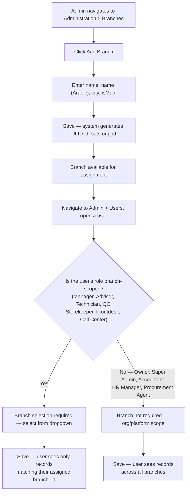
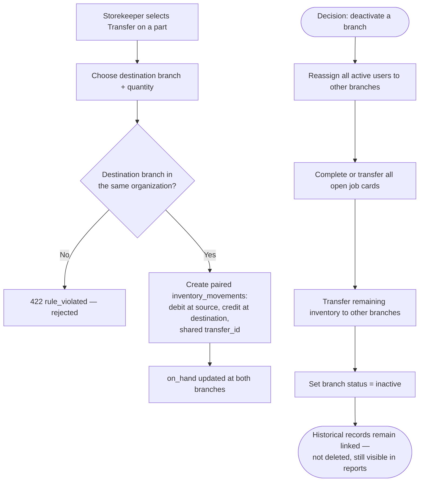

# How To: Configure Branches

Diagrams for setting up branch locations, assigning users to them, and the branch-scoped operations that follow: cross-branch inventory transfers and branch deactivation.

Source: [`docs/knowledge-base/how-to/configure-branches.md`](../../knowledge-base/how-to/configure-branches.md)

---

## Branch Setup and User Assignment

---

## Inter-Branch Transfer and Branch Deactivation

