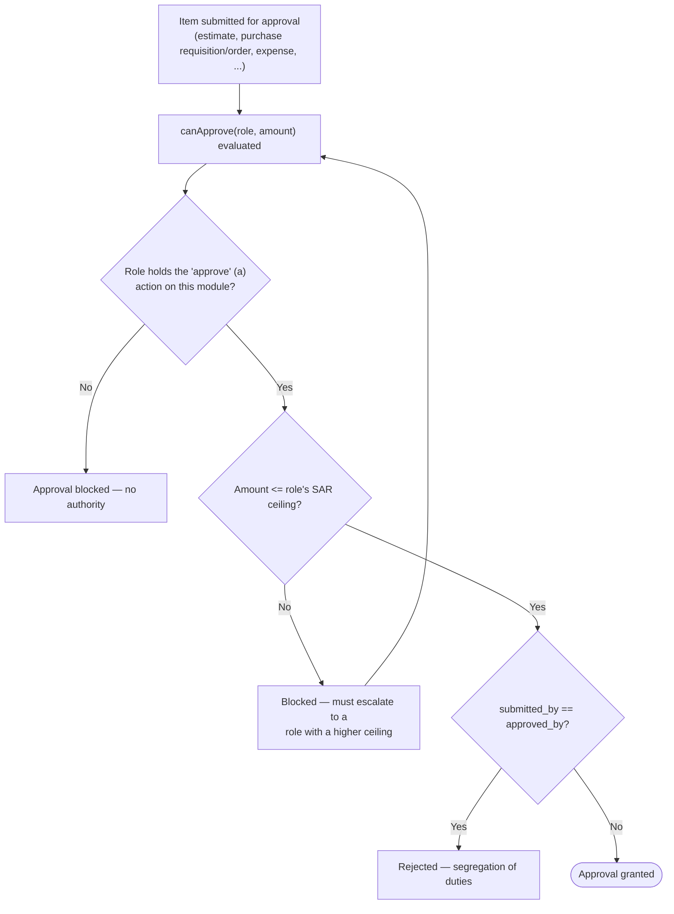
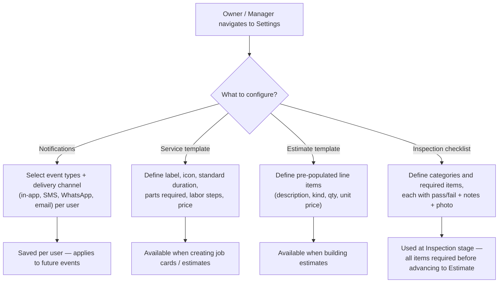

# How To: Customize Workflows

Diagrams for the generic approval-ceiling check that gates estimates, purchase orders, expenses, and other approvable items across SALIS AUTO, and for the administrative steps that configure notifications, service templates, and inspection checklists.

Source: [`docs/knowledge-base/how-to/customize-workflows.md`](../../knowledge-base/how-to/customize-workflows.md)

---

## Approval Ceiling Check (canApprove)

---

## Configuring Workflow Settings

