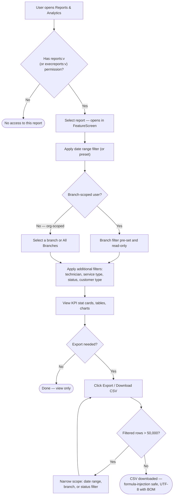
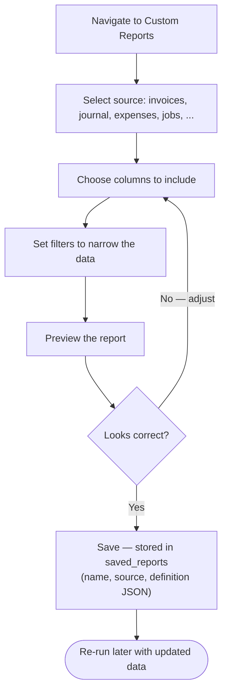

# How To: Generate Reports

Diagrams for navigating to and filtering a report, the CSV export path with its 50,000-row limit, and the Custom Reports Builder flow.

Source: [`docs/knowledge-base/how-to/generate-reports.md`](../../knowledge-base/how-to/generate-reports.md)

---

## View, Filter, and Export a Report

---

## Custom Reports Builder

