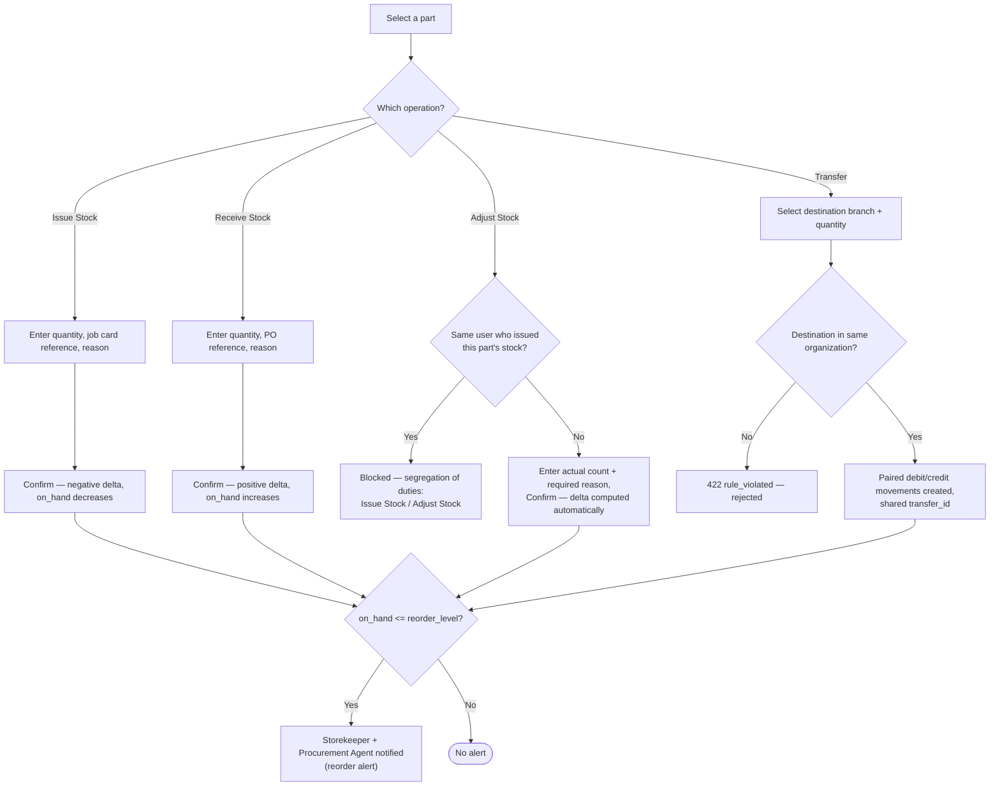
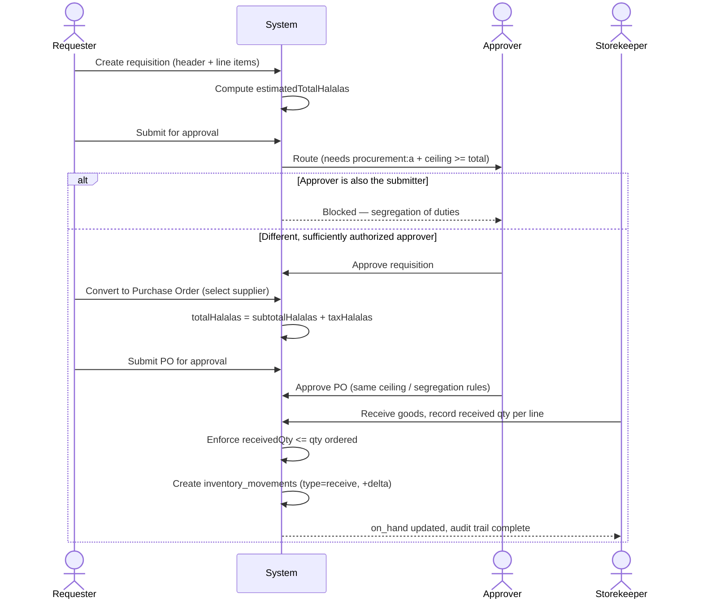

# How To: Manage Inventory

Diagrams for the four stock movement operations (issue, receive, adjust, transfer) including the issue/adjust segregation-of-duties rule and reorder alerting, and for the full purchase-requisition-to-receiving procurement cycle.

Source: [`docs/knowledge-base/how-to/manage-inventory.md`](../../knowledge-base/how-to/manage-inventory.md)

---

## Stock Movement Operations

---

## Purchase Requisition to Receiving

