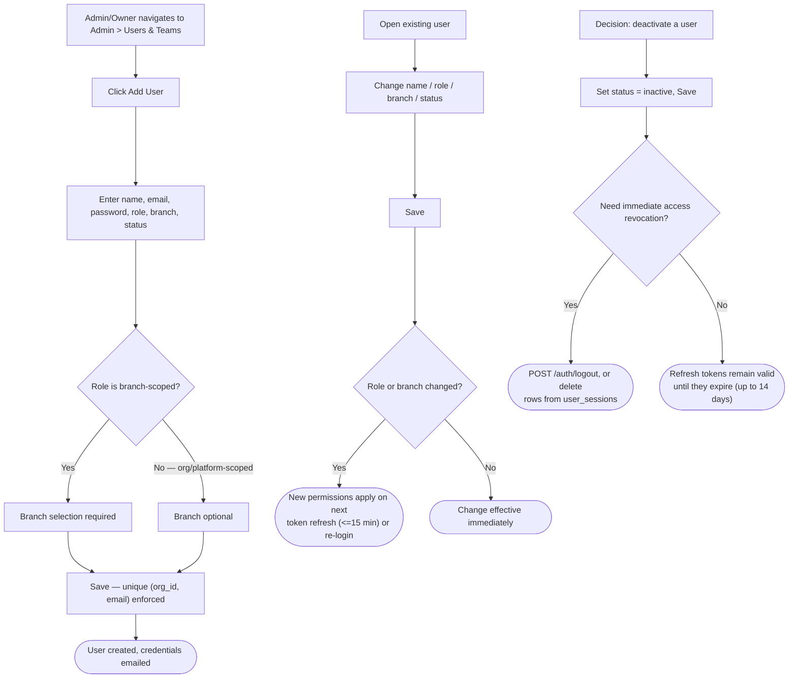
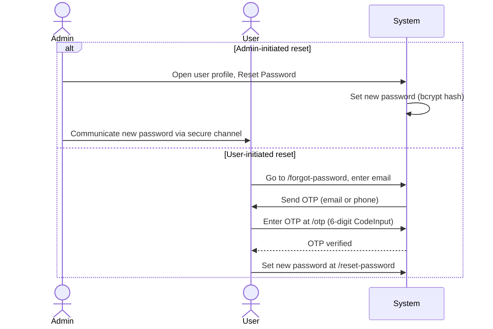

# How To: Manage Users & Roles

Diagrams for the user account lifecycle (create, edit, deactivate) and the two password-reset paths — admin-initiated and self-service.

Source: [`docs/knowledge-base/how-to/manage-users-roles.md`](../../knowledge-base/how-to/manage-users-roles.md)

---

## User Lifecycle: Create, Edit, Deactivate

---

## Password Reset: Admin-Initiated vs. Self-Service

